# **Google Ecosystem Setup and Demo Execution**
## **Table of contents**

1. Hardware Requirements
2. Software Requirements
3. Setup of Google Home and Android Smart Phone
4. Matter Integration setup in Developer console
5. Matter Demo using Google Home 
6. Deleting Matter Application from Google Home
### **1. Hardware Requirements**
Hardware Required for Google Nest Hub EcoSystem [Refer Ecosystem overview Prequisites Section](./ecosystem-setup#prerequisites)
### **2. Software Requirements**
- Google Account
- Google Home App with Beta Version
### **3. Set Up Google Home and Android Smartphone**
***
#### 3a. Google Matter EAP:
The Google Matter **Early Access Program** is a partnership between Google and silicon providers who support Matter development.
This partnership allows for faster onboarding of new devices into Matter and Thread by lowering the bar for starting with development of a new Matter-based product.
* The Google Matter Early Access Program is run through the Google Developer Center. You can access the Google developer center here:
https://developers.home.google.com/
* The Matter focused portion of the Google Developer Center is located here:
https://developers.home.google.com/matter
* The Google Matter Early Access Program is located here:
https://developers.home.google.com/matter/eap

**Note**: Until the public preview, access to this page is reserved to those allowed in by the Google Partner engineering team.

#### 3b. Prerequisites for Google Setup
- In order to run the Google Ecosystem demo you will need both Google and matter device . you will need Google Nest Hub 2nd Generation and
an Android phone (at least a Pixel 5 is recommended) that can run at least Android 8 (8.1, API Level 27) or newer and has Bluetooth LE capability
#### 3c. Instructions for Setting Up EAP:
- Once you have access, you will need to set up the Nest Hub 2nd Gen and Android phone with the Google Home app using the same Google Account that is used to access the EAP website.
- If you have set up the Nest Hub 2nd Gen with the correct Google account, you will receive the OTA update to the Beta version within 24 hours.
You can verify this by going to Device information > Technical information > Update Channel and the channel should read "matter-dev-current-beta-channel".
#### 3d. Set Up the Android Phone
Follow these instructions to set up the Android phone with the necessary applications:
- Set up the Google Home app: https://developers.home.google.com/matter/eap/setup/home-app
- Set up Google Play Services :- https://developers.home.google.com/matter/eap/setup/play-services
#### 3e. Create a Matter integration in the Google Developer Console.
Follow these instructions to create a Matter integration in the Google Developer Console.
http://developers.home.google.com/matter/eap/project/create

- After completing these steps, you should be ready to build your Matter accessory
### **4. Matter Integration Setup in the Developer Console**
***
- Now that you have created a home in your android smartphone, add your Nest Hub to that home. 
- After this, on a browser on your PC go to the following webpage to create a project:
  https://developers.home.google.com/matter
- Click “Console” at the top of the page
- On the next page, click “Create a Project"
- Give your project a name and click “Create a new project”
- On the next page click “Add Matter integration”
- On the next page click “Next: Develop”
- Click “Next: Setup”
- Set Up the fields on this page as shown below:
  - Product name: Light
  - Device type: light
  - Vendor ID (VID) Test VID
  - Test VID: 0xFFF1
  - Product ID (PID) 0x8005

- Product ID options for Matter devices are as follows:
  - Light-Switch: 0x8004 
  - Light: 0x8005
  - Lock: 0x8006 
  - Thermostat: 0x800E 
  - Window Covering: 0x8010
- Click “Save & Continue.”
- On the next page Click “Save”.
- You will now see a Matter integration for device type light in your console 
- You have now completed setting up the following:
   - Your home in the Google home app in your Android smartphone
   -	A project in your Google developer console
- A matter integration for the light device type
Having finished the above, the only step left to have your setup ready is to open a QR code webpage for the light device type in your PC. 

- QR Code link will be present in Device configuration section of logs. Copy the link and paste it in google chrome so you will be able to QR Code.

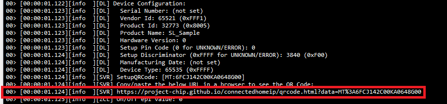
 
### **5. Matter Demo Execution using Google Home**
***
### 5a. Commission Matter device through Google Home app
1. Refer [Getting Started Overview Guide](/matter/<docspace-docleaf-version>/matter-wifi-getting-started-example) for setting up Silicon Labs Matter Accessory Device.

2. Connect Board to a Computer
    - For Wi-Fi NCP Mode Boards [Follow Connect EFR32 Board to computer](/matter/<docspace-docleaf-version>/matter-wifi-getting-started-example/getting-started-efx32-ncp#connect-the-efx32-boards-to-a-computer)
    - For Wi-Fi SOC Mode Boards [Follow Connect SiWx917 SOC to Computer](/matter/<docspace-docleaf-version>/matter-wifi-getting-started-example/getting-started-with-soc#connect-siwx917-soc-to-computer)

3. Flash the bootloader binary for your device along with the application (e.g., lighting , lock, thermostat, window covering, light-switch).
   [Follow the instructions in this link to flash binaries](./flashing-using-commander)

4. Open the Google Home app on your phone.

5. Click on **Devices Section** and click on **Add** Button.
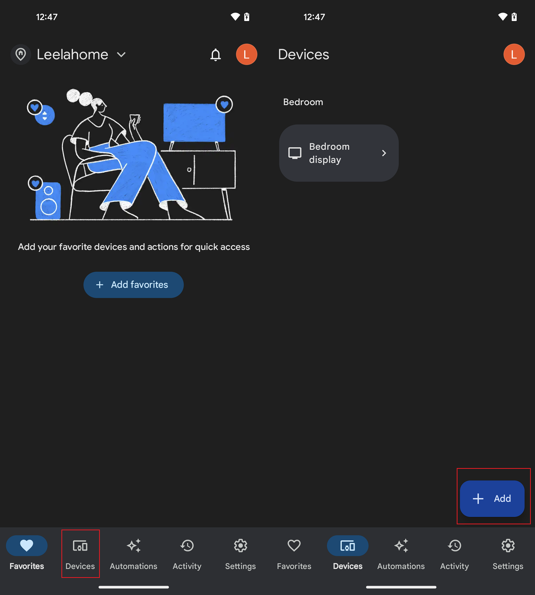

6. In the **Set Up Device** window, tap to select the **New Device** option.
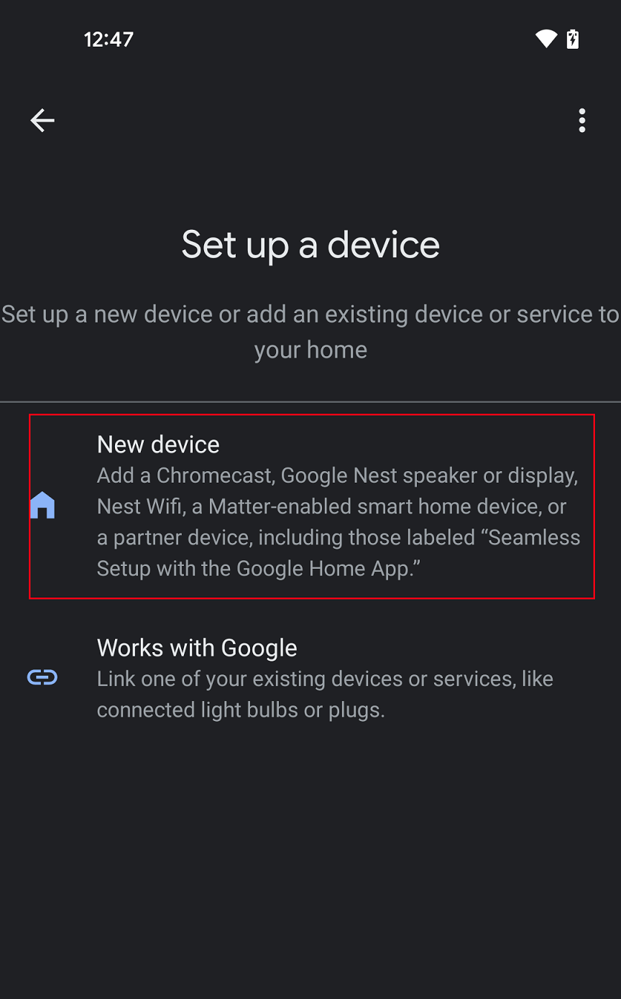

7. In the **Choose Home Section** select your home is selected and click next.
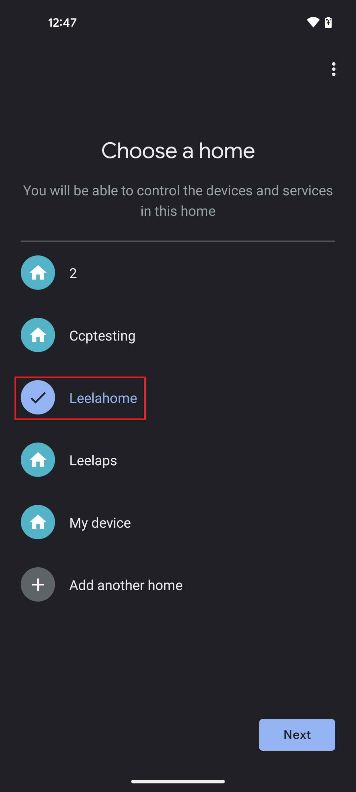

8. The Google Home App will now looking for the Nearby Matter device.
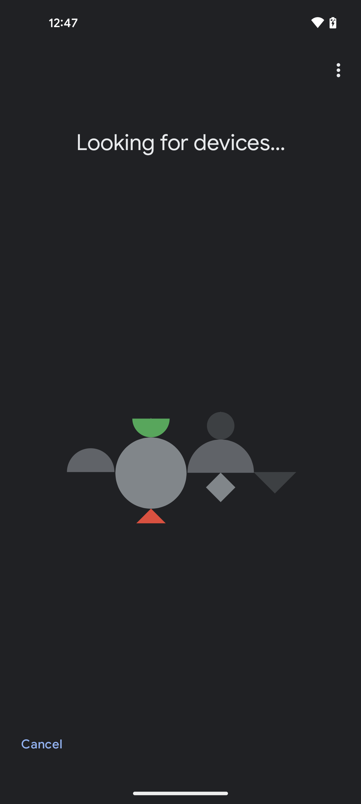

9. If the device is found click on Application which you flashed on device. (For Example Light, Lock,).

10.  If the device is not found tap "Matter Enabled Device".
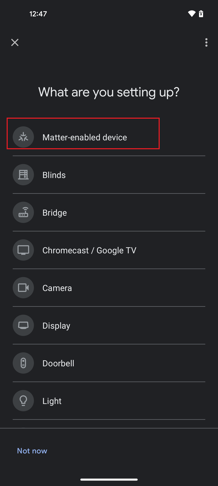

11.  Once the Google Home app has found the device, it will ask you to scan its QR code.
12.  Google Home app will now ask you if you want to connect this device to your Google account. Tap “I agree”.
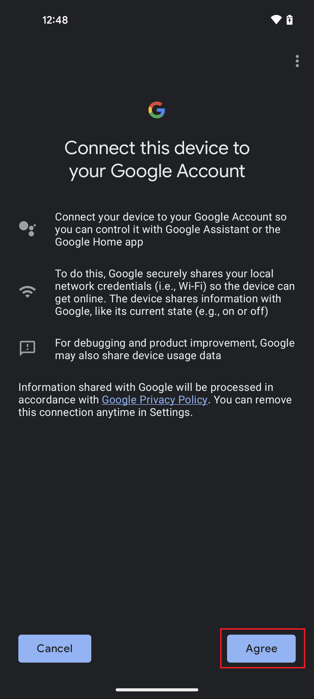

13.  The Google Home app will now start commission the device with Bluetooth LE.
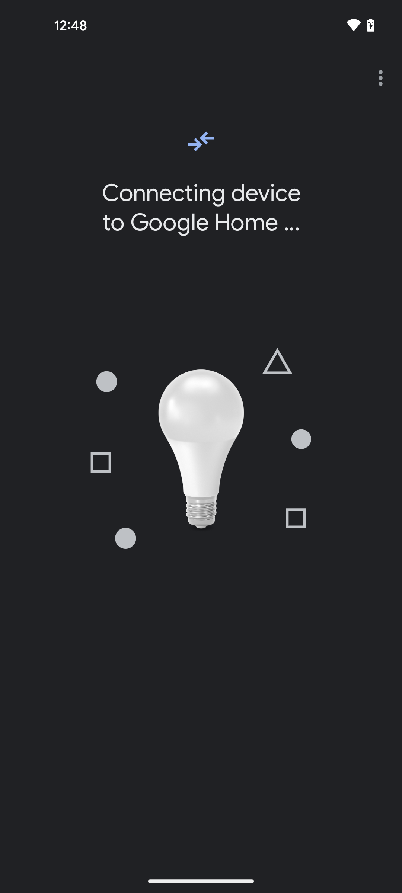

14.  Once you see the message stating that the **Device connected**, tap “Done”.
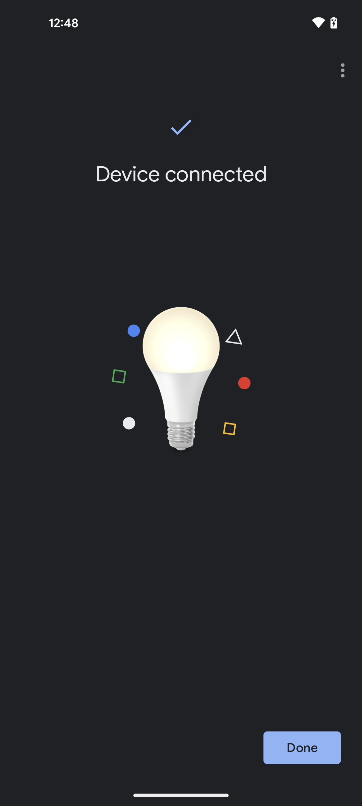

15.  After this Google Home App will ask you select Room where you want to keep **Application**. You can select any room from the list and click Next.
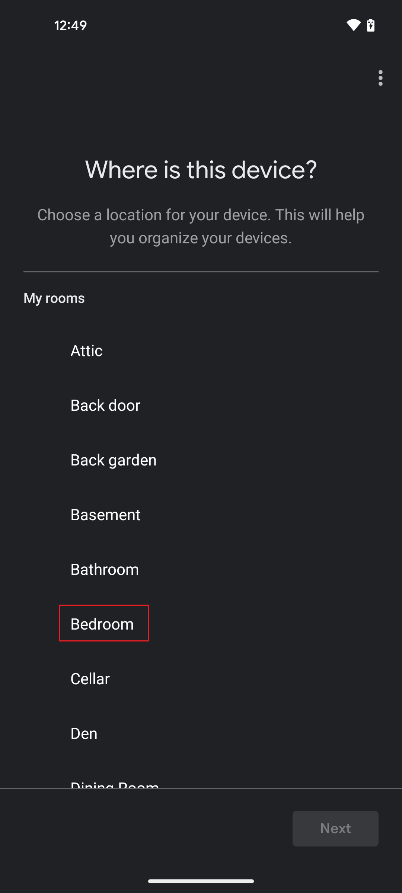

16.  Google Home App will ask to create unique name for the application (For Example: Light, Lock). create any name for identification of application and click Next.

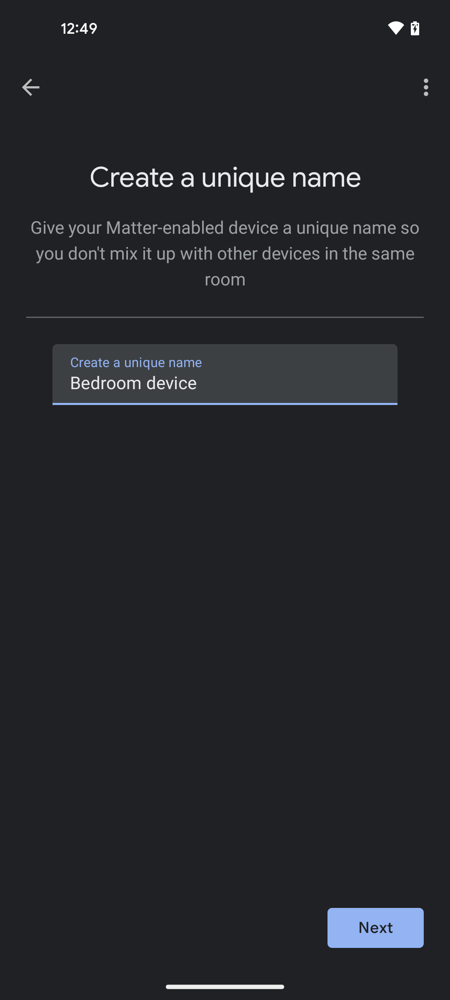

17. You will now see your light shown as being connected to your Google account and added to your selected Room at Step 15.
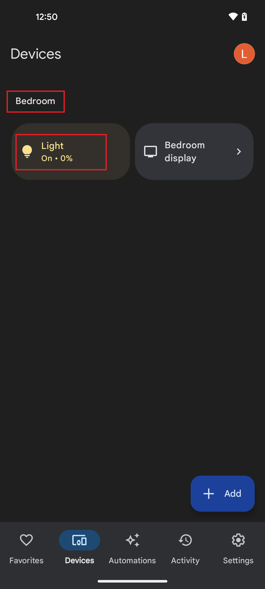

### 5b. Control the Light via Google Home App
1. In the Google Home app, you will now be able to tap your light to turn it ON and OFF.
2. You can control the light by giving a voice command (for example, 'Ok Google! Turn ON Light') and through the app user interface.
3. You will see the LED1 on your WSTK board turned on or off depending on the command you enter.

### **6. Deleting Matter Application from Google Home**

1. Press and hold Matter Application for detailed view.
2. Click on **Setting** button on top right corner.
3. Select **Remove device** option.
4. It will prompt **Unlink all Matter apps & services from device** select unlink.