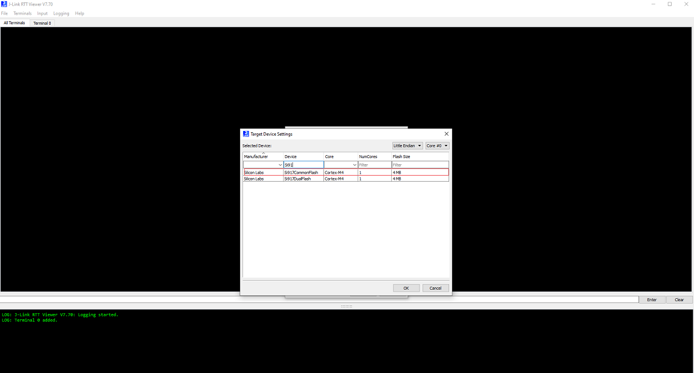

# JLink RTT Environment Setup for a SiWx917 SoC Device

- For 917 SOC Common Flash Boards, Ozone debugging support is not enabled. To get the logs for 917 SOC, the **JLink RTT** tool will be used.
- Auto detection of SiWx917 SoC device in **JLink RTT** is not enabled.
- Follow the steps to configure the SiWx917 SoC with Latest **JLink RTT Logging** tool.

## Steps to Configure the SiWx917 SoC on the JLink-RTT Logging

1. Update the **JlinkDevices.xml** and **RS9117_SF_4MB_42bsp.elf** files found on the [Matter Artifacts Page](/matter/{build-docspace-version}/matter-prerequisites/matter-artifacts).
    - Download the JLinkDevices.xml file and copy it in your **JLink RTT** installation path shown in this [JlinkDevices Folder](https://wiki.segger.com/J-Link_Device_Support_Kit#JLinkDevices_folder). If there is no JLinkDevices Folder, create a `JLinkDevices` folder and copy the `JlinkDevices.xml` file into it.
    - In the `JLinkDevices` folder, create a `si917` folder.
    - Download the **RS9117_SF_4MB_42bsp.elf** file (Flash driver) and copy it in the created `si917` folder.

    **Note**:- **RS9117_SF_4MB_42bsp.elf** flash driver file is used to download the application using the Ozone debugger.

2. Launch **J-Link RTT Viewer**. The SiWx917 Common Flash SoC device should be visible in the Device field’s selection list.

    

3. Select **SI917COMMONFLASH** and, click **OK**.

    
