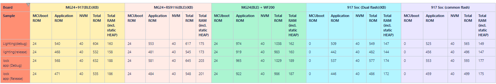
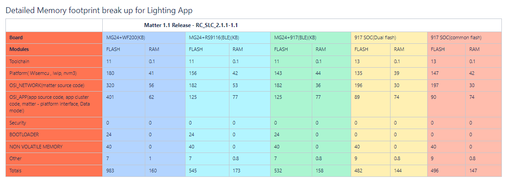

# Optimizing Memory Usage
This document provides information on Optimizing Memory Usage for Silicon Labs devices.

## Memory Reports for Silicon Labs Devices
Memory usage information is provided in the reports below:
 - Memory usage of silicon labs devices can be checked at

   

 - Detailed Memory Footprint can be checked at

   

## How to Optimize Memory
To optimize an application's memory footprint, check the following:
  1. Analyze and reduce stack usage of the application wherever possible.
  2. Disable any included debug modules.
  3. Turn off unused peripherals, features and functions.
   
### Disabling Debug Logging
- Memory can be optimizied by disabling debug logs. 
- **matter_no_debug** component will disable the below from the project.
        - Disables Silabs specific logging used in matter
        - Disables Hard Fault logs
        - Keeping Log Level to None
- To add **matter_no_debug** Component, modify corresponding app specific **.slcp** project file.
 ```shell     
  - id: matter_no_debug  
    from: matter
```