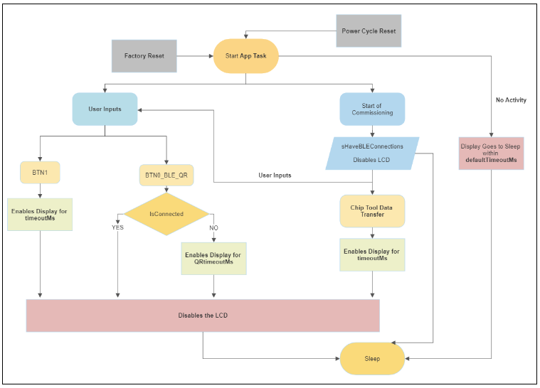

# Optimizing Power Consumption for Intermittently Connected Devices (ICD)

This page provides information on optimizing power consumption for Intermittently Connected Devices (ICD) formerly called Sleepy End Devices.

## Minimal Power Consumption

Simply enabling ICD functionality does not give the application the best power consumption.
By default, several features that increase power consumption are enabled in the example applications.

To achieve the most power-efficient build, the following components need to be disabled. The `matter_platform_low_power` component will do these steps for you, if installed.

- Matter Shell (`matter_shell`)
- LCD (`matter_lcd`) and Qr Code (`matter_qr_code`)

> **Note:**
> `matter_shell` is not enabled by default in project file.
>
> - Add `matter_shell` component in project file to enable the matter shell feature (for Wi-Fi non-ICD apps)
> - Remove `matter_shell` while enabling ICD apps

## Flow of the Matter Wi-Fi App with LCD Configuration

- A timer starts in the Start of App Task. If there is NO activity after defaultTimeoutMs, the callback is triggered and the LCD will go to Sleep.
- In between, if the user presses BTN1, the LED1 will toggle as usual and the LCD screen will be enabled. After timeoutMs it will trigger the callback and disable the LCD.
- If the User presses BTN0, the system will check if the device is already commissioned. If it is not commissioned, the display will be enabled, it will toggle the QR Code, and the call back function will be triggered after QRtimeoutMs.

### Start of Commissioning

- At the start of commissioning the display remains enabled. On pressing BTN0 the user can see the QR code to commission for a period of QRtimeoutMs.

- Once the commissioning process starts, the LCD screen will be disabled.

### After Commissioning

- The LCD display is off during inactive transmissions.
- The LCD display active if there is any BTN press or data transfer.
- On pressing the BTNs it will work the same way as before.
- On initiating Data Transfer, once the action is initiated the LCD display will be enabled and disabled again after the specified time.
- On triggering Factory Reset the LCD will be enabled for QRtimeoutMs, then it will be disabled.

The following diagram shows the end-to-end flow for optimizing power consumption:
  

## Power Save Methods

For information on power saving, refer to [Power Save Methods](./wifi-sleepy-end-device#power-save-methods)
