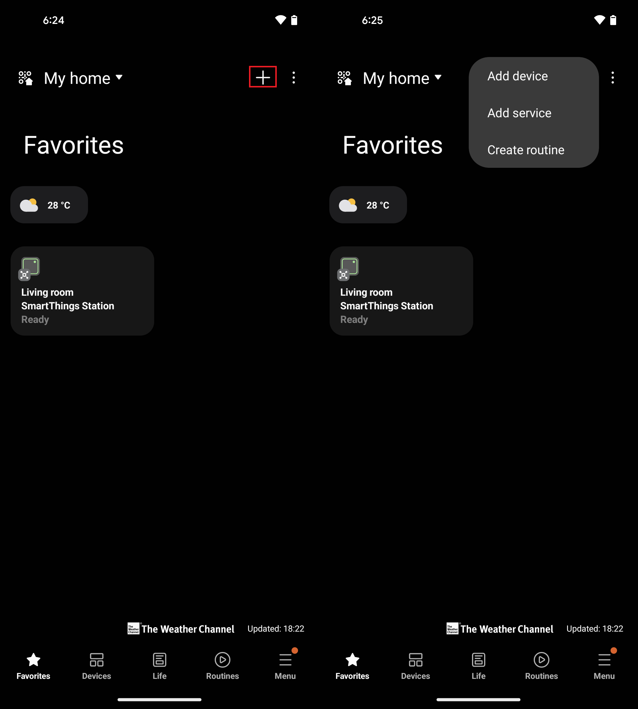
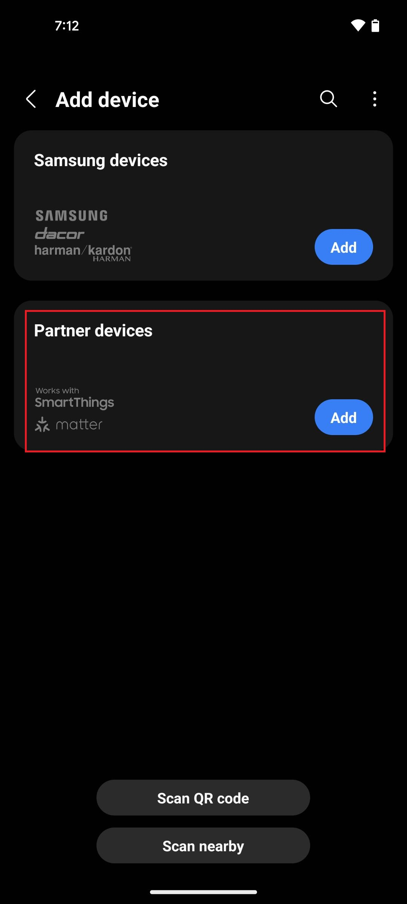
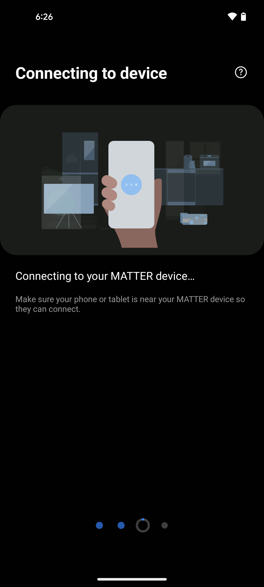
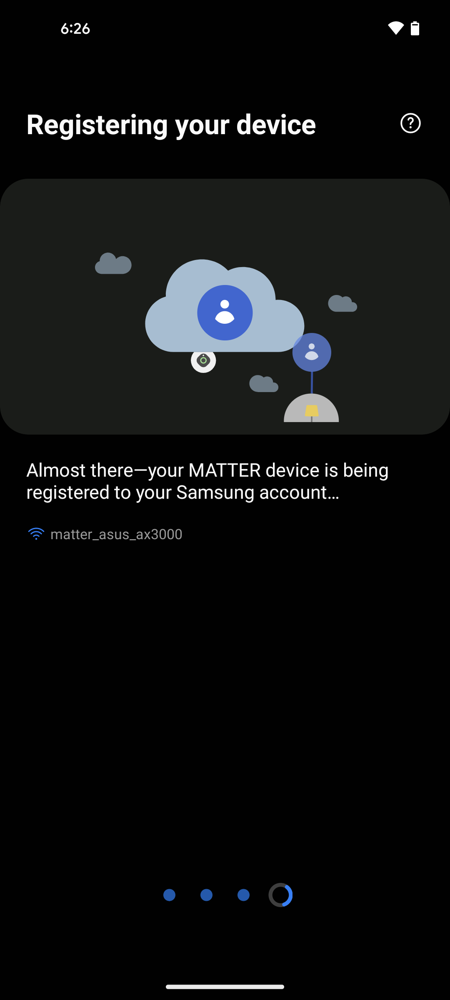
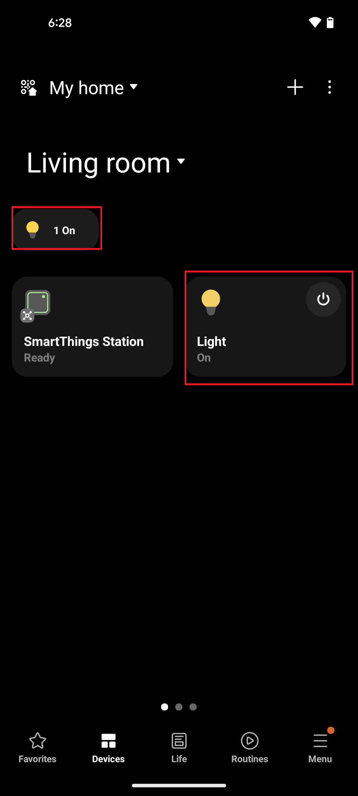

# **Samsung Ecosystem Setup and Demo Execution**
## **Table of contents**

1. Hardware Requirements
2. Software Requirements
3. Setup of Samsung Smart Home Hub
4. Matter Demo using Samsung Smart Aeotec
5. Deleting the Matter Application From Samsung Smart App

### **1. Hardware Requirements**
Hardware Required for Samsung Smart Thing EcoSystem [Refer Ecosystem Setup Prequisites Section](./ecosystem-setup#prerequisites)
### **2. Software Requirements**
- Samsung Account
- Samsung Smart things App on smartphone [Section 3](#3-setup-of-samsung-smart-home-hub)

### **3. Setup of Samsung Smart Home Hub**
[Refer Official Set up Smart Home Hub Page](https://aeotec.freshdesk.com/support/solutions/articles/6000240326-how-to-setup-smart-home-hub)

### **4. Matter Demo Execution using Samsung Smart Aeotec**

1. Build Matter Application by referring page
  [Build MATTER Application](./sw-setup)

2. Connect Board to a Computer
    - For Wi-Fi NCP Mode Boards [Follow Connect EFR32 Board to computer](/matter/<docspace-docleaf-version>/matter-wifi-getting-started-example/getting-started-efx32-ncp#connect-the-efx32-boards-to-a-computer)
    - For Wi-Fi SOC Mode Boards [Follow Connect SiWx917 SOC to Computer](/matter/<docspace-docleaf-version>/matter-wifi-getting-started-example/getting-started-with-soc#connect-siwx917-soc-to-computer)

3. Flash the bootloader binary for your device along with the application (e.g., lighting , lock, thermostat, window covering, light-switch).

4. Open Smart things app , tap on “+" ,Select **Add device**

1. Select Partnet Devices.

1. Through the smart things app scan the Application QR code to trigger commissioning.
 
2. After scanning QR code ,verify Commissioning is triggered by checking on the DUT logs.

1. While commissionig at last step it will Register your device with Access Point.

1. Once commissiong is success, verify Matter Application is added in one  room of Samsung smart App and is in online mode.

1.  Send UI command from Smart thing app to control Matter Application.
   
   For Example: Tap on Light UI to turn ON/OFF.

### 4a. Control the Light via Samsung Smart Thing App
- In the Samsung Smart Thing app, you will now be able to tap your light to turn it ON and OFF.
- You will see the LED1 on your WSTK board turned on or off depending on the command you enter.
   - **Note**: Samsung Smart Thing won't support voice control commands.

### **5. Deleting the Matter Application From Samsung Smart App**

- In order to remove the Matter Application from Samsung Smart things app go to **Devices Section**.
- Long Press and Hold Matter Application and click on **Remove**.
- If you want to add Matter Application again follow [Step 4](#4-matter-demo-using-samsung-smart-aeotec)