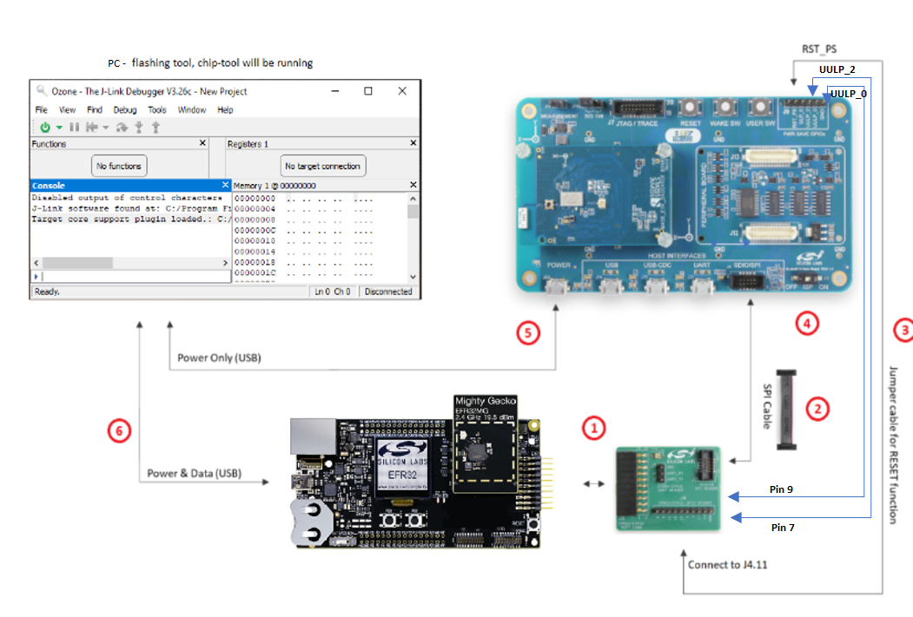
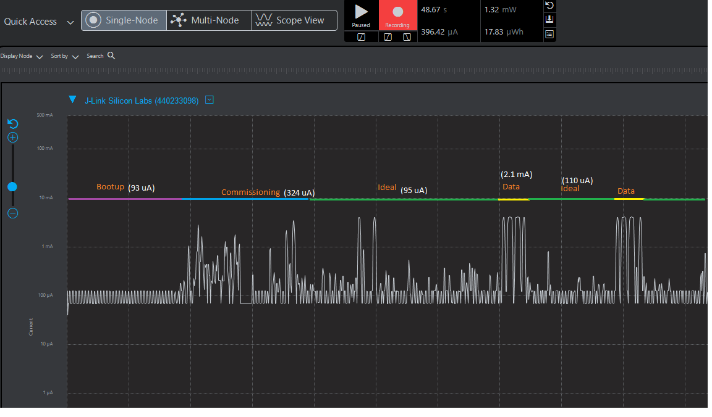

# Matter over Wi-Fi Intermittently Connected Devices (ICD), formerly Sleepy End Devices

This page explains how Matter Wi-Fi ICDs work and how to configure a Matter Wi-Fi SED example.

## Overview

Matter provides a Intermittently Connected Device (ICD) operating mode to extend the battery life of power-limited devices. This operating mode leverages native Wi-Fi functionality to enhance the power management features provided within the Matter protocol.

Wi-Fi module power saving is achieved by the Wi-Fi Station notifying the Access Point (AP) that it is entering its power save (PS) mode. Afterwards, the Wi-Fi station will shut down its RF and Wi-Fi SoC blocks to enter power saving mode.

The Access Point (AP) buffers the frames destined to a Wi-Fi station while it is in power save mode. The Access Point (AP) will send the buffered frames to the Wi-Fi station when requested to do so.

During association, the Wi-Fi Station uses the Delivery Traffic Information Map (DTIM) parameter to get from the Access Point (AP) how many beacon intervals it shall spend in sleep mode before it needs to retrieve the queued frames from the Access Point (AP).

Wi-Fi module sleep is implemented by using the PS-Poll Legacy Power Save (DTIM based) method. EFR sleep is implemented by using the power manager component (EM2).

**Note**: Wi-Fi module sleep is enabled after successful commissioning and EFR sleep is enabled after system bootup.

**Note**: Wi-Fi is implemented with DTIM-based sleep, since the operational discovery packet is a broadcast packet that will not be buffered by the Wi-Fi router.

## Power Save Methods

### Deep Sleep Power Save Mode for EFR32

The EFR32 will go into deep sleep (EM2) power save mode by using the power manager module. The power manager is used to transition the system to a power mode when the application is the Idle Task.

In EM2 energy mode, all high frequency clock sources are shut down. Peripherals that require a high frequency clock are unavailable or have limited functionality.

### PS-Poll Legacy Power Save for Wi-Fi Module

The PS-Poll Legacy power save mode leverages the PS-Poll frame to retrieve the buffered frames from the Access Point (AP). The PS-Poll frame is a short Control Frame containing the Association Identifier (AID) value of the Wi-Fi station.
In the Legacy power save mode, when the Wi-Fi station receives a beacon with its Association Identifier (AID) in the TIM element, it initiates the buffered frame delivery by transmitting a PS-POLL control frame to the Access Point (AP).
The AP acknowledges the PS-Poll frame and responds with a single buffered frame.

In this mode, the Wi-Fi station stays active and retrieves a single buffered frame at a time. The AP also indicates that there are more buffered frames for the station using the More Data subfield.
The Wi-Fi station continues to retrieve buffered frames using the PS-Poll frame until there are no more buffered frames and the More Data subfield is set to 0. The Wi-Fi station goes back into the sleep afterwards.

A Wi-Fi station can enter sleep mode after sending a Null frame to the AP with the power management (PM) bit set. From then on, the AP will store all packets destined to the Wi-Fi station in a per-device queue and sets the TIM field in the beacon frame to indicate that packets destined for the Wi-Fi station have been queued.

The Wi-Fi station wakes up to receive buffered traffic for every Delivery Traffic Indication Message (DTIM) beacon.
When it detects that the Traffic Indication Map (TIM) field for it has been set, it sends a PS-Poll control frame to the AP.

### Delivery Traffic Indication Message (DTIM)

A Wi-Fi station in DTIM Power Save mode can wake at any time to transmit uplink traffic, but can only receive downlink traffic (broadcast, multicast or unicast) immediately after receiving a DTIM beacon.
In order to inform the Wi-Fi station in Power Save mode that the access point has buffered downlink traffic, the access point uses the Traffic Indication Map element present in the beacon frames.
The Wi-Fi station in Power Save mode wakes up to receive the DTIM beacon and checks the status of the TIM element. This element indicates whether any frames need to be retrieved from the Access Point (AP).

**Note**: The DTIM parameter can be configured on the access point settings.

## Building with ICD Functionality

To enable ICD functionality for Wi-Fi, the `ICD Management` cluster/component needs to be installed within the **Software Components** tab from Simplicity Studio.

- Search for the ICD Management cluster and enable for **Server**. You will receive a warning that the corresponding component was unable to be installed. This is due to component conflicts within Simplicity Studio.

    

- Navigate to the **Software Components** tab and install the ICD Management Server Cluster component.

    

- For SiWx917 SOC, click on **Replace Subscription Timeout Resumption**. Sleepy support is enabled; build the project. Sleep support on M4 and TA can be enabled by installing `matter_icd_core` component.

- For rs9116 and WF200: `matter_icd_management` component is installed by default for lock-app. For thermostat and window, you need to install the mentioned cluster/component to enable sleepy.
- For 917NCP: `matter_icd_management` component is installed by default for lock-app. For thermostat and window, you need to install the mentioned cluster/component to enable sleepy.

### EFR32 + RS9116 Setup for ICDs (Sleepy Devices)

- The following GPIO pins should be connected for 9116 and Host handshakes.
pin 7 and 9 to UULP_2 and UULP_0 respectively.

## Power Measurements for Wi-Fi Devices

This section explains how to measure the power values for EFR Wi-Fi and SOC Wi-Fi co-processor.

### Using Simplicity Studio Energy Profiler for Current Measurement

After flashing the Matter application to the module, Energy profiler or a power meter can be used for power measurements.

In Simplicity Studio, click **Tools** on the toolbar, select **Energy Profiler**, and click **OK**.

From the Quick Access or Profiler menu, select **Start Energy Capture**.

**Note**: A quick-start guide on the Energy Profiler user interface is in the Simplicity Studio User's Guide's [Energy Profiler User Interface section](https://docs.silabs.com/simplicity-studio-5-users-guide/latest/ss-5-users-guide-tools-energy-profiler/energy-profiler-user-interface).

### Power Consumption Measurement Using Energy Profiler for Wi-Fi Devices

Analyze the power values using Energy Profiler.

### Power Consumption Measurement Using a Power Meter

Power consumption measurement pins for RS9116 Evk Boards:

Power consumption measurement pins for EXP Boards:

The power meter's negative probe is used for pin-1 and the positive probe is used for pin-2.

Analyze the power values using the power meter.

