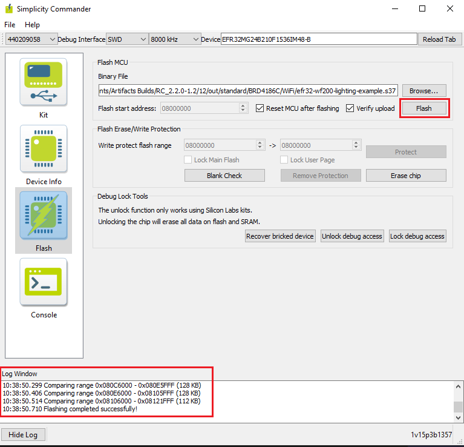
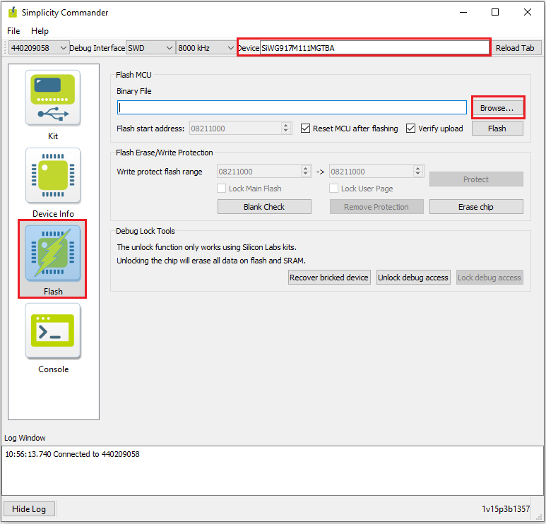
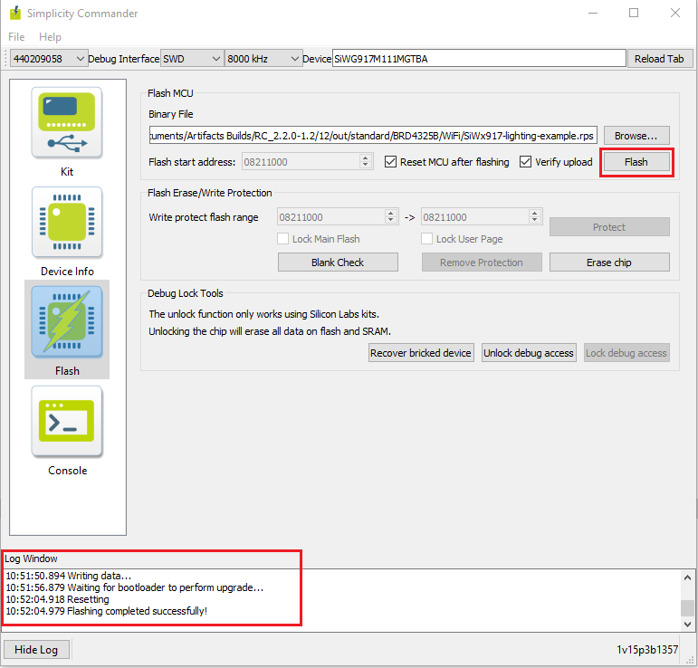

# Flashing the Matter Pre-Built Binary Using Simplicity Commander
- To Flash the application for EFR32 and SiWx917 SOC Board Simplicity commander software will be used.
- Before flashing the application for EFR32 Boards, We need to flash **bootloader images** as per board variants
    - **BRD4186C Board**
      - For MG24 + RS9116 :- Internal Bootloader (bootloader-storage-internal-single-512k-BRD4186C-gsdk4.1)
      - For MG24 + WF200 :- External Bootloader (bootloader-storage-spiflash-single-1024k-BRD4186C-gsdk4.1)
    - **BRD4187C Board**
      - For MG24 + RS9116 :- Internal Bootloader (bootloader-storage-internal-single-512k-BRD4187C-gsdk4.1)
      - For MG24 + WF200 :- External Bootloader (bootloader-storage-spiflash-single-1024k-BRD4187C-gsdk4.1)
   - Bootloader binaries will be available in the respective path of codebase **third_party/silabs/matter_support/matter/efr32/bootloader_binaries** folder.
   - We recommend to flash latest bootloader binaries from codebase everytime.
 - **Note**: Bootloader binaries will be flashed using Simplicity Commander only. It will support EFR32 Boards only.

## Flashing the Bootloader Binaries for EFR32 Board using Simplicity Commander

1. In the Simplicity Studio home page, click Tools.

2. In the Tools dialog, select Simplicity Commander and click OK.

3. In the Simplicity Commander window, click Select Kit and choose your radio board.

4. In the navigation pane, go to the Flash section.

5. Above beside "Reload tab" board will be displayed, click Browse next to the Binary File field and locate bootloader binary.

6. Click Flash, the bootloader will be flashed and the Log Window will display a "Flashing completed Successfully" message.

## Flashing the EFR32 Matter Pre-Built Binary using Simplicity Commander

1. In the Simplicity Studio home page, click Tools.
   
2. In the Tools dialog, select Simplicity Commander and click OK.

3. In the Simplicity Commander window, click Select Kit and choose your radio board.

4. In the navigation pane, go to the Flash section.
   
5. Above beside "Reload tab" board will be displayed, click Browse next to the Binary File field and locate binary.

6. Click Flash, the binary will be flashed and the Log Window will display a "Flashing completed Successfully" message.

## Flashing the SiWx917 SOC Matter Pre-Built Binary using Simplicity Commander

1. In the Simplicity Studio home page, click Tools.
   
2. In the Tools dialog, select Simplicity Commander and click OK.

3. In the Simplicity Commander window, click Select Kit and choose your radio board.

4. In the navigation pane, go to the Flash section.

5. Above beside "Reload tab" board will be displayed, click Browse next to the Binary File field and locate binary.

6. Click Flash, the binary will be flashed and the Log Window will display a "Flashing completed Successfully" message.
