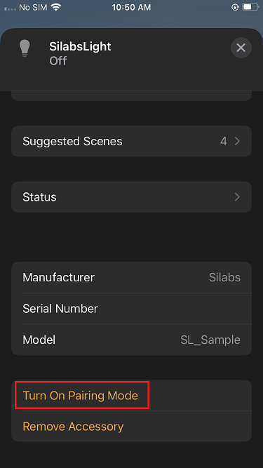
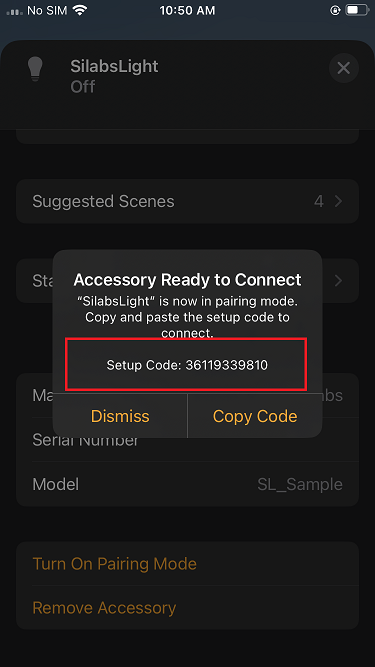

# Using Multi-Admin to Share Matter Accessory Devices (MAD) across Multiple Controllers

Matter devices can participate in multiple Matter ecosystems simulatenously through a feature called Multi-Admin.
Multi-admin allows you to join the Matter device to several Matter fabrics and administer it by several different Matter controllers.

Any Matter Accessory Devices (MAD) can be shared between two or more Matter fabrics by first commissioning to one Matter fabric and then sharing control of them to other Matter controllers, typically a Matter ecosystem hub.
For more details on commissiong your MAD to a Matter network, please first follow the steps in [Single Controller](./singlecontroller-ecosystem) for your ecosystem. If you are testing an MAD using CHIP-Tool, please see our guides for using [CHIP-Tool over Thread](/matter/{build-docspace-version}/matter-thread/index) or [CHIP-Tool over Wi-Fi](/matter/{build-docspace-version}/matter-wifi-run-demo/use-case-execution) instead.

Once your MAD is commissioned to a Matter fabric, you must then use the Matter controller of that fabric to open a commissioning window for your MAD.
This will allow another Matter controller to commission the Matter node and make it part of their own Matter fabric. The next step is commissioning the Matter device to the new fabric using the special pairing code generated when opening the commissioning window.
Please see below some examples on how this is done with the Silabs Matter hub and a commercial Matter ecosystem.

## Sharing MAD from CHIP-Tool to any Matter Ecosystem

Note: these steps assume you've followed the [Matter over Thread Example](/matter/{build-docspace-version}/matter-thread/index) or the [Matter over Wi-Fi Example](/matter/{build-docspace-version}/matter-wifi/index) and already commissioned your MAD to your CHIP-Tool-based Matter hub.

1. From your Matter hub CLI, open a commissioning window for your MAD.
```shell
$ mattertool pairing open-commissioning-window <node_id> <option> <window_timeout> <iteration> <discriminator>
```

Where:
- <node_id> is the ID of the node taken during commissioning.
- <option> is equal to 1 for enhanced commissioning method and 0 for basic commissioning method.
- <window_timeout> is the time in seconds before the commissioning window closes.
- <iteration> is the number of PBKDF iterations to use to derive the PAKE verifier.
- <discriminator> is the device-specific discriminator determined during commissioning.
Note: The <iteration> and <discriminator> values are ignored if the <option> is set to 0.

Example command for opening a commissioning window (enhanced) for 5 minutes for an MAD with node ID 4115:
```shell
$ mattertool pairing open-commissioning-window 4115 1 300 1000 2365
```

2. Once the commissioning window is open, you'll receive a pairing code (11-digits) to be used with the other Matter controller.
Example: the code here is 00320849359.
```shell
$ [1671488142.041249][341258:341263] CHIP:CTL: Manual pairing code: [00320849359]
```

3. Commissiong your MAD with your other Matter ecosystem as normal - see the steps at [Single Controller](./singlecontroller-ecosystem) for your Matter ecosystem - with one change to the procedure: instead of scanning a QR code you'll use the pairing code from step #2.

## Sharing MAD from Apple Home Pod to Google Home Ecosystem

This phase is very similar to the [Single Controller](./singlecontroller-ecosystem.md). The difference is that the Matter device will be controlled using the Apple Home Ecosystem. The process will be almost identical, with some minor difference related to Apple Home App UI.

See [How to Set Up an Apple Home Ecosystem](./apple-ecosystem-setup.md). Then use the following procedure to share multi-control from Apple Home to Google Home.

1. Open Apple Home app.
2. Tap the Light Application to open the detailed view.
3. Scroll down to the bottom of the application detailed view.

    

4. Open the commissioning window for the Google Home Pod by tapping **Turn On Pairing Mode**.
5. The Setup Code appears, with a message printed as shown below in the Apple Home App.

    

6. Open Google Home app, tap **Devices**, and tap **Add**.
7. Tap **Set up without QR Code** and insert the setup code displayed in Step 5.

    

8. Commissioning will start and proceed in the same way as explained in [Google Ecosystem Setup and Demo Execution](./google-ecosystem-setup.md).
9. Once the commissioning is done, the new Matter device should be visible in the Room view of the Google Home app.

## Sharing MAD from Samsung SmartThings Ecosystem

1. Open the SmartThings app.
2. Select the MAD to be shared from your devices.
3. Press the vertical ... at the top right.
4. Select Share with other services.

Option A:
   - 5. Press Share on the available service for the Matter ecosystem you wish to commission your device to.
   - 6. Follow the steps on screen to complete the commissioning.

Option B:
   - 5. Press QR Code.
   - 6. Either use the QR Code or the provided pairing code (11-digits) with your other Matter ecosystem app.
   - 7. Follow the steps on screen to complete the commissioning.

## Sharing MAD from Google Home Ecossytem

1. Open the Google Home app.
2. Select the MAD to be shared from your devices.
3. Press the gear icon at the top right.
4. Press Linked Matter apps & services.
5. Press Link apps & services.

Option A:
   - 6. Press the Matter ecossytem app you wish to share the MAD with.
   - 7. Follow the steps on screen to complete the commissioning.

Option B:
   - 6. Press Use pairing code or Share with QR code.
   - 7. Either use the QR Code or the provided pairing code (11-digits) with your other Matter ecosystem app.
   - 8. Follow the steps on screen to complete the commissioning.

## Sharing MAD from Alexa Ecosystem

1. Open the Amazon Alexa app.
2. Select the MAD to be shared from your devices.
3. Open the device Settings page.
4. Press Other Assistants and Apps.
5. Press Add Another.
6. Wait for the Amazon Alexa app to generate a pairing code.
7. Use the provided pairing code (11-digits) with your other Matter ecosystem app.
8. Follow the steps on screen to complete the commissioning.
