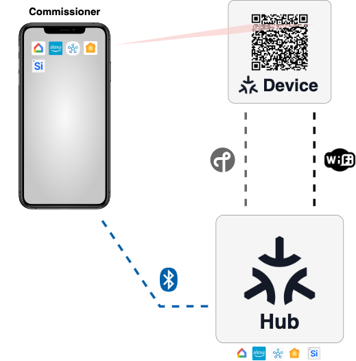

# Overview of Matter Ecosystems

A Matter ecosystem is a commercial platform that supports the Matter protocol, enabling seamless control of smart home devices. The ecosystem can include platforms such as Google Home, Apple Home, Samsung SmartThings, and Amazon Alexa. The Matter protocol allows these devices to work across multiple ecosystems simultaneously, providing a unified control interface.

- The Silicon Labs Matter platform supports the most recent versions of the Matter protocol and works with several commercial Matter ecosystems.
- Matter allows multiple ecosystems to work together and control a single, shared Device.
- Silicon Labs Matter devices can be controlled by various Matter enabled Ecosystems.

## Ecosystem Components
There are three main roles for devices in a Matter Ecosytstem:

1) **Matter Accessory Device (MAD):** These are smart home devices, such as smart lights, thermostats, locks, and sensors that are Matter-enabled. These devices are controlled by the Matter Hub.
2) **Matter Hub (Controller):** This device connects to all MADs over one of two wireless networking protocols, those being OpenThread or WiFi. 
3) **Commissioner:** Often a smartphone, the commissioner securely adds new MADs to the network by scanning a QR code associated with the MAD. The commissioning process is conducted between the MAD, commissioner and Matter hub over Bluetooth Low Energy (BLE).

## Prerequisites
### Ecosystems
"Off the shelf" devices that are compatible with the official implementation of Matter in at least one commercial ecosystem:
- [Google Matter Hubs](https://developers.home.google.com/matter/supported-devices#choosing_a_device_type)
- [Apple Matter](https://www.apple.com/home-app/accessories/)
- [Samsung SmartThings Matter](https://support.smartthings.com/hc/en-us/articles/11219700390804-SmartThings-x-Matter-Integration-)
- [Amazon Alexa Matter](https://developer.amazon.com/en-US/docs/alexa/smarthome/matter-support.html)

### Smartphone to Control the Ecosystem
  Smartphone with any of the following Ecosystem mobile apps installed: 
  - [Simplicity Connect](https://docs.silabs.com/mobile-apps/latest/mobile-apps-start/#simplicity-connect)
  - Amazon Alexa 
  - Google Home 
  - Samsung Smart Things.
  
>**Note:** Not all smartphones and ecosystems are cross-compatible. Make sure that the smartphone and mobile application correspond to the target ecosystem.

### Silicon Labs Development Boards
For detailed information about Silicon Labs Development Boards, refer to [Hardware Requirements](/matter/<docspace-docleaf-version>/matter-prerequisites/hardware-requirements).
## Setting up Matter with an Ecosystem and Running a Matter Application
A Matter device can be controlled by single Ecosystem controller and is also interoperable with multiple controllers.
- Follow [Single Controller Setup and Execution](./singlecontroller-ecosystem.md) to operate with single controller
- Follow [Multiple Controller Setup and Execution](./multicontroller-ecosystem.md) to interoperate with multiple controllers