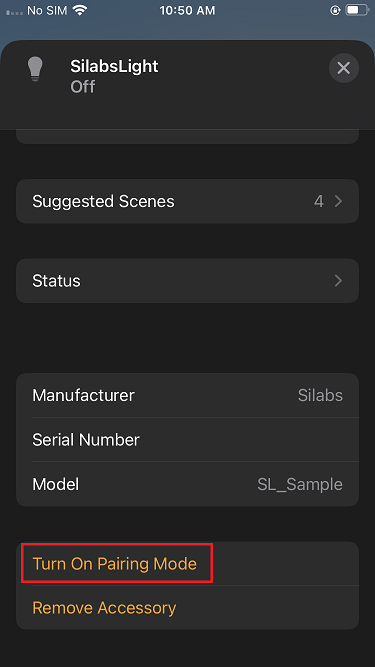
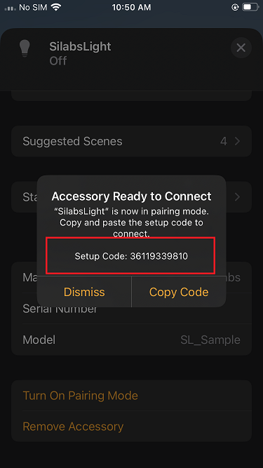
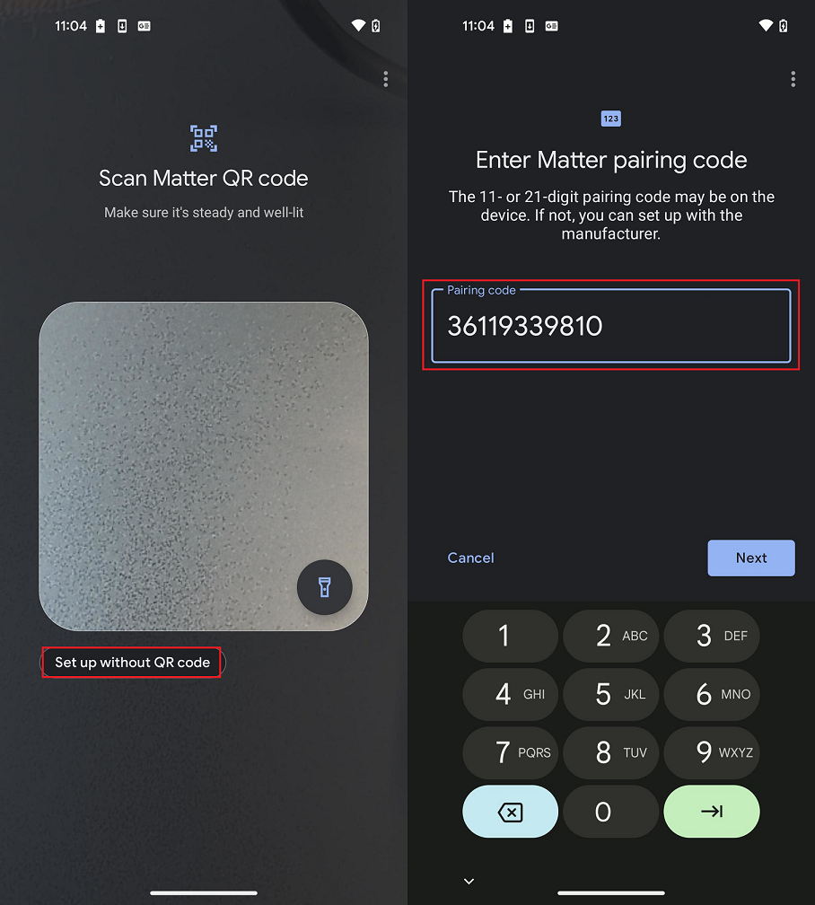

# Sharing Multi-Control over Wi-Fi Light from Apple Home Pod to Google Home Ecosystem

This phase is very similar to the [Single Controller](./singlecontroller-ecosystem). The difference is that the Matter Over Wi-Fi device will be controlled using the Apple Home Ecosystem. The process will be almost identical, with some minor difference related to Apple Home App UI.

See [How to Set Up an Apple Home Ecosystem](./apple-ecosystem-setup). Then use the following procedure to share multi-control from Apple Home to Google Home.

1. Open Apple Home App.
2. Click the Light Application to open the detailed view.
3. Scroll down at the bottom of the application detailed view.

    

4. Open the commissioning window for the Google Home Pod by clicking **Turn on Pairing Mode**.
5. The Setup Code appears, with a message printed as shown below in the Apple Home App.

    
6. Open Google Home App, click the **Devices Section**, and click **Add**.
7. Click **Set up without QR Code** and insert the setup code displayed in Step 5.

    

8. Commissioning will start and proceed in the same way as explained in [Google Ecosystem Setup and Demo Execution](./google-ecosystem-setup).
9. Once the commissioning is done, the new Matter Wi-Fi device should be visible in the Room view of the Google Home App.