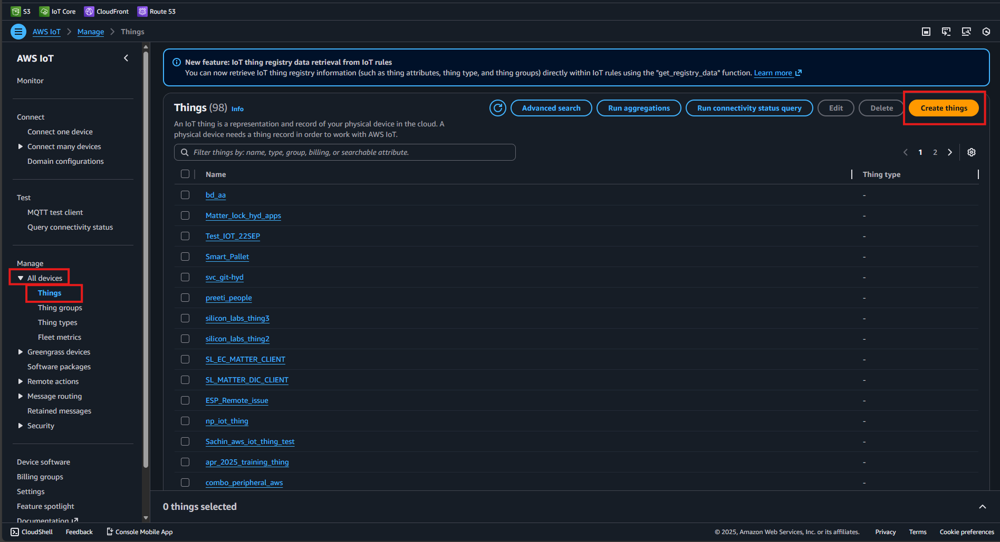
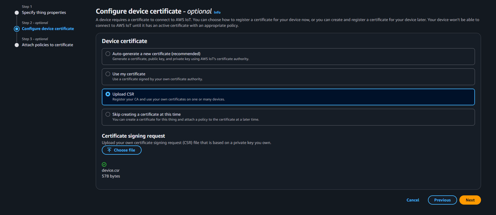
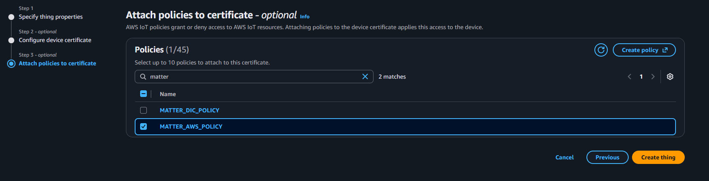

# Amazon Web Services (AWS)

Amazon Web Services offers reliable, scalable, and inexpensive cloud computing services. Refer to [AWS Documentation](https://aws.amazon.com/what-is-aws/) for more details.

## AWS CA Certificate Registration

1. Open [AWS](https://aws.amazon.com/).
2. Log in using your AWS credentials.
3. Go to **AWS IoT**
4. In the left panel, go to **Security > Policies** and select **Create Policy**. 

Enter the policy name (e.g., `MATTER_AWS_POLICY_`). In the policy statements, select **JSON** and replace the contents with the JSON provided below:

    ```shell
     {
       "Version": "2012-10-17",
       "Statement": [
        {
          "Effect": "Allow",
          "Action": "*",
          "Resource": "*"
        }
      ]
     }
    ```

5. Once done, select **Create**.

6. Create a client CSR certificate and a client key by following the steps in the [OpenSSL Certificate Creation](./openssl-certificate-creation.md) documentation.

7. Complete the following steps to create a thing and generate certificates for your Matter application to use in the `MatterAwsNvmCert.cpp` source file:

    - Go to **All Devices > Things** and select **Create Things**.
    
    - Select **Create Single Thing** and click **Next**.
    - Under **Info > Give the thing a name**, specify the thing name (this will be the client ID), then click **Next**.
    - (Optional) Configure the device certificate under  **Info > Upload CSR**.
    - In **Certificate > Choose file** (Choose Client CSR generated in Openssl Certificate Creation ex: `device.csr`). Click **Next**. 
       
    - Use the policy (e.g., `MATTER_AWS_POLICY_`) created in AWS Certificate creation.
       
    - Once the thing is successfully created, click on view certificate - 
       
       Next, activate and download the certificate.
       

8. Copy the contents of [AWS_CA CERT](https://www.amazontrust.com/repository/AmazonRootCA3.pem) and add it as CA certificate in `examples/platform/silabs/matter_aws/matter_aws_interface/include/MatterAwsNvmCert.cpp`. 
   ```cpp
   char ca_certificate[]     = {
    "-----BEGIN CERTIFICATE-----\r\n"
    "MIIBtjCCAVugAwIBAgITBmyf1XSXNmY/Owua2eiedgPySjAKBggqhkjOPQQDAjA5\r\n"
    "MQswCQYDVQQGEwJVUzEPMA0GA1UEChMGQW1hem9uMRkwFwYDVQQDExBBbWF6b24g\r\n"
    "Um9vdCBDQSAzMB4XDTE1MDUyNjAwMDAwMFoXDTQwMDUyNjAwMDAwMFowOTELMAkG\r\n"
    "A1UEBhMCVVMxDzANBgNVBAoTBkFtYXpvbjEZMBcGA1UEAxMQQW1hem9uIFJvb3Qg\r\n"
    "Q0EgMzBZMBMGByqGSM49AgEGCCqGSM49AwEHA0IABCmXp8ZBf8ANm+gBG1bG8lKl\r\n"
    "ui2yEujSLtf6ycXYqm0fc4E7O5hrOXwzpcVOho6AF2hiRVd9RFgdszflZwjrZt6j\r\n"
    "QjBAMA8GA1UdEwEB/wQFMAMBAf8wDgYDVR0PAQH/BAQDAgGGMB0GA1UdDgQWBBSr\r\n"
    "ttvXBp43rDCGB5Fwx5zEGbF4wDAKBggqhkjOPQQDAgNJADBGAiEA4IWSoxe3jfkr\r\n"
    "BqWTrBqYaGFy+uGh0PsceGCmQ5nFuMQCIQCcAu/xlJyzlvnrxir4tiz+OpAUFteM\r\n"
    "YyRIHN8wfdVoOw==\r\n"
    "-----END CERTIFICATE-----\r\n"
    };
   ```

1.  Repeat Step 6 to create a new thing for use in MQTT Explorer, using the certificate generated for MQTT Explorer during OpenSLL certificate creation (e.g., `explorer.csr`). Create a `.pem` file from the CA certificate in step 8 and use it as the server certificate in MQTT Explorer.

    **Note**: The thing name must be unique as it will be used as the client ID.
