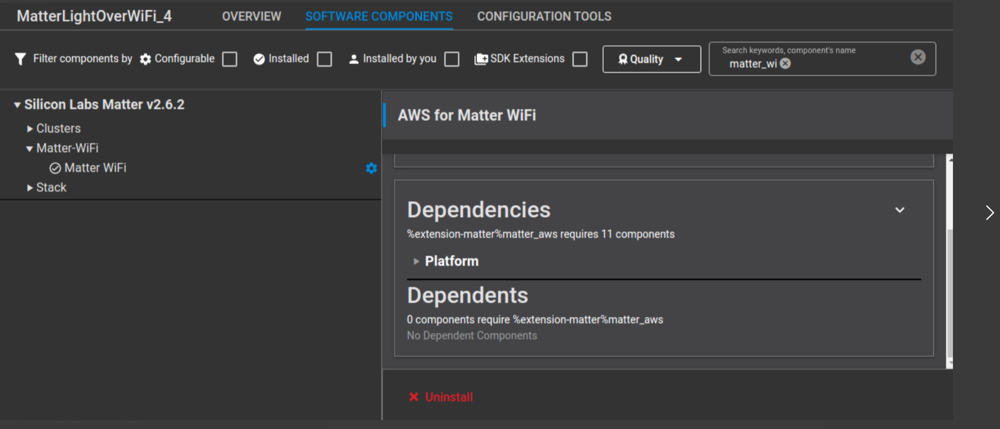
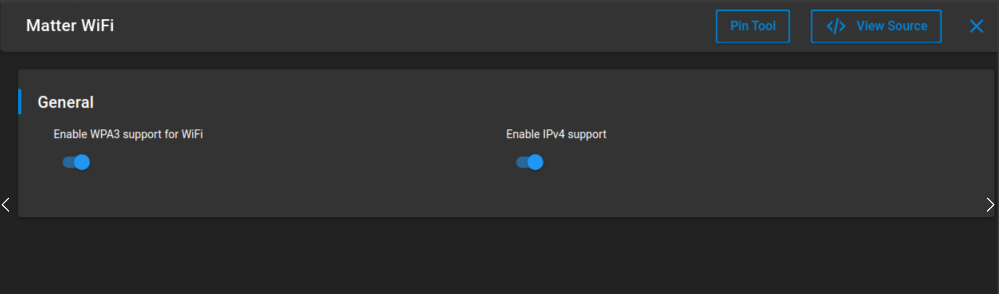
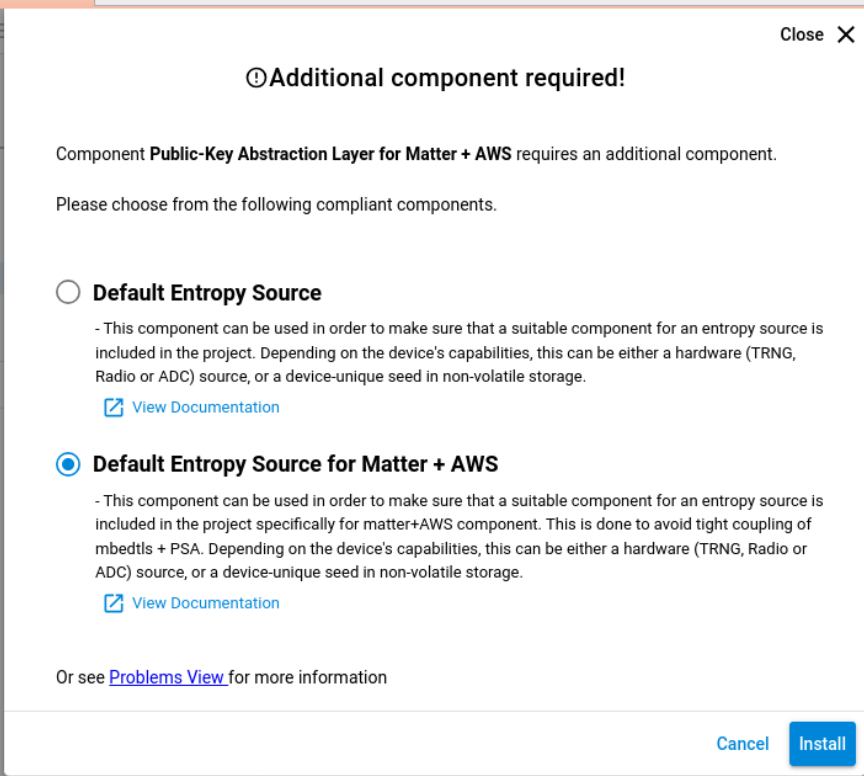
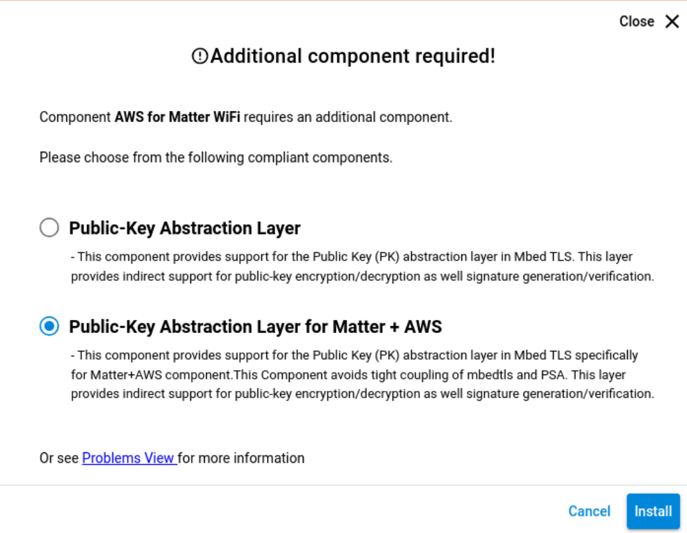
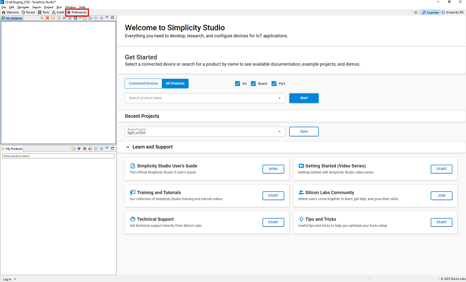
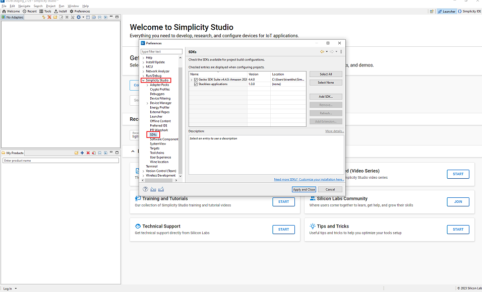
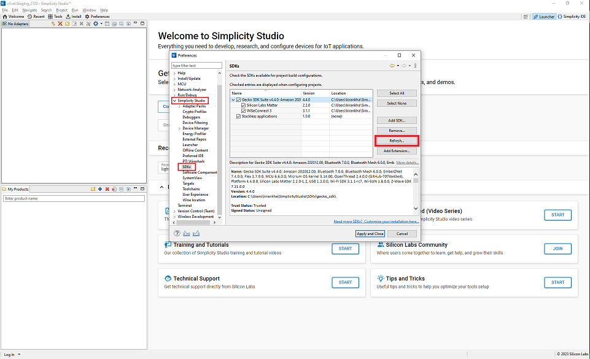

# Build Procedure For Matter + AWS

The following components are common for all apps and should be modified in the corresponding app specific .slcp file.

## How to Add the Matter + AWS Component

To add the Matter + AWS component, modify the corresponding app specific .slcp file.

```shell
  - id: matter_aws
    from: matter
```
To add component in Simplicity Studio, add below components.

- Go to Software components, search for Matter_Wifi. Click on Settings symbol beside Matter Wifi component in the left panel and enable IPV4 configuration.
    
    

- Go to Software Components, search for aws and install matter aws component.

- Next select the dependencies for matter aws component.
 
 

## How to Add the Matter + AWS Server, Client, Cluster Details.

- Add the Server ID, CLient Id and Cluster Info in `MatterAwsConfig.h`.
    - update AWS server name at #define MATTER_AWS_SERVER_HOST ""
    - update client ID at #define MATTER_AWS_CLIENT_ID ""
    - update intrested cluster at #define ZCL_USING_THERMOSTAT_CLUSTER_SERVER


## Building Matter + AWS Application

- After modification in the **.slcp** Project file as above step, refresh the **matter-extension** in Simplicity Studio.

- Select **Preferences** in the **Launcher** tab.

 

- Expand Simplicity Studio section and click on **SDKs** Tab.

 

- Expand **Simplicity SDK** and click the **Refresh** button from side menu.

 

- Build the Matter + AWS application using Simplicity Studio
  - [Build SOC Application Using Studio](/matter/{build-docspace-version}/matter-wifi-run-demo/build-soc-application-using-studio)

## Compile using new/different certificates

-   Two devices should not use the same Client ID. Use a different Client ID for
    your second connection.
-   While using AWS, Change the following:
    -   Add your AWS certificates in file
        `examples/platform/silabs/matter_aws/matter_aws_interface/include/MatterAwsNvmCert.h`
        -   Provide the AWS Root CA key
            (https://www.amazontrust.com/repository/AmazonRootCA3.pem)
        -   provide device_certificate and device_key with your device cert and
            device key. Refer
            [Openssl Device Certificate Creation] (./openssl-certificate-creation.md)
    -   Add your AWS server and Client ID in file
        `examples/platform/silabs/matter_aws/matter_aws_interface/include/MatterAwsConfig.h`
        -   Provide `MATTER_AWS_SERVER_HOST` with your AWS Server name
        -   provide `MATTER_AWS_CLIENT_ID` with your device/thing ID
        -   provide  `ZCL_USING_THERMOSTAT_CLUSTER_SERVER` with the cluster details.
-   The preferred certificate type to use in the application is ECDSA.
-   AWS RootCA used in this PoC is
    https://www.amazontrust.com/repository/AmazonRootCA3.pem

