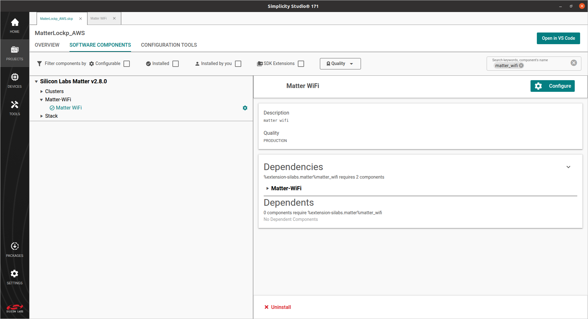
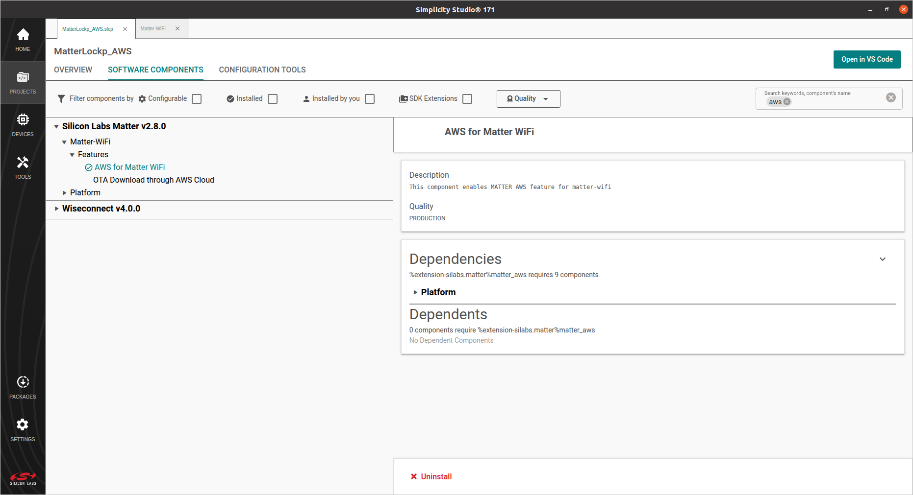
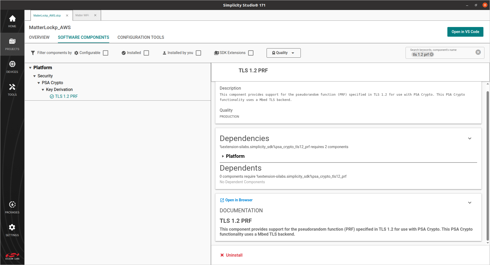
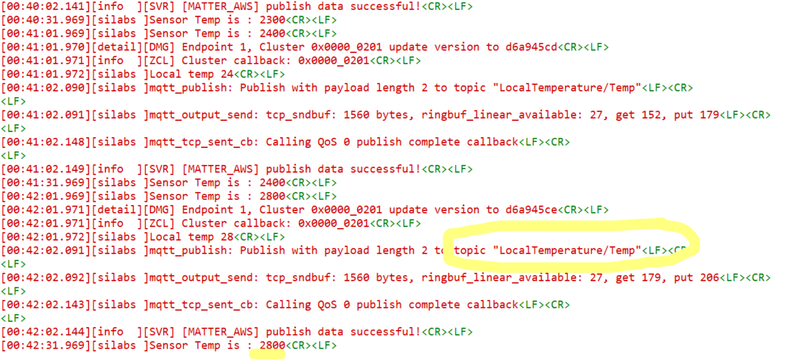

# Build Procedure For Matter + AWS

The following components are common for all apps and should be modified in the corresponding application-specific `.slcp` file using the Studio Project Configurator tool.

## How to Add the Matter + AWS Component
To enable the component in Simplicity Studio, add the following components.

- Go to **Software** components, search for `Matter_Wifi`. Click on **Settings** symbol beside Matter Wi-fi component in the left panel or the **Configure** option and enable IPV4 configuration.
    
    

- In **Software Components**, search for `aws` and install the Matter AWS component.
    
- Next, select the dependencies for the Matter AWS component.
    > Note: The order can vary, but in every case select the option with "+ AWS"
 
 

### Added Step for 917 NCP
 - In **Software Components**, search for `TLS 1.2 PRF` and install the TLS 1.2 PRF component.
    

## How to Add the Matter + AWS Server, Client, Cluster Details.
- Go to the `matter_<version>/third_party/matter_sdk/examples/platform/silabs/matter_aws/matter_aws_interface/include/` folder from Project Explorer.
- Update the definitions for the server ID, client ID and cluster in `MatterAwsConfig.h`:    
    - Update the AWS server name at `#define MATTER_AWS_SERVER_HOST ""`.
    - Update the client ID at `#define MATTER_AWS_CLIENT_ID ""`.
    - Update the cluster information based on your app, with reference to the below table:

| Application Type | Cluster Definition |
|------------------|--------------------|
| Matter Thermostat | `#define ZCL_USING_THERMOSTAT_CLUSTER_SERVER` |
| Matter Light | `#define ZCL_USING_ON_OFF_CLUSTER_SERVER` |
| Matter Lock | `#define ZCL_USING_DOOR_LOCK_CLUSTER_SERVER` |
| Matter Window Covering | `#define ZCL_USING_WINDOW_COVERING_CLUSTER_SERVER` |


## Building Matter + AWS Application

- After adding the Matter + AWS component as described above, refresh the `matter-extension` in Simplicity Studio.

-  On the **Launcher** tab, select **Preferences**.

 

- Expand the **Simplicity Studio** section, and click the **SDKs** tab.

 

- Expand **Simplicity SDK**, and click **Refresh** in the side menu.

 

- Build the Matter + AWS application using Simplicity Studio as described in
  - [Build SOC Application Using Studio](/matter/{build-docspace-version}/matter-wifi-run-demo/build-soc-application-using-studio).
- After building and flashing the app, the user can see [MATTER_AWS] logs after device bootup - 
    ```console
    [00:00:23.400][info  ][SVR] [MATTER_AWS] connection callback started
    [00:00:23.690][info  ][SVR] [MATTER_AWS] MQTT connection status: 0
    [00:00:23.995][info  ][SVR] [MATTER_AWS] MQTT sub request callback: 0
    ```
    - After subscribing to a topic in AWS IoT, the user can see the publish logs -
    

## Compile using new/different certificates

-   Two devices should not use the same client ID. Use a different client ID for
    your second connection.
-   While using AWS, update the following information:
    -   Add your AWS certificates in file
        `examples/platform/silabs/matter_aws/matter_aws_interface/include/MatterAwsNvmCert.cpp`
        -   Provide the AWS Root CA key
            (https://www.amazontrust.com/repository/AmazonRootCA3.pem)
        -   Provide `device_certificate` and `device_key` with your device certificate and
            device key. For more details, refer to
            [OpenSSL Device Certificate Creation] (./openssl-certificate-creation.md)
    -   Add your AWS server and client ID information to the
        `examples/platform/silabs/matter_aws/matter_aws_interface/include/MatterAwsConfig.h` file.
        -   Provide `MATTER_AWS_SERVER_HOST` with your AWS Server name.
        -   Provide `MATTER_AWS_CLIENT_ID` with your device/thing ID.
        -   Provide  `ZCL_USING_THERMOSTAT_CLUSTER_SERVER` with the cluster details.
-   The preferred certificate type to use in the application is ECDSA.
-   AWS RootCA used in this PoC is
    https://www.amazontrust.com/repository/AmazonRootCA3.pem

