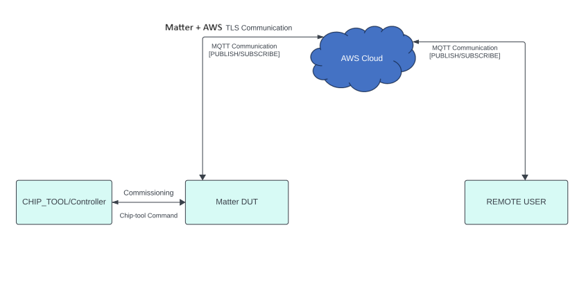
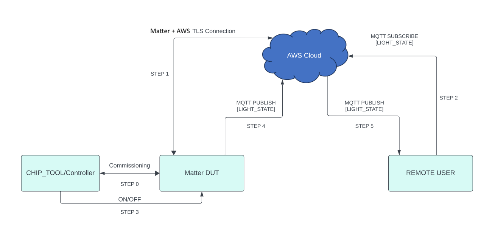
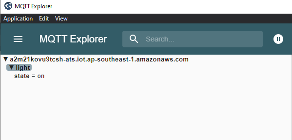
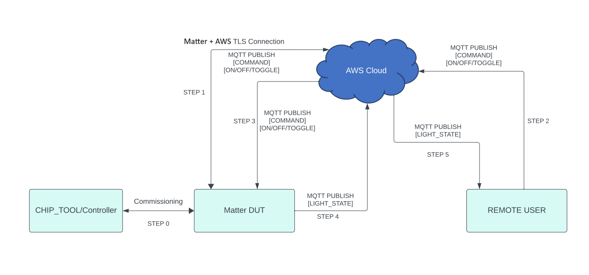
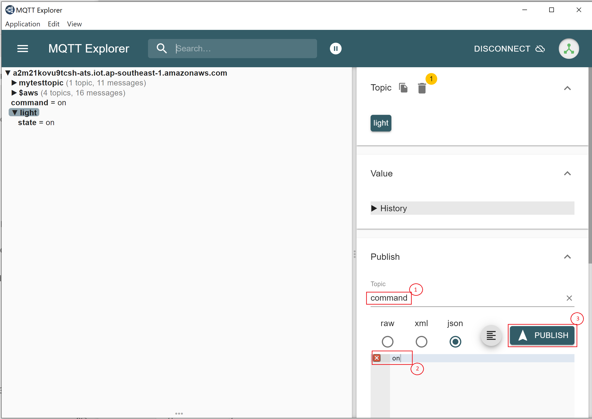

# Matter + AWS Component

-   Matter + AWS is a Silicon Labs–specific feature that enables Matter devices to connect directly to 
    proprietary cloud solutions, such as AWS Cloud.  As such, a Matter Wi-Fi device
    must support connecting locally on the Matter Fabric via IPv6 and
    connecting to the Internet via IPv4.
-   Matter devices can be controlled by chip-tool or a controller. The
    status of the modified attributes will be published to the cloud.
-   Remote users can install a cloud-specific application to receive
    notifications about the attribute status.

## Matter + AWS Feature Diagram

The following diagram shows end-to-end flow for Direct Internet Connectivity.



## Prerequisites

### Hardware Requirements

For a list of hardware requirements for the Matter + AWS feature, see the
official
[Silicon Labs Matter hardware requirements](/matter/{build-docspace-version}/matter-prerequisites/hardware-requirements)
documentation.

> **Note:** This is supported for 917 SoC and NCP boards only.

### Software Requirements

For a list of software requirements for the Matter + AWS feature, see the
official
[Silicon Labs Matter Software requirements](/matter/{build-docspace-version}/matter-prerequisites/software-requirements)
documentation.

## End-to-End Set-up bring up

### Message Queuing Telemetry Transport (MQTT)

MQTT is an OASIS standard messaging protocol for the Internet of Things
    (IoT). It is designed as an extremely lightweight publish/subscribe
    messaging transport that is ideal for connecting remote devices with a small
    code footprint and minimal network bandwidth. 
    For more details, visit https://mqtt.org/.

### Configuring the MQTT server

To set up and configure AWS for Matter + AWS support, see the following documentation:

- [AWS installation](./aws-configuration-registration.md)

### Remote User Setup (MQTT Explorer) (optional)

Remote users are used to check the state of Matter devices. In this context, MQTT Explorer acts as a remote user. For more information, see [MQTT Explorer Setup and Configuration](./mqtt-explorer-setup.md).

### Building Matter + AWS Application using Simplicity Studio

Follow the instructions in [Build MATTER + AWS](./build-matter-aws.md) to enable the MATTER + AWS feature in your application code.


## End-to-End Test of Matter + AWS Application

User Setup (MQTT Explorer):

- Sharing status of device to cloud
  - The following diagram shows the end-to-end flow for sharing status from a Matter device to the cloud.



  **Note**: For reference, the diagram shows Lighting App commands. Other application commands also can be passed.

- For the end-to-end commands to be executed from chip-tool, refer to [Running the Matter Demo Over Wi-Fi](/matter/{build-docspace-version}/matter-wifi-run-demo).
- The following application-specific attributes or states are shared to the cloud:
  - For Lighting App, On/Off Attributes
  - For Lock App, lock/unlock Attributes
  - For Windows App, lift/tilt Attributes
  - For Thermostat App, SystemMode/CurrentTemp/LocalTemperature/OccupiedCoolingSetpoint/OccupiedHeatingSetpoint Attributes
  - For On/off Plug App, On/Off Attributes
  - The MQTT Explorer UI updates the application status as shown in following image.
  
      

- Control of the device through cloud interface
  - The following diagram shows the end-to-end flow for control of the Matter device through a cloud interface.
  
      

    **Note**: For reference, the diagram shows Lighting App commands. Other application commands also can be passed.

  - Ensure that the Matter device is running and successfully commissioned. For detailed steps, refer to [Running the Matter Demo Over Wi-Fi](/matter/{build-docspace-version}/matter-wifi-run-demo).
  - To control the device, set the topic name and the commands to be executed in the MQTT Explorer for the following applications.

```shell
    - Lighting App
      - Topic: command
        - Commands:
           - toggle
           - on
           - off
    - Onoff-plug App
      - Topic: command
        - Commands:
          - toggle
          - on
          - off
    - Lock App
      - Topic: command
        - Commands:
          - lock
          - unlock
    - Thermostat App
      - Topic: command
        - Commands:
          - SetMode/value(value need to provide 1,2,3,4 ex:SetMode/1)
          - Heating/value(value need to provide 2500,2600 ex:HeatingSetPoint/2500)
          - Cooling/value(value need to provide 2500,2600 ex:CoolingSetPoint/2500)
    - Window App
      - Topic: command
        - Commands:
          - Lift/value(value need to provide in range 1000 to 10000)
          - Tilt/value(value need to provide in range 1000 to 10000)
```

- Click **Publish** to execute the command.


