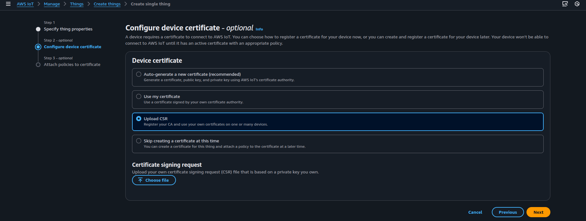

# OpenSSL Certificate Creation

An SSL certificate is an important way to secure user information and protect against hackers.

## Openssl Installation (In ubuntu 22.04)

1. To install OpenSSL (v 3.0.2), issue the following command:  `sudo apt install openssl`

## Certificates Creation

Use the following commands to generate certificates:

1. **Generate the client key:**
    - `openssl ecparam -name prime256v1 -genkey -noout -out device.key`
2. **Generate the client certificate** (e.g., `device.crt` and `device.key`) using a CA
   certficate:
    - `openssl req -new -out device.csr -key device.key`
3. **Upload CSR to AWS**: While creating the AWS IoT thing, use the **Upload CSR** option in the configure device
   certificate step. Once the CSR generated in step 2 is uploaded, AWS will
   generate an AWS CA-authenticated `device.crt`.
   

To use MQTT Explorer, repeat steps 1 and 2 to create an additional set of certificates 
(e.g., `explorer.crt` and `explorer.key`). Use a different name to uniquely identify the certificates.
