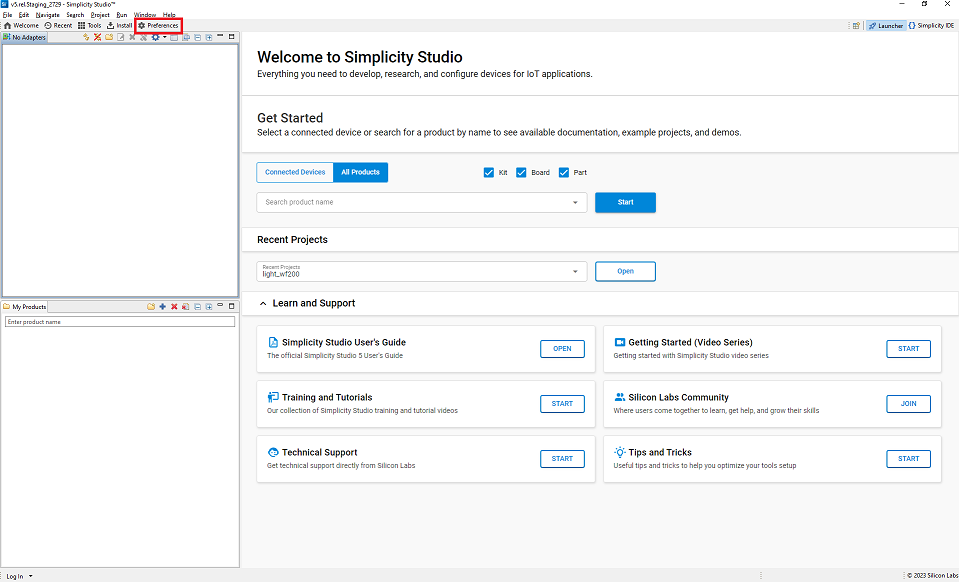
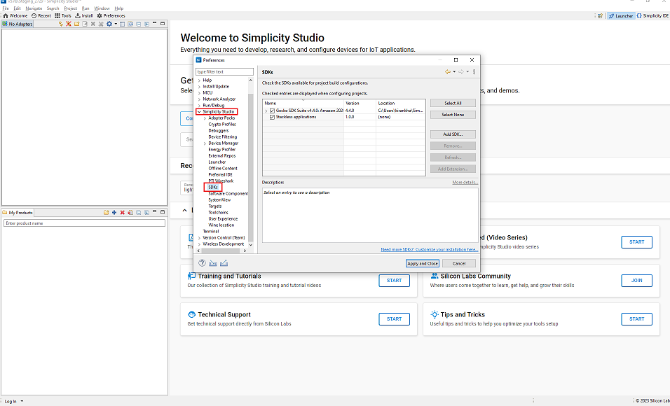
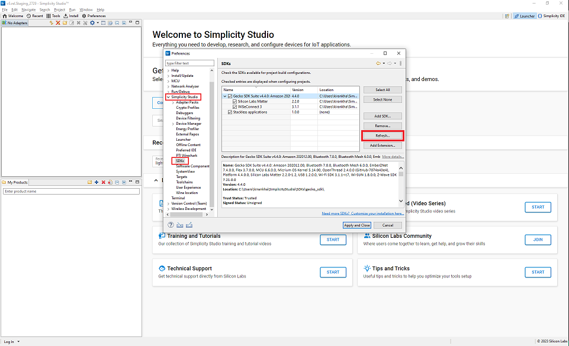

# Build Procedure For Wi-Fi Direct Internet Connectivity (DIC)

The following components are common for all apps and should be modified in the corresponding app specific .slcp file.

## How to Add the DIC Component

To add DIC Component, modify corresponding app specific .slcp file.

```shell
  - id: matter_dic
    from: matter
```

## How to Add the DIC AWS OTA Component

To add DIC AWS OTA Component, modify corresponding app specific .slcp file.

```shell
  - id: aws_ota_wifi_dic
    from: matter
```

Note:- Building with aws_ota_wifi_dic component enables matter_dic component by default.

## Building DIC Application

- After Modification in **.slcp** Project file as above step, refresh the **matter-extension** in Simplicity Studio.

- Select **Preferences** in **Launcher** tab.

  

- Expand Simplicity Studio section and click on **SDKs** Tab.

  

- Expand **Gecko SDK** and click the **Refresh** button from side menu.

  

- Build the DIC application using Simplicity Studio
  - [Build EFx32 Application Using Studio](/matter/<docspace-docleaf-version>/matter-wifi-run-demo/build-efx32-application-using-studio)
  - [Build SOC Application Using Studio](/matter/<docspace-docleaf-version>/matter-wifi-run-demo/build-soc-application-using-studio)

## Compile Using New/Different Certificates

- Two devices should not use the same `DIC_CLIENT_ID`. To use a different Client ID for your second connection, do the following:
- If using AWS, change the following file `matter_extension/examples/platform/silabs/DIC/matter_abs_interface/src/dic_nvm_cert.cpp` under `#if USE_AWS`.
  - Use device_certificate and device_key with your device cert and device key.
  - Use `DIC_CLIENT_ID` macro value with your Client ID in `matter_extension/examples/platform/silabs/DIC/matter_abs_interface/inc/dic_config.h`
  - The preferred certificate type to use in the application is ECDSA.
  - If using mosquitto, change the following file `matter_extension/examples/platform/silabs/DIC/matter_abs_interface/src/dic_nvm_cert.cpp` enable `USE_MOSQUITTO` and disable `USE_AWS`.
- Under `#if USE_MOSQUITTO`
  - Use ca_certificate, device_certificate and device_key with your ca_certificate, device cert and device key.
  - Use `DIC_CLIENT_ID` macro value with your Client ID.
- The preferred certificate type to use in the application is ECDSA.
