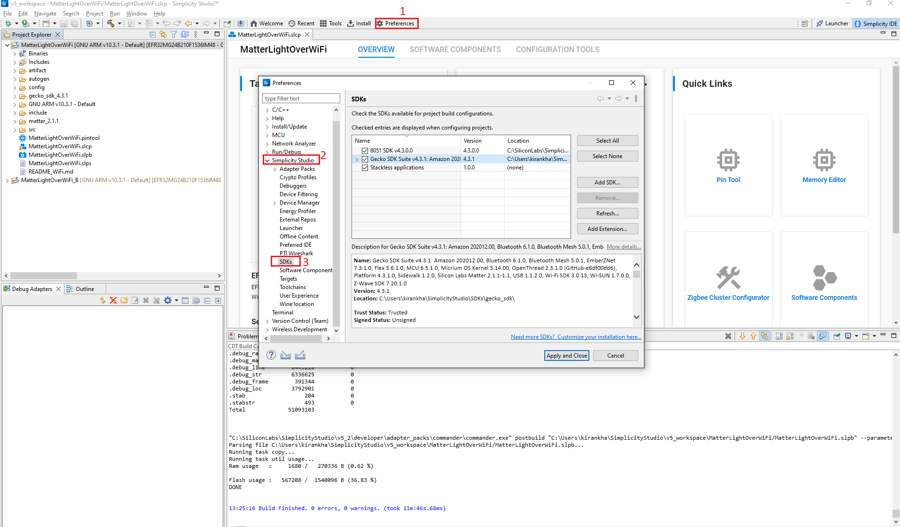
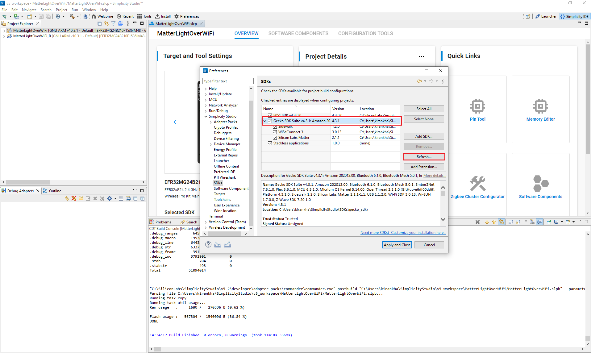
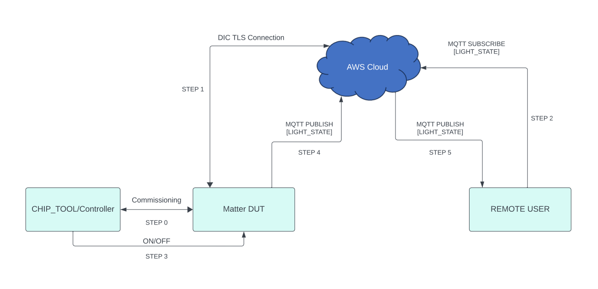

# Matter Wi-Fi Direct Internet Connectivity

Direct Internet Connectivity (DIC) is a Silicon Labs-only feature to connect Matter devices to proprietary cloud solutions (eg, AWS, GCP, Apple) directly. As such, a Matter Wi-Fi device must support connecting locally on the Matter Fabric, via IPv6, and connecting to the Internet via IPv4.

- Matter devices can be controlled by chip-tool or controller, and the respective status of the attribute modified will be published to the cloud.
- Remote users can install the cloud-specific application to get the notifications on the attribute status and to control the device.

## DIC Feature Diagram

The following diagram illustrates the end-to-end flow for Direct Internet Connectivity.


## Prerequisites

### Hardware Requirements

For the hardware required for the DIC feature to run on the Silicon Labs Platform, refer to [Matter Hardware Requirements](/matter/<docspace-docleaf-version>/matter-prerequisites/hardware-requirements).

### Software Requirements

To run the DIC feature, refer to [Software Requirements](/matter/<docspace-docleaf-version>/matter-prerequisites/software-requirements).

## End-to-End Set-Up Bring Up

### Message Queuing Telemetry Transport (MQTT)

MQTT is an OASIS standard messaging protocol for the Internet of Things (IoT). It is designed as an extremely lightweight publish/subscribe messaging transport that is ideal for connecting remote devices with a small code footprint and minimal network bandwidth. Refer to [https://mqtt.org/](https://mqtt.org/) for more details.

### Configuring the MQTT server

To set up and configure AWS or Mosquitto for DIC support, see the following documentation:

- [AWS installation](./aws-configuration-registration.md)
- [Mosquitto installation](./mosquitto-setup.md)

### Remote User Setup (MQTT Explorer)

A remote user is used to check the state of a Matter device. In this context, MQTT explorer is used as a remote user. See [MQTT explorer setup and configuration](./mqtt-explorer-setup.md).

### Building Matter DIC Application using Simplicity Studio

1. Follow instructions in [Build DIC](./build-dic.md) to enable the DIC feature in code.

2. After enabling DIC in the Matter extension code, click **Preferences** and then click **SDKs** in Simplicity Studio.

    

3. In the **SDKs** tab, click  **Simplicity SDK** and click **Refresh**. It will refresh the Matter extension code for changes made in step 1.

    

4. After refreshing the Matter extension, create and build a project for the Silicon Labs Device Platform. Refer to the following:

    - [Creating and Building Project for NCP Board](/matter/<docspace-docleaf-version>/matter-wifi-getting-started-example/getting-started-efx32-ncp#building-and-flashing-an-application)
    - [Creating and Building Project for SoC Board](/matter/<docspace-docleaf-version>/matter-wifi-getting-started-example/getting-started-with-soc#building-the-917-soc-matter-accessory-devices-using-simplicity-studio)

**Note**: Matter extension code is located at the following location: `C:\Users\system_name\SimplicityStudio\SDKs\simplicity_sdk\extension`.

## End-to-End Test of DIC Application

User Setup (MQTT Explorer):

- Sharing status of device to cloud
  - The following diagram shows the end-to-end flow for sharing status from a Matter device to the Cloud.



  **Note**: For reference, Lighting App commands are given in the above image. Other application commands also can be passed.

- For the end-to-end commands to be executed from chip-tool, refer to [Running the Matter Demo Over Wi-Fi](/matter/<docspace-docleaf-version>/matter-wifi-run-demo).
- Below are the application-specific attributes or states shared to the cloud:
  - For Lighting App, On/Off Attributes
  - For Lock App, lock/unlock Attributes
  - For Windows App, lift/tilt Attributes
  - For Thermostat App, SystemMode/CurrentTemp/LocalTemperature/OccupiedCoolingSetpoint/OccupiedHeatingSetpoint Attributes
  - For On/off Plug App, On/Off Attributes
  - Application status would be updated on the mqtt_explorer UI, as shown in below image.
  
      

- Control of the device through cloud interface
  - The diagram below shows the end-to-end flow for control of the Matter device through a cloud interface.
  
      

    **Note**: For reference, Lighting App commands are shown in the above image. Similarly, other application commands also can be passed.

  - Make sure the Matter device is up and commissioned successfully. Refer to [Running the Matter Demo Over Wi-Fi](/matter/<docspace-docleaf-version>/matter-wifi-run-demo).
  - For controlling the device, set topic name and the commands to be executed in the mqtt_explorer for the following applications.

```shell
    - Lighting App
      - Topic: command
        - Commands:
           - toggle
           - on
           - off
    - Onoff-plug App
      - Topic: command
        - Commands:
          - toggle
          - on
          - off
    - Lock App
      - Topic: command
        - Commands:
          - lock
          - unlock
    - Thermostat App
      - Topic: command
        - Commands:
          - SetMode/value(value need to provide 1,2,3,4 ex:SetMode/1)
          - Heating/value(value need to provide 2500,2600 ex:HeatingSetPoint/2500)
          - Cooling/value(value need to provide 2500,2600 ex:CoolingSetPoint/2500)
    - Window App
      - Topic: command
        - Commands:
          - Lift/value(value need to provide in range 1000 to 10000)
          - Tilt/value(value need to provide in range 1000 to 10000)
```

- Click **Publish** to execute the command.


- Download AWS OTA Image through a cloud interface.
  
  - The diagram below provides the end to end flow of the firmware upgrade feature through AWS.

  

  - Make sure the Matter device is up and commissioned successfully. Refer to [Running the Matter Demo Over Wi-Fi](/matter/<docspace-docleaf-version>/matter-wifi-run-demo).
  
  - Make sure the device is connected to the MQTT Server successfully.
  
  - Create an AWS OTA Job on the AWS website. Refer to [How to create AWS OTA job](./aws-configuration-registration.md).
  
  - Trigger the OTA command through MQTT Explorer like below.
  
  - Click **Publish** to execute the AWS OTA command.
  
  
