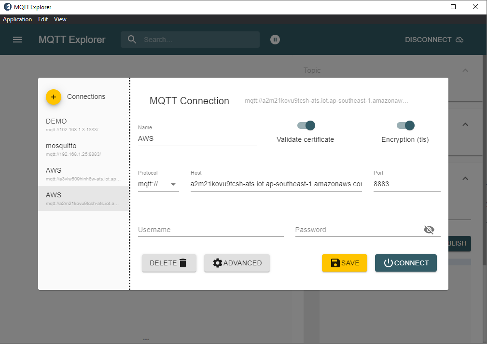
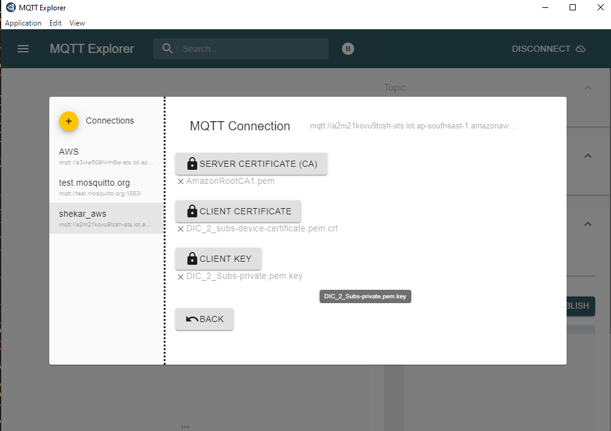
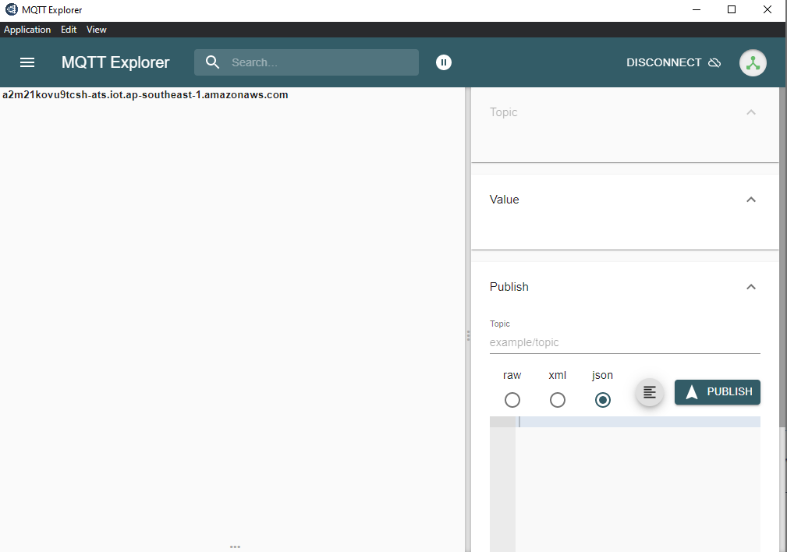

# Set Up MQTT Explorer

Download and install the MQTT Explorer from https://mqtt-explorer.com/.

## Connecting to MQTT Server

### Connecting to AWS

- Host: Your Host name (examples: a2m21kovu9tcsh-ats.iot.ap-southeast-1.amazonaws.com)
- Port: 8883
- Make sure you enable **Validate Certificate and Encryption**
- Click **Advanced Settings**
  

- Add application specific topics as shown below
  - For Lighting app, topic to be added (light/*)
  - For onoff plug app, topic to be added (light/*)
  - For Lock app, topic to be added (lock/*)
  - For thermostat app, below topics to be added
    - LocalTemperature/*
    - OccupiedCoolingSetpoint/*
    - OccupiedHeatingSetpoint/*
    - thermostat/*
  - For Windows app, below topics to be added
    - lift/*
    - tilt/*
- MQTT Client ID depends on the certificate set that you will use.
- Add the Certificate, following step 7 in [AWS installation](./aws-configuration-registration.md).

- Once the above steps are done, try connecting to AWS.

  
### Connecting to Mosquitto Connection

- Host : Your Mosquitto ip address
- Port : 8883
- Make sure you enable Validate Certificate and Encryption
- Click **Advanced Settings**

- Add application specific topics as shown below
  - For Lighting app, topic to be added (light/*)
    - For onoff plug app, topic to be added (light/*)
    - For Lock app, topic to be added (lock/*)
    - For thermostat app, below topics to be added
      - LocalTemperature/*
      - OccupiedCoolingSetpoint/*
      - OccupiedHeatingSetpoint/*
      - thermostat/*
    - For Windows app, below topics to be added
      - lift/*
      - tilt/*
  - MQTT Client ID depends on the certificate set that you will use.
  - Add the Certificate, following step 5 in [openssl certificate create](./openssl-certificate-creation.md).

