# Using Custom Part Manufacturing Services (CPMS)

Silicon Labs offers Matter support through our [Custom Part Manufacturing Services (CPMS)](https://docs.silabs.com/iot-security/latest/iot-security-cpms/). Your organization can order your Matter devices directly from Silicon Labs or a third-party vendor utilizing our CPMS services. Silicon Labs is one of the few providers that can program your firmware and DACs directly to silicon through secure automation with our partner, Kudelski IoT.

## What is CPMS?

CPMS allows you to customize Silicon Labs hardware – wireless SoCs, modules, MCUs – at the factory. The CPMS self-service web portal guides you through the customization process and its various customizable features and settings. You can place orders for customized test and production units from our factories, securely via the CPMS portal.

Unlike traditional flash programming, CPMS is a secure provisioning service that enables you to customize your chips with highly advanced features. These include secure boot, secure debug, encrypted OTA, public, private, and secret keys, secure identity certificates, and more. The custom features, identities, and certificates are injected into the hardware securely, quickly, and cost efficiently through Silicon Lab's own factories.

## Why CPMS?

Securing an IoT device is a highly complicated and costly process. You must generate public and private keys for secure boot and secure debug, sign code with a private key, store all the private keys in a Hardware Security Module (HSM), place the public keys for secure boot and secure debug in one-time-programmable (OTP) memory, flip OTP bits for secure boot and secure debug, and flash the encrypted code and identity certificates within the hardware. CPMS streamlines the programming part of this process for you. Even the most advanced security features, certificates, and identities can be programmed in a secure, fast, and cost-efficient way in Silicon Lab's factories.

## How Does Matter Fit into the CPMS Equation?

Silicon Labs is one of the few IoT-embedded solution providers at this time offering a secure provisioning service for Matter devices at scale. Silicon Labs has partnered with [Kudelski IoT](./01-matter-cpms-kudelski.md) to provide scalable access to Device Attestation Certificates (DACs) for your Matter devices. Kudelski has "30+ years of experience securely provisioning more than 500 million devices". Rest assured that your secrets are stored in HSMs both on and offline to provide maximum security for your secret key material. Learn more about [Security](https://www.kudelski-iot.com/services-and-systems/matter-paa-pai).

CPMS allows you to configure your device and receive production samples for a minimal cost before making a full production order. To configure your Matter settings, there are two ways to accomplish this with Silicon Labs tooling.

If your organization uses [Simplicity Studio](https://www.silabs.com/developers/simplicity-studio), Silicon Lab's IoT IDE, we have provided a built-in utility that will output a JSON formatted data file that can be uploaded directly into CPMS. This data file will fill out the necessary Matter information for you. This is the preferred method as it reduces the potential for errors and/or typos.

The second method is to simply provide the required information through the CPMS web forms. This is a minimal process that includes important attestation information such as your VID (Vendor ID), PID (Product ID), CD (Certification Declaration), and other inputs required to generate the Matter certificate chain.

CPMS has automated integrations with Kudelski to obtain the unique DACs for each device at the time of manufacturing. All data remains encrypted throughout the entire process through secure channels between Kudelski and Silicon Labs.

## I'm Ready to Get my Product to Market. What is Needed by CPMS?

CPMS will ask for various attributes about your device, but these are the primary elements that will be needed for proper certificate generation.

- Vendor ID: Your unique VID will be required by CPMS to properly generate the necessary PKI infrastructure to allow your device on the Matter network.

- Product ID: Your organization will need to provide a unique PID that will be used to identify this product on the network.

- Certification Declaration: This is a cryptographic document that is issued to you by Connectivity Standards Alliance after your device has been successfully certified by an approved testing facility.

## Pre-Production Checklist

1. Choose a Matter-capable part to develop your Matter application on.

2. Become a [Connectivity Standards Alliance member](https://csa-iot.org/become-member/) if your organization is not already a member. An associate-level membership or higher is required to obtain membership perks, certification, and a Vendor ID. See [Device Development Prerequisites](/matter/{build-docspace-version}/matter-device-dev-prereqs). If you have not been through these steps, please ensure ample time to get this step done before you are ready to go to production.

3. If you are already a Connectivity Standards Alliance member, make sure that you have been supplied a VID from Connectivity Standards Alliance. If not, contact Connectivity Standards Alliance to obtain a VID. The VID should also have been added to the [Distributed Compliance Ledger (DCL)](https://webui.dcl.csa-iot.org/).

4. Confirm that your VID has been added to the [DCL](https://webui.dcl.csa-iot.org/).

5. As a device maker and Connectivity Standards Alliance member, you should add information about your device to the ledger before shipping your device to the market. If this is not available at the time of release, your devices will not attest properly.

6. Your application has been developed and is ready for certification.

7. Using the [Pre-certification tool](https://csa-iot.org/certification/tools/certification-tool/), you can test your application for completeness before submitting your application for certification. Save your organization time and money by pre-certifying your application before submitting it for certification.

8. Submit your application for certification to a [Approved testing facility](https://csa-iot.org/certification/testing-providers/) for your product type. Once certified, you will be issued a **Certification Declaration (CD)**. This is a cryptographic document stating that your device has successfully been certified and is used in conjunction with the Matter certificate chain to attest to the Matter network. This file should be in a .der format.

9. Begin the process of setting up an account with Kudelski IoT as a provider of DACs. Note: Kudelski provides DACs on the Test DCL for no charge. [Learn more about our partnership](./01-matter-cpms-kudelski.md) with Kudelski IoT for Matter devices.

10. Ensure that you have the CD in hand. This will need to be uploaded to CPMS. For a production device, this will need to be the fully accredited CD from an approved test facility.

11. You're ready to order samples with [CPMS](https://console.silabs.com/cpms)!

## CPMS Matter Production Guide (Do's and Don'ts)

Producing products for Matter can be a challenge. Here are a few suggestions to keep in mind when readying your product for production.

1. Your Matter application should be built to work on the device that you are specifically targeting. For example, an application built for a 10dBm power output part will not work on a 20dBm part. You will need to build and test your application on the specific target device to ensure that your application will work properly.
2. CPMS stores Matter attestation data in the last six pages of flash. Of those six pages, Matter certificates and the CD are stored in the last page of flash. Other Matter attestation data is located in the NVM3 block. Below is an example memory map describing how Matter attestation data is programmed.

    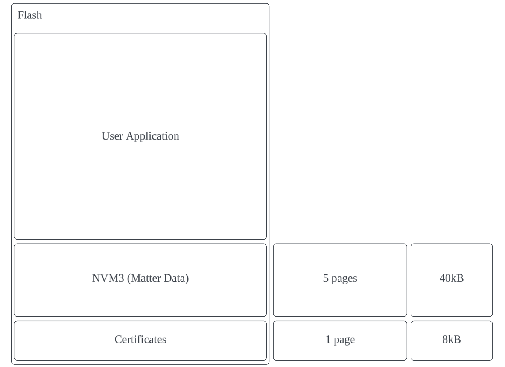

3. If a part has been programmed in CPMS with standard debug lock, this **MUST NOT** be unlocked if you are expecting to commission this device in the future.  By unlocking this, **all pages in flash will be erased**, including the Matter device attestation data and certificates.  We recommend using Secure Debug Lock in production so that you will have access to debug if required.

4. During a typical Matter development journey, your project was most likely created with a default set of attestation data and certificates to be used during development. These should work great for testing our projects while in development, but will not work in production.

    Once a part is created in CPMS, production certificates and attestation data are dynamically provisioned onto the part.  If, for any reason, the certificates commissioned through CPMS are erased, the device could commission through a false positive by defaulting to the development certificates.  These will not be able to attest to a production Matter network.  The QR code and scanner can be used to display the VID/PID and other helpful information to help establish which credentials are being used.

## Choosing the Test DCL or Production DCL

There are two public ledgers available to developers known as the Matter Distributed Compliance Ledger (DCL). The DCL is a cryptographically secure ledger based on blockchain technology. This ledger preserves an immutable record that stores public information that can be retrieved by DCL clients. For more details, see the [Matter DCL whitepaper](https://csa-iot.org/developer-resource/white-paper-distributed-compliance-ledger/). Each DCL contains five schemas that can be accessed by a client to retrieve information about a device.

- Vendor Info Schema: This schema provides public information about the device vendor such as the VID, Vendor Name, and Company Legal Name.

- Device Model Schema: This schema provides public information about the actual device such as the Product Name, PID, VID, and more.

- Device Software Version Model Schema: This schema provides public information about software-specific data about the device such as Release Notes URL, OTA software image URL, and more.

- Compliance Schema: This schema provides public information about the certification of a device such as the VID, PID, Software Version, CD Certificate ID, and more.

- PAA Schema: This schema provides information about valid Product Attestation Authority certificates for approved PAAs.

The **Test DCL**, as the name suggests, is a public Matter ledger that will allow vendors to test their devices in a test environment. Entries into the Test DCL are less rigorous than the Production DCL and can be used to test devices using test certificates provided by Matter or other valid vendors. These test certificates cannot be used on the production DCL. For the production case, you must ensure that you have the proper certificate chain in place. For CPMS, Kudelski provides Test DCL DACs at **no additional charge**. Your organization needs to ensure that an account has been created with Kudelski to order these DACs through CPMS. [Learn more here](./01-matter-cpms-kudelski.md).

If you are ready to take your device to production, you have the option to select the **Production DCL**. This is the primary [Matter DCL](https://webui.dcl.csa-iot.org/) for production devices. For your device to properly commission onto the Matter fabric, the commissioner needs to be able to verify that a valid certificate chain is in place. The information needed must be publicly available in the production DCL. The device needs to have a valid DAC signed by an approved PAI provider, and a root PAA provider. Your device also must contain a valid certification of the device, all available in the DCL. Silicon Labs partners with Kudelski IoT as a PAA provider of choice. Kudelski also signs the Product Attestation Intermediate (PAI) certificate for our customers using CPMS. Each PAI is specific to our customer's products and is created when you set up a new product on your account with Kudelski. Production DCL samples must be approved even if you have already approved Test DCL samples before going to production.

## CPMS Workflow

You've completed all of the items in the pre-production checklist and are ready to create samples. With CPMS, you get the benefit of receiving several actual samples of your product for your approval. This allows you to test the actual device before placing a large production run. Once you approve the sample, you have an Orderable Part Number (OPN) that can be used with Silicon Labs or other third-party distributors. The workflow involves the following steps:

1. To access CPMS, you need to register for an account with Silicon Labs. If you are using Simplicity Studio or other Silicon Labs tools, you probably already have this. If not, [register for a Silicon Labs account](https://community.silabs.com/SL_CommunitiesSelfReg).

2. [Login to CPMS](https://console.silabs.com/cpms).

    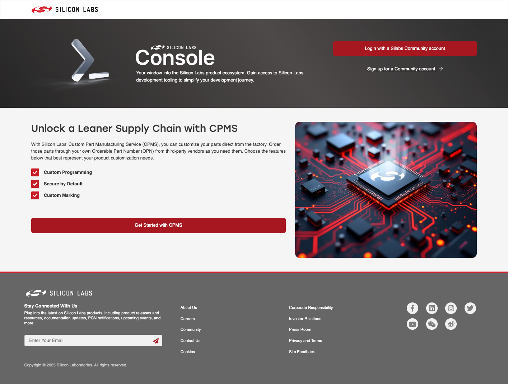

3. Create a new Custom Part by giving your part a name.

4. Select the part on which you have built your Matter application.

    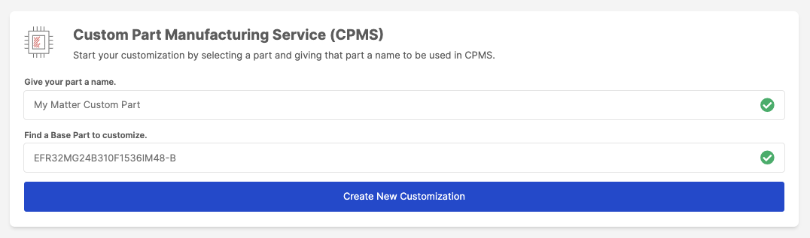

5. Click **Create New Customization** to start configuring your device. With CPMS, you have a wide range of options to work with to customize your device. Matter is only one component of this. You have full control over other features of the part itself such as debug lock/unlock, secure boot, and many other security features depending on the part selected.

6. The Matter-specific configurations can be found in the Ecosystem Identities toggle. Select the toggle to view the available ecosystems supported by your device.

    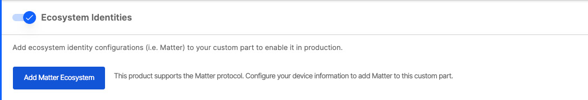

7. Add the Matter Ecosystem to your part and you will be presented with the required Matter inputs to help secure the proper PAA/PAI/DAC certificates from Kudelski. CPMS will automatically obtain the PAIs from Kudelski based on your email address domain. Any PAIs setup with Kudelski will be available for you to choose. This includes both Test and Production PAIs. You will need to select a PAI to continue.

    **Example Test DCL PAIs**
    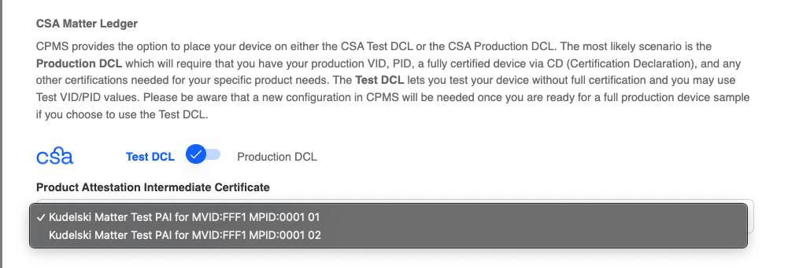

    **Example Production DCL PAIs**
    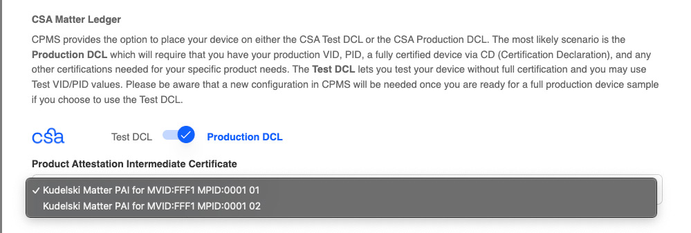

    **Example of a missing set of PAIs (test or production)**
    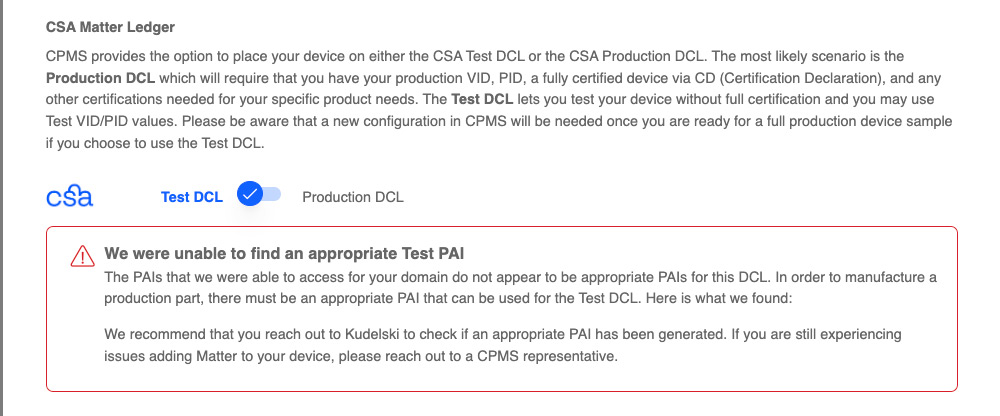

    Upon selecting a PAI from the list, the VID (and PID if applicable) will be automatically set for you further down in the customization.

    **Note:** A condition can exist where CPMS is unable to obtain PAIs from Kudelski for your company and an error is presented. This is most likely due to the system not being able to obtain PAIs from Kudelski IoT. This could be that the account has not been setup yet or the PAIs have not yet been finalized. There are a series of steps that need to complete before these are available to CPMS. Please reach out to [Kudelski IoT](https://www.kudelski-iot.com/) to check on this status and work through any remaining items.

    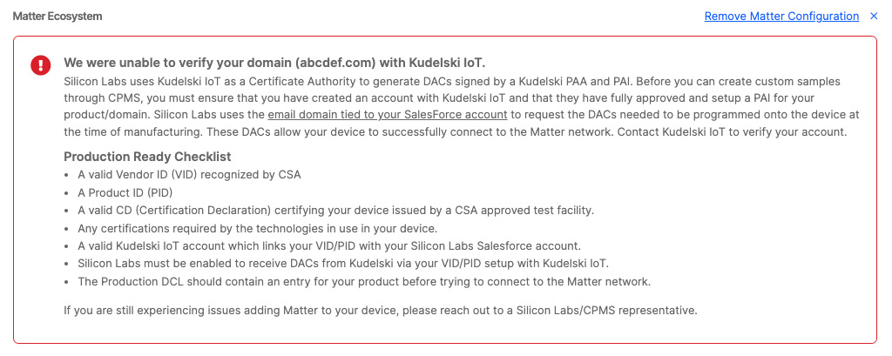

8. Upload your Certification Declaration. This is the file in .der format that you should have received after successful certification from a Connectivity Standards Alliance approved testing facility. Note: If you are creating a sample for the Production DCL, the VID (and PID if applicable) in the CD must match that of the PAI. If a mismatch occurs, the sample will not be able to properly attest to the Matter network.

    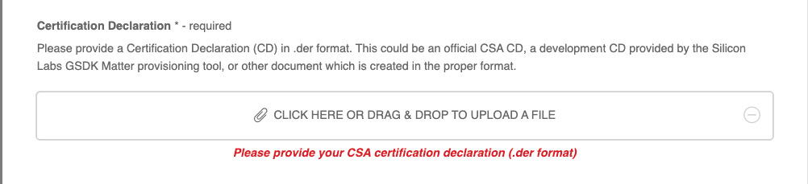

9. (optional) If you used Simplicity Studio, use the Provisioning Tool to output your Matter information directly from the application. This tool outputs a cpms.json file that can be uploaded to help you quickly fill out this information.

    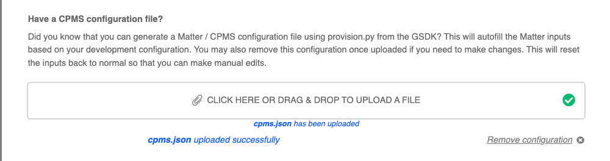

10. Fill out the required Matter fields. This includes the VID, PID, and several additional inputs to help Silicon Labs generate the appropriate certificate chain to generate and sign the DACs for your parts. If you use the cpms.json file that is generated through the Silicon Labs Matter provisioning tool, these will be automatically filled in for you. Depending on the type of PAI chosen prior to this step, the VID or the VID & PID will be automatically filled in for you and disabled to prevent any manual changes of these values. Any mismatch in VID/PID values will cause attestation problems when trying to attest to the Matter network. It is crucially important that the VID/PID in the PAI, CD, and any input values from CPMS all match when they are provisioned to the device for a production build.

    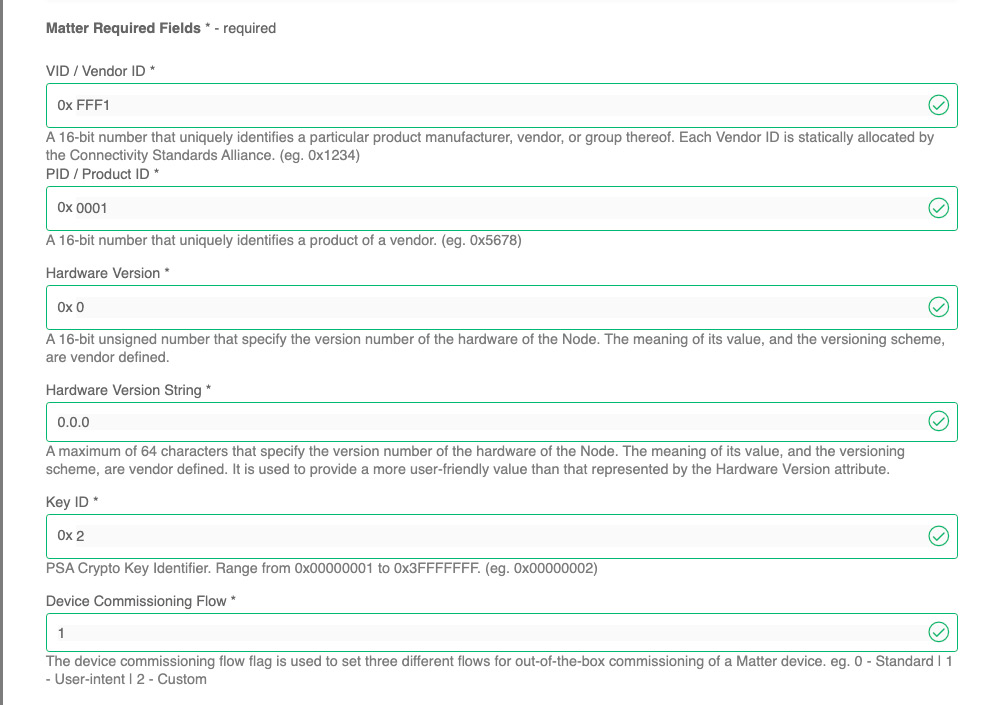

    **Note:** The PAI that you selected previously will autofill the VID and PID inputs and disable these to prevent a mismatch between the PAI and the VID/PID combination that could get entered manually. Depending on the PAI, you could have a VID-only scoped PAI which would fill only the VID value and leave the PID input open for you to fill in. If your PAI is VID & PID scoped, both of these values will be automatically filled in for you, as is the case for the scenario presented below.

    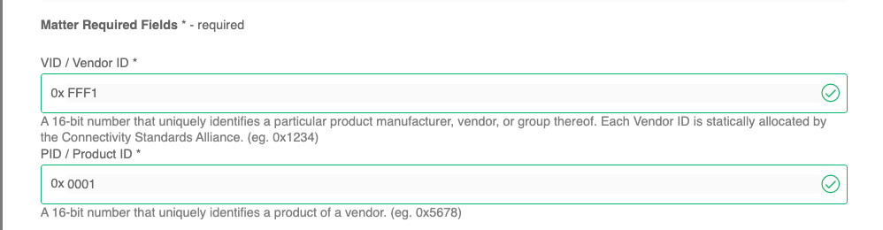

11. (optional) Fill out the Matter Optional Fields. These fields will also be automatically filled out for you if you use the cpms.json file referenced above.

    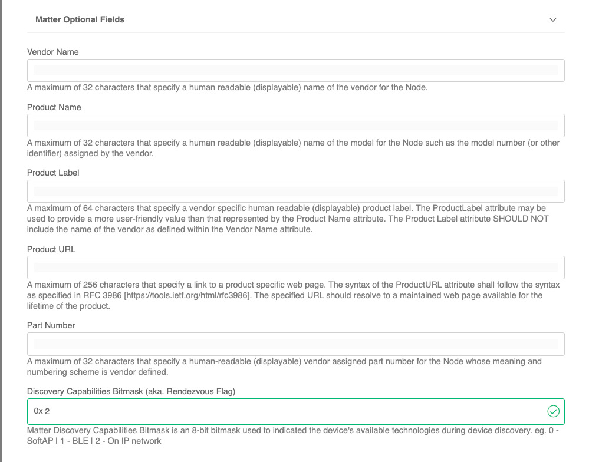

12. Once you have satisfied all of the required fields, you will be prompted to **Proceed to Review** to review the selections in your order.

    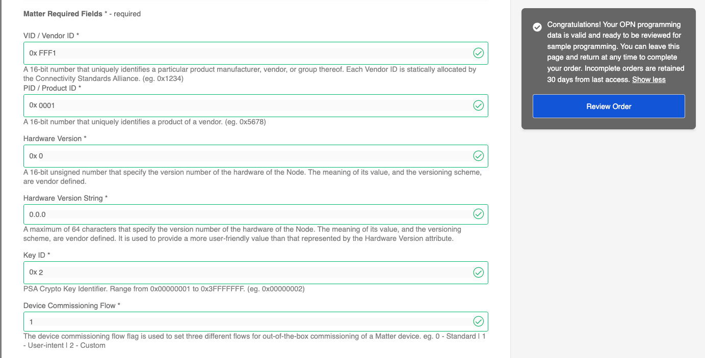

13. Review your customizations and pricing information. You may also be asked for the shipping information if this is not on file with us already. The sample orders will be shipped to this address.

14. Submit for evaluation.

15. For Matter-specific parts, Silicon Labs works with Kudelski IoT to secure the DACs for your sample parts. These DACs are signed with the proper PAA/PAI certificate chains and delivered via Secure Vault Services integrations directly with Kudelski.

16. Once the DACs are available, the order will go into Silicon Labs manufacturing to be programmed and shipped to your address once the samples are complete.

17. You can then Approve or Reject the samples once your organization is able to test the sample parts. Silicon Labs recommends at this time that you test these samples with your device commissioner to ensure that the samples can properly attest to the Matter network. Sample generation typically takes from 4 to 6 weeks to produce, assuming all of the integrations with Kudelski IoT are in place to receive DACs.

18. Once approved, you will be able to order these parts, based on the OPN for that part. You can do this through Silicon Labs or through a third-party distributor. You may also opt to work with a Silicon Labs Field Application Engineer to help get this order executed.
