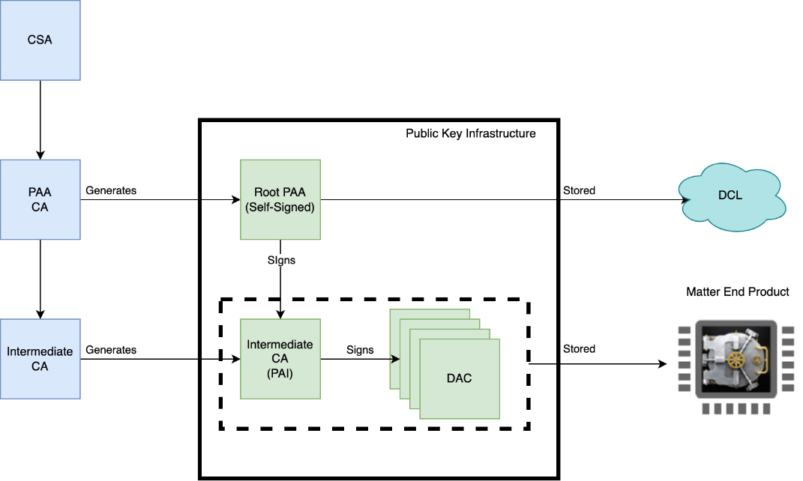

# Matter Device Attestation

## Matter Certificate Overview

For Matter devices to be commissioned into a Matter network, a Matter commissioner must verify that the devices are certified by the Connectivity Standards Alliance, this step in the Commissioning process is called Device Attestation. Each certified device must be configured with a unique Device Attestation Certificate (DAC) and its corresponding private key which will be checked by a commissioner to add this device to its Matter fabric. For a more conceptual overview of the Matter Certificates and Device Attestation Procedure, refer to [Matter Security](/matter/<docspace-docleaf-version>/matter-fundamentals-security/).

## Device Attestation Public Key Infrastructure and Certification Declaration

Device Attestation Certificates or DACs must be included in all commissionable Matter products and must be unique in each product. Device Attestation Certificates are immutable, so they must be installed in-factory and must be issued by a Product Attestation Intermediate (PAI) which chains directly to a Product Attestation Authority (PAA), issued by specified root Certification Authorities (CAs). These root CAs are entities that have been approved by the CSA to issue digital Matter Certificates. Therefore, if you decide not to apply to become a Certification Authority, you will need to request the generation of the Matter Certificate Chain which is a Public Key Infrastructure. To request these certificates, you must meet the following requirements:

- Certify your Matter Product. CSA will issue a CD with a corresponding VID and PID.

- Select a Certification Authority where you will request your DACs. At Silicon Labs, we have partnered with Kudelski to offer the [Custom Manufacturing Service](/matter/<docspace-docleaf-version>/matter-using-cpms/) to facilitate this process.

The PAA are root certificates (certificates of a Root Certificate Authority) and are used to sign PAIs (intermediate certificates). For the attestation process to succeed, the certificate chain must start from a trusted Root Certificate; for this purpose, Matter has a database, called [Distributed Compliance Ledger (DCL)](https://webui.dcl.csa-iot.org/), where the PAAs will reside.

>Note: PAAs are not stored on the target devices.

The PAIs are intermediate certificates, signed by the PAA's private key, and are used to sign the DACs (device certificates). The PAI is stored on the target device and sent to the Commissioner during the attestation process.

The DAC is the certificate that uniquely identifies the device itself. It is signed by the PAI, and like the PAI itself, it is sent to the Commissioner during the attestation process. The DAC public-key must match the device's private-key, which should be stored in the most secure location possible and is used to sign outgoing messages during commissioning.

The CD (Certification Declaration) is a file issued by CSA upon the firmware's certification process. It contains the Vendor ID (VID), and a list of Product IDs (PIDs), which should match the VID, and PID stored in the Subject field of both the PID, and DAC certificates. Along with the PID and DAC, the CD is stored on the device and sent to the Commissioner during the commissioning process.

## Certification Authorities and Recommended Certificate Use

The Certification Authority's certificate chain is used to validate any certificate said authority has signed. Intermediate Certificate Authorities are CAs whose certificates have been signed by a higher-level CA. A Root Certification Authority is a CA whose certificates are self-signed; these are the most trusted and secured CAs, and their private keys are expected to be the most highly secured keys. A compromise in the private key of the Root CA would jeopardize not only their issued Root Certificates, but all the certificates in that chain. *(Add cases where certificates could be compromised)*

Typically, in order to obtain a digital certificate, network entities generate a Certificate Signing Request (CSR), which is signed using the private-key, and contains the public-key. The CSR is then sent to the Certification Authority (CA), which generates the actual certificate, and sign it using its own private key.

While the information in the certificate file is public, write access to the certificate file should be restricted. Usually the certificates are installed in-factory, but the exact procedure depends on the CAs involved, and the mechanisms available to secure the private-key, and the certificate files. Ideally:

1. The device must run a small application in privilege mode that generates the key-pair in a secured environment.

2. The device issues a CSR, signed with its new private key, that is sent to the CA.

3. The CA issues the new certificate and sign it using its own private key.

4. The newly created certificate is returned to the device.

5. The device stores the new certificate in a read-only section of non-volatile memory.

6. The device boots into normal operation mode, thus forbidding any further modification of either the key-pair, or the certificate file.

7. From this point on, the private-key value should never be exposed, and the certificate must never be modified.

However, in some environments, the key-pair is generated outside the device. A CA may generate the keys on behalf of the device and use the keys to generate the device certificate too. In this case, both the key-pair, and the certificates are stored into the device on secured locations, and any external copy of the private-key must be destroyed.
