# Matter over Thread Light and Switch Step-by-Step Example

## Setting up the Matter Hub

1. Prepare a compatible dev board to become your Matter hub's ot-rcp (see details in the [introduction](./index.md)):

   1. Start Simplicity Studio 5 with the latest GSDK and Silicon Labs Matter GSDK Extension installed (see details in the [Overview](/matter/<docspace-docleaf-version>/matter-overview#software-requirements)).

      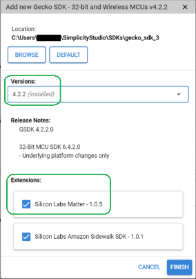

   2. Connect the dev board to your development computer.

   3. Once it shows up in the Debug Adapters view, select it.

      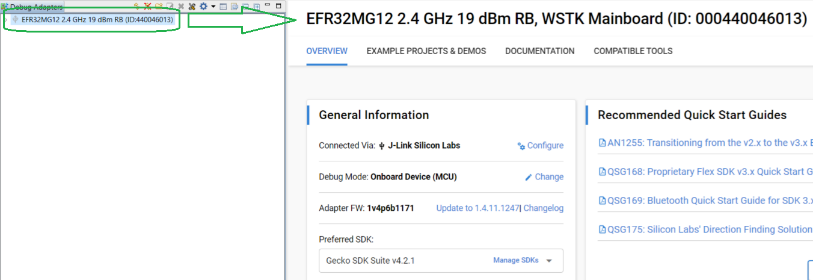

   4. Go to the Example Projects and Demos tab. Select the **OpenThread** filter and enter *openthread rcp* in the **Filter on keywords** box. Select the **OpenThread - RCP** example and click **Run**.

      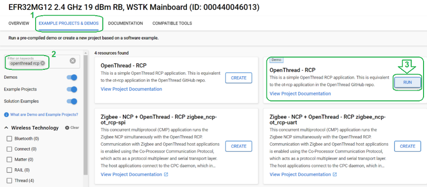

   5. Disconnect the dev board and connect it to your RPi4B.

2. Prepare the Raspberry Pi 4B (RPi4B) to become a Matter hub:

   1. Download and extract the Matter hub Raspberry Pi image (see details under [Software requirements](/matter/<docspace-docleaf-version>/matter-overview#software-requirements)).

   2. Flash the image to the desired SD card. Please note this will erase all existing content on that SD card:

      1. Under **Operating System**, click **CHOOSE OS**. Scroll down and choose the last option, **Use custom**. Browse to your extracted **SilabsMatterPi.img** file and select it.

          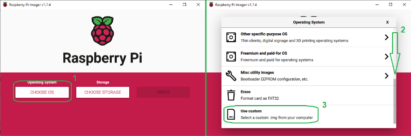

      2. Under **Storage**, click **CHOOSE STORAGE**. Select your target SD card. If it does not show up, make sure it is inserted properly and not in use by other software and retry this step.

          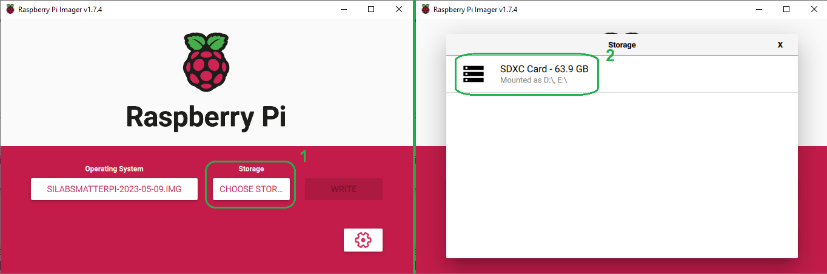

      3. Click **WRITE** and then click **YES** to confirm the action. Wait for the process to finish writing to the SD card and verifying the results.

          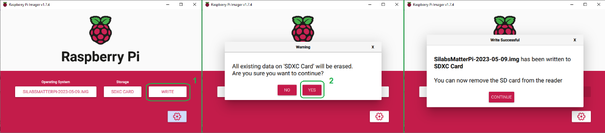

   3. Insert the SD card in your Raspberry Pi 4B (RPi4B) and connect it to your network by Ethernet (Wi-Fi cannot be used for this example).

   4. Power-up the RPi4B. Once it is booted up, check your local network DHCP IP address allocation rules to determine the RPi4B's assigned IP address. You may also use networking tools such as *nmap* to find your RPi4B’s IP assigned address.

   5. Use PuTTY to connect to your RPi4B.

      1. The first time you connect to your RPi4B, PuTTY will warn you about a new host key or key fingerprint. Accept the key.

         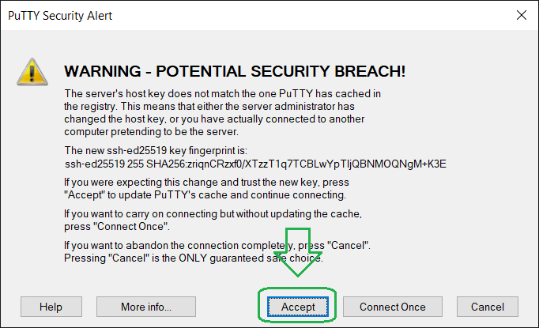

      2. The default credentials are **ubuntu**:**ubuntu** (username:password). **Note**: In PuTTY, you can set the default username to **ubuntu** under **Connection > Data > Auto-login username**.

         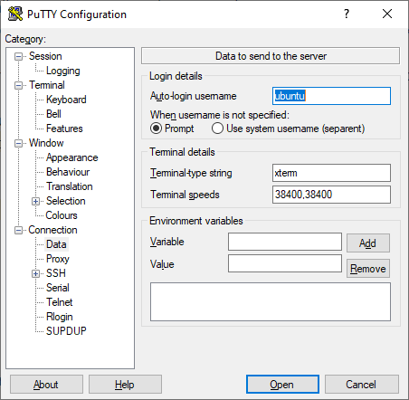

      3. You may be prompted to change the password.

   6. Verify that your *ot-rcp* board is visible in your RPi4B. It should show up as a *ttyUSB****n*** or a *ttyACM****n*** in */dev/.* where ***n*** indicates the port's number (ex: */dev/ttyACM0*).

      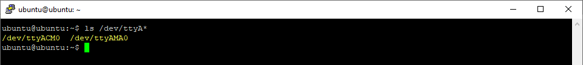

      **Note**: If your RCP shows up with a number other than 0, the otbr-agent file will need to be updated.

You now have a working Matter hub. Keep the PuTTY session open for the following steps.

## Creating the Matter Accessory Devices (MADs)

1. In Simplicity Studio 5, create the light MAD:

   1. Switch to the Launcher view (if not already in it).

   2. Connect one compatible dev board to your development computer. This example uses a BRD4186C.

   3. Once it shows up in the Debug Adapters view, select it.

   4. Go to the Example Projects and Demos tab, turn off **Demos**, check the **Matter** filter under **Wireless Technology**, and enter *thread* in the **Filter on keywords** box. Select the **Matter - SoC Lighting over Thread with external Bootloader Solution** and click **Create**.

       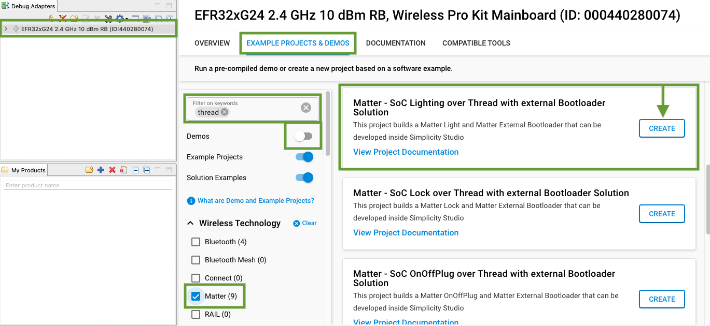

   5. Name your project and click **Finish** (no other changes are required at this time).

      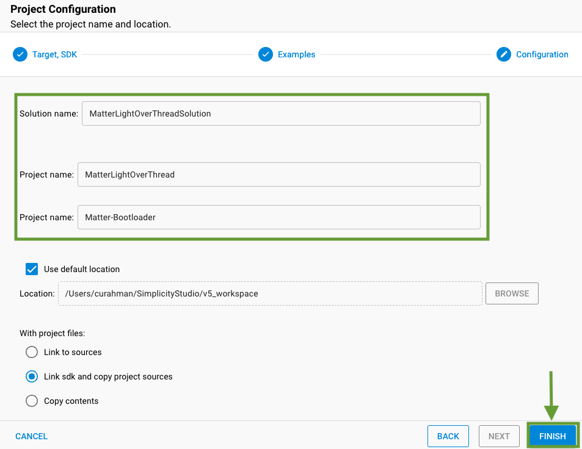

   6. Once the solution is created, select it in the Project Explorer view and click the hammer icon to build. This will begin building both the bootloader and application images.

      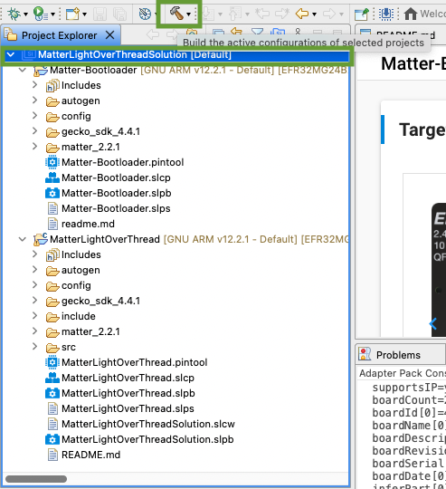

   7. Once the compilation is done, right-click the dev board in the Debug Adapters view and select **Upload application...**.

      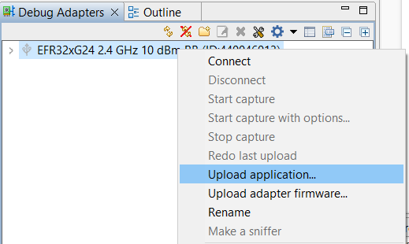

   8. Select the **Application image path** for your newly compiled solution application. The resulting application image will be within the **artifact** directory inside the project workspace. This image has both the bootloader and application binaries combined into one image. Check **Erase chip before uploading image**. Bootloader images are also provided in the zip file referenced on the [Silicon Labs Matter Artifacts page](/matter/<docspace-docleaf-version>/matter-prerequisites/matter-artifacts). Unzip and reference the extracted location if electing to use these default bootloader images.

       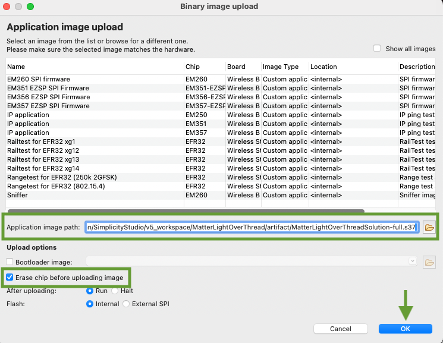

      **Note**: If you are unsure of the path for the newly created binary, you can find the project’s path in the project’s *Properties* window under *Resource*. The binary is typically located in:
      >*{workspace folder}\|{project name folder}\|{GNU ARM v??? folder}\|{project name binary}.s37*

      For example, you would find the binary for a Matter light over Thread project with the default name here:
      >*{workspace folder}/MatterLightOverThread/GNU ARM v12.2.2 - Default/MatterLightOverThread.s37*
      
      The combined binary (bootloader and application image) will be located in:
      >*{workspace folder}/MatterLightOverThread/artifact/MatterLightOverThreadSolution-full.s37*

      **Note**: You should only need to upload a bootloader image and erase the chip once. Subsequent application uploads do not need the bootloader image or chip erasure.

      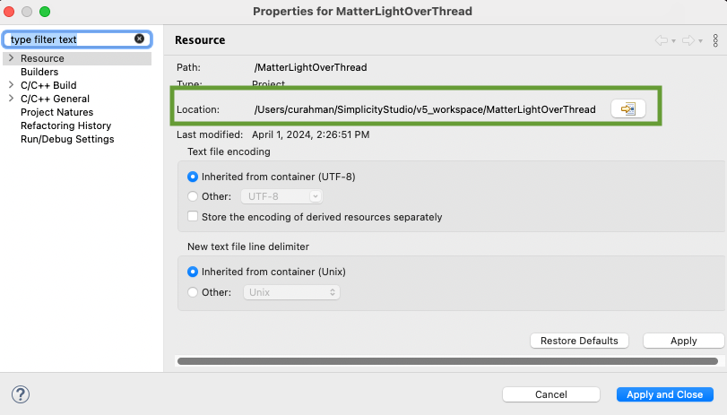

   9. If you are using a dev board with a WSTK, you should now see a QR code displayed on the WSTK's LCD.

   10. Disconnect the dev board from your development computer.

   11. **Optional**: you may want to label this device as your light or switch, as appropriate, to make it easier to identify later.

2. Repeat the process above with the second dev board but selecting the *Matter - SoC Light Switch over Thread* example instead.

## Creating the Matter Network

The *mattertool* is a convenient wrapper script that allows you to easily perform common steps using *chip-tool*. Chip-tool provides a command-line interface into the Matter protocol. mattertool and chip-tool are installed in the Matter Hub image file.

mattertool provides many commands at your disposal. These are some important ones used in this example:

- *mattertool startThread*

- *mattertool bleThread*

- *mattertool on*

- *mattertool off*

- *mattertool toggle*

You can use the command *mattertool help* to display the available commands. With some commands (such as on, off, and toggle), you may also want to specify which node ID to interact with. You can do this by adding the *-n nodeID* parameter after a command, such as *mattertool on -n 5678*.

The *mattertool* also allows you to perform any of the commands you can normally use directly with the *chip-tool*.

1. In a PuTTY session to the Matter hub, use the *mattertool* to create your network.

   1. Start the Thread network with: *mattertool startThread*. This will output the Thread dataset.

      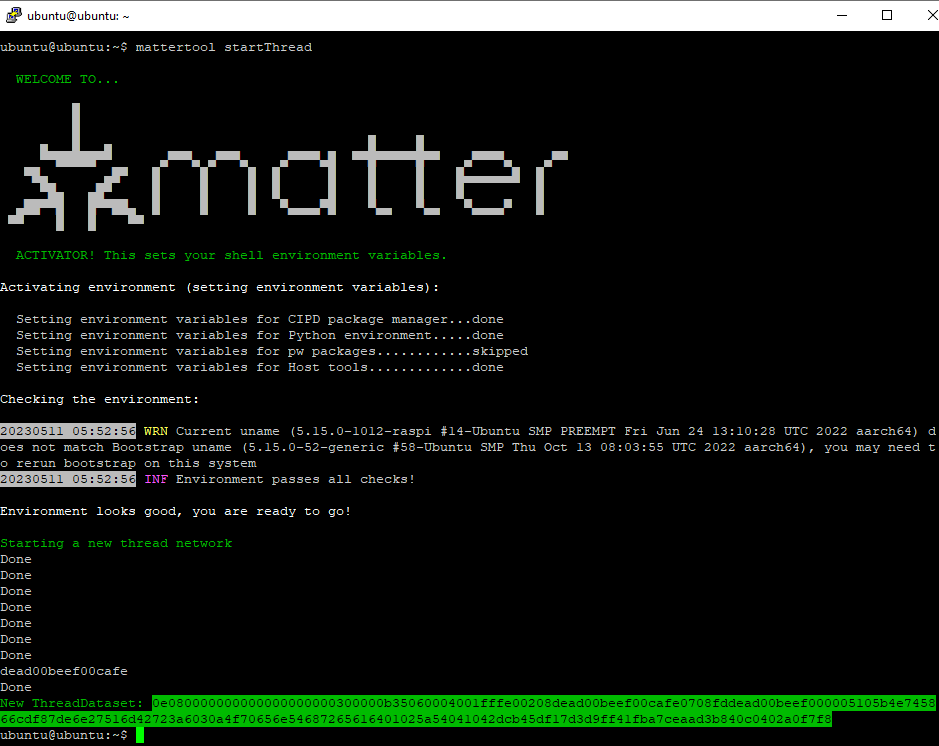

   2. If you need the Thread dataset in the future (such as after a power cycle), you can use *mattertool getThreadDataset*.

## Connecting MADs to the Matter hub

1. In a PuTTY session to the Matter hub, use the *mattertool* to commission your Matter light switch device.

   1. Connect your Matter light switch device to a power source.

      >**Notes**: Only power-up one device at a time to ensure proper commissioning since no discriminator is used to keep this example simple.

      >If this device previously failed commissioning or was on a Thread network, you may need to perform a factory reset before doing this process.

      >The Matter devices will stop advertising after ~15 minutes. Make sure to complete the commissioning before the advertising has expired. If unsure, power cycle the MAD.

   2. Once the MAD is powered and booted up, use the PuTTY session to commission the device using 'mattertool bleThread -n nodeID', where 'nodeID' is replaced with the desired ID. In the resulting log, you should see a line similar to:

      `[1683785224.525598][1455:1461] CHIP:CTL: Commission called for node ID 0x000000000000637E`, indicating the nodeID (in this example, `0x637E`) of the newly commissioned device.

      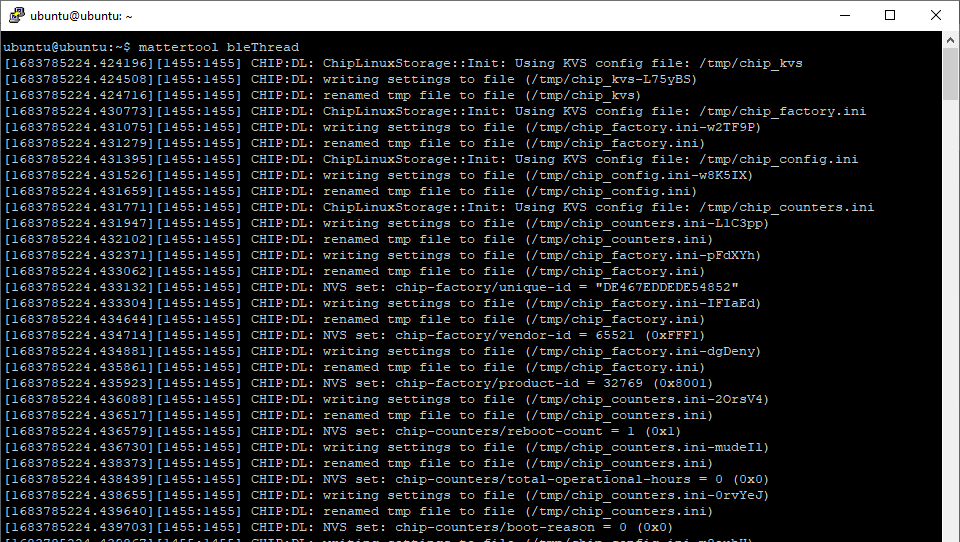

      >**Note**: If you do not specify a *nodeID*, one will be assigned automatically. Make sure to take note of what nodeID assigned to your Matter light switch and Matter light devices. These will be needed later for modifying the Matter light's ACL & the Matter light switch's binding table.

   3. Power up the Matter light device and commission it as well, by following the previous steps for this MAD but using a different *nodeID*.

You now have two Matter devices on your network ready to be used

## Controlling the Light MAD

The various compatible boards will have different setups for their LED(s). Typically, one LED (or a color channel, if RGB) is used to indicate the network status of the device:

- Short blink: indicates the MAD is advertising to join a network.

- Half/half blink: indicates the BLE steps are in progress.

- Long blink: indicates joining the Thread network.

- Solid on: indicates the MAD is now in the network.

For example, on the dev board *xG24-DK2601B EFR32xG24* (also known as *BRD2601*), the red channel of **LED0** is used to indicate the network status. The green channel of **LED0** is used to indicate the light status.

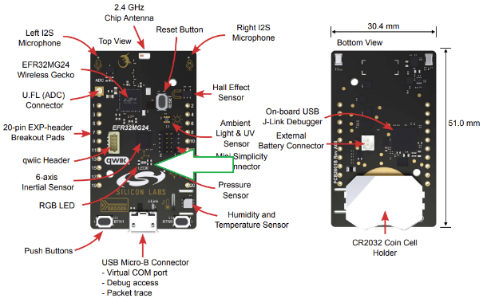

1. In a PuTTY session to your Matter hub, use the *mattertool* to test your Matter light device.

   1. Using `mattertool on -n nodeID` (similarly, `mattertool off` and `mattertool toggle` can also be used) you can control the light status of your Matter light device.

      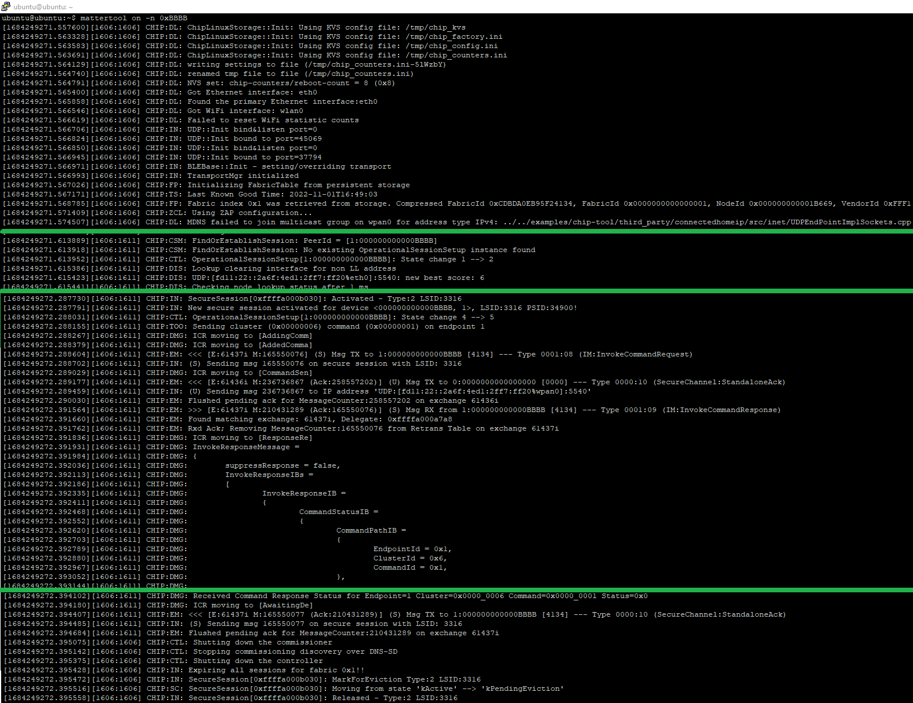

   2. For dev board with buttons available, you can use **BTN1** to toggle the light status locally.

2. In a PuTTY session to your Matter hub, use the *mattertool* to bind your Matter light switch device to your Matter light device, thus allowing the switch to control the light.

   1. First, you will need to modify the Access Control List (ACL) of your Matter light device. This list determines which device in the network your Matter light device will react to. Modify your Matter light device's ACL using: `mattertool accesscontrol write acl '[ { "fabricIndex" : 1 , "privilege" : 5 , "authMode" : 2 , "subjects" : [`**`112233`**`] , "targets" : null } , { "fabricIndex" : 1 , "privilege" : 3 , "authMode" : 2 , "subjects" : [`**`nodeID-switch`**` ], "targets" : null }]' `**`nodeID-light 0`**, where the highlighted parameters are:

      - **112233**: The node ID of the controller (OTBR). This is always 112233.

      - **nodeID-switch**: The node ID of the Matter light switch device in base 10 (ex: 43690 for 0xAAAA).

      - **nodeID-light**: The node ID of the Matter light device in hex (ex: 0xBBBB).

      - **0**: The endpoint in the Matter light device that holds the ACL. This is always 0.

      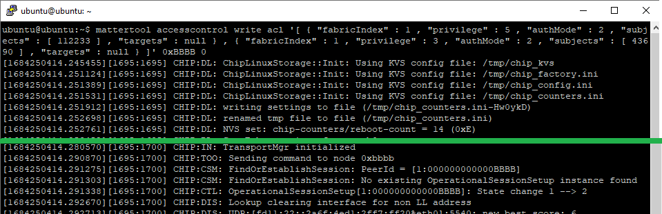

      **Note**: The ACL table action is a read/modify/write step. If you accidentally remove the chip-tool entry, this will prevent further control of the device, requiring a factory reset.

      You can read the ACL for a Matter device using: *mattertool accesscontrol read acl* ***nodeID*** ***0***, where the highlighted parameters are:

      - **nodeID**: The nodeID of the Matter device you wish to read the ACL contents from.

      - **0**: The endpoint in the Matter device that holds the ACL. This is always 0.

        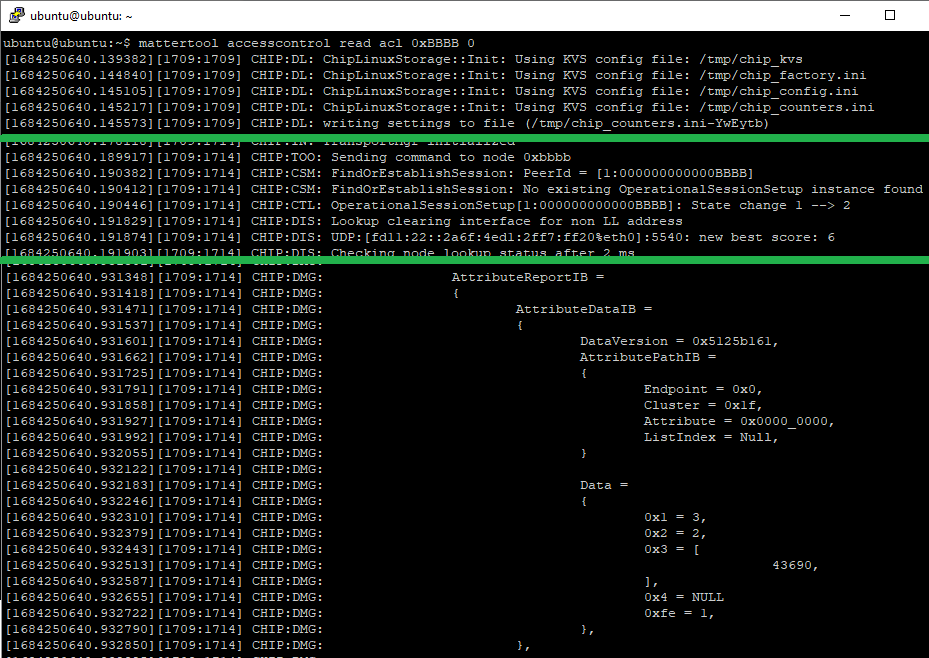

   2. Second, you need to bind the switch's write command to the light. This is done by updating the binding table of your Matter light switch device. You do this with: `mattertool binding write binding '[ { "fabricIndex" : 1 , "node" :`**`nodeID-light`**,` "endpoint" : `**`1`**,`"cluster" :`**`6`**`} ]'`**`nodeID-switch 1`**, where the highlighted parameters are:

      - **nodeID-light**: The node ID of the Matter light device.

      - **1**: The application endpoint in the light. In the Silicon Labs examples, this is always 1.

      - **6**: The on/off cluster in the light. This is always 6.

      - **nodeID-switch**: The node ID of the switch.

      - **1**: This is the application endpoint in the switch that holds the binding table. In the Silabs examples, this is always 1.

      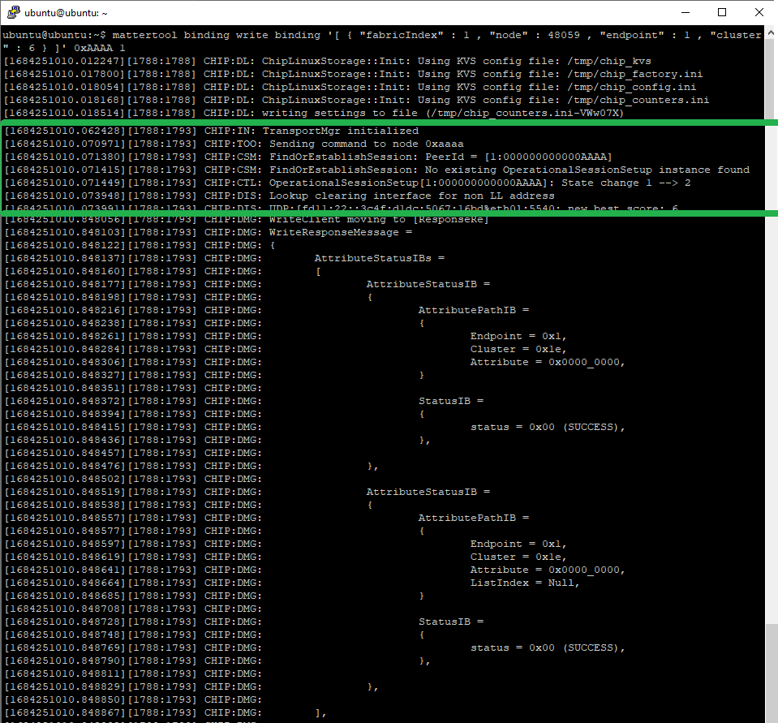

      **Note**: As with the ACL table step, the binding table action is a read/modify/write step. If you accidentally remove the chip-tool entry, this will prevent further control of the device, requiring a factory reset.

      You can read the binding table from a Matter device using: `mattertool binding read binding`**`nodeID-switch 1`**, where the highlighted parameters are:

      - **nodeID-switch**: The node ID of the Matter switch.

      - **1**: The application endpoint in the switch that holds the binding table. In the Silabs examples, this is always 1.

         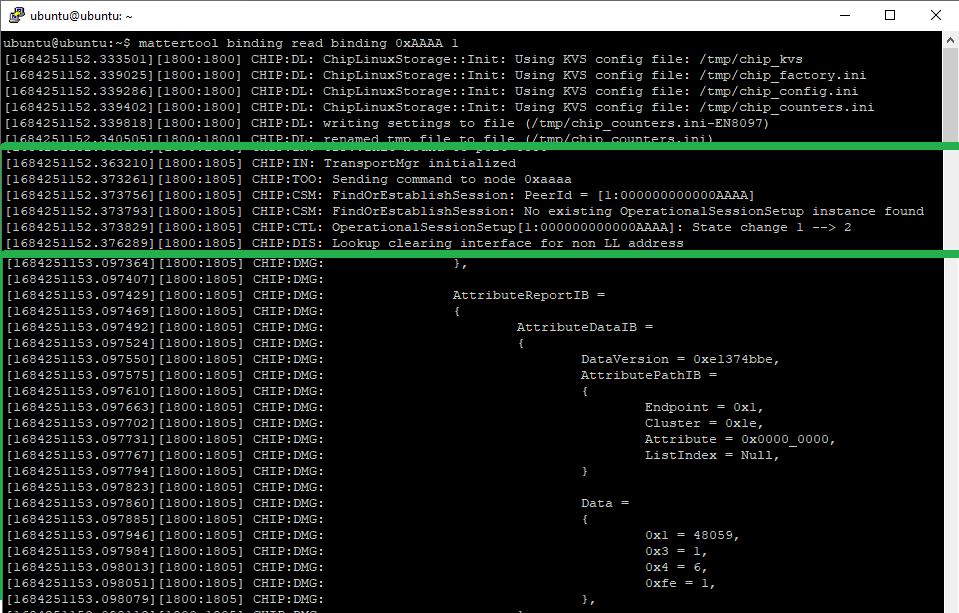

   With the binding complete, a button press on the Matter light switch device should now toggle the light status in the Matter light device.
