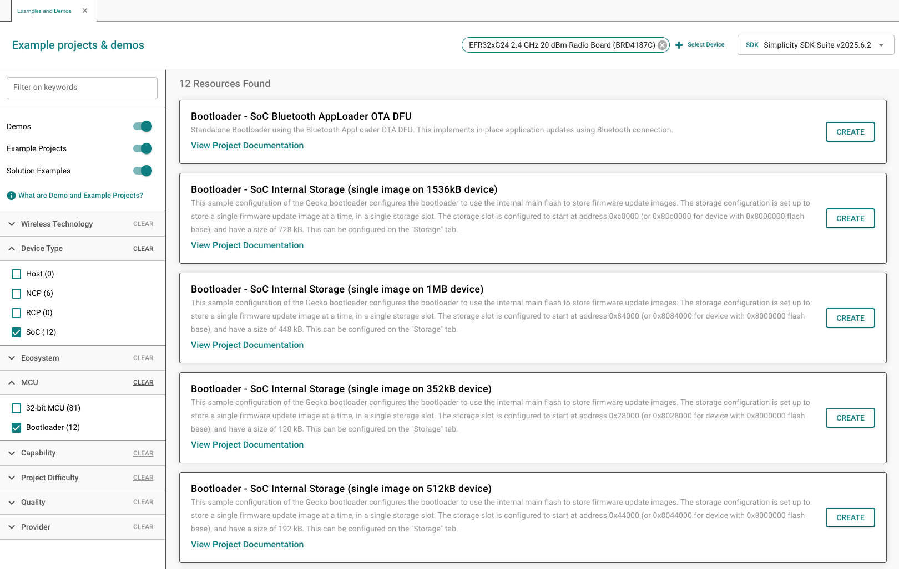
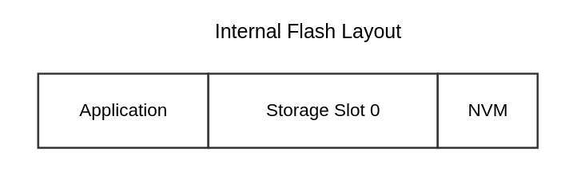
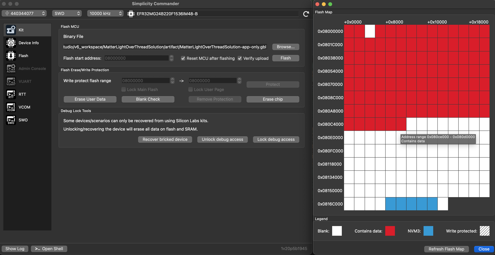
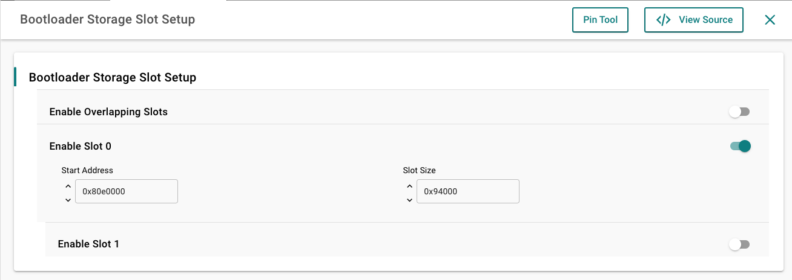

# Creating a Gecko Bootloader for Use in Matter OTA Software Update

The Matter OTA Software Update functionality on EFR32 devices requires the use of a Gecko Bootloader built with correct configuration parameters. The key parameters are the storage slot size and (in case of internal storage) storage slot address. The current document lists the steps required to build the Gecko Bootloader for Matter OTA Update and discusses the configuration parameter selection. For a detailed discussion of Gecko Bootloader refer to *UG489: Silicon Labs Gecko Bootloader User's Guide for GSDK 4.0 and Higher*.

The Gecko Bootloader is built with Silicon Labs Simplicity Studio. These instructions assume that you have installed Simplicity Studio, the Simplicity Commander tool (installed by default with Simplicity Studio), Simplicity SDK (SiSDLK) and associated utilities, and that you are familiar with generating, compiling, and flashing an example application in the relevant version.

## Bootloader Project In Studio

### Creating the Project

Each Matter Sample Application Solution in Simplicity Studio contains a bootloader project pre-configured for Matter OTA Software Updates, generally for external storage. The stand-alone bootloader project for internal or external storage can be found in the Examples & Demos view in Simplicity Studio.

In Simplicity Studio, click **Home > all projects & demos** to create a new project. Select the correct Target Board via the **+ Select Device** button and SDK from the dropdown menu of the Example & Demos view.

From there the list of projects can be easily filtered, in this case, for an SoC Bootloader



In the next screen, select the example project the bootloader will be based on. For a bootloader using external storage, select **Bootloader SoC SPI Flash Storage(single image with slot size of 1024K)**. For a bootloader using internal storage, select **Bootloader - SoC Internal Storage (single image on 1536kB device)**.

### Configuring Storage Components and Parameters

In the newly created project, select the project's .slcp file, click the **Software Components** tab, and select **Platform > Bootloader > Storage**. In the **Bootloader Storage Slot** component (it should be already installed), configure Slot 0's **Start Address** and **Slot size**.

- For external storage bootloaders, the **Start Address** should be 0 and **Slot size** should be 1048576 (0x100000). Both values are set by default.
- For internal storage bootloaders, see the **Internal Bootloader: Image Size, Selecting Storage Slot Address and Size** section. In the **Common Storage** component, leave **Start address of bootload info** at 0.

### Configuring Other Components

Silicon Labs recommends installing the **GBL Compression (LZMA)** component under **Platform > Bootloader > Core**. This allows the bootloader to handle compressed GBL files. This component is required for internal storage bootloaders.

At this point, the project contains all the components necessary to support the Matter OTA Software Update functionality. Other components can now be added to support additional features such as Secure Boot. Refer to *UG489: Silicon Labs Gecko Bootloader User's Guide for GSDK 4.0 and Higher* for the description of various bootloader features and the steps to enable them.

### Building and Flashing the Bootloader

Build the project by clicking on the hammer icon in the Project Solution in the Simplicity Studio VS Code extension. Flash the bootloader to the board by pressing the chip icon in the Project Solution in the Simplicity Studio VS Code extension.

## Internal Bootloader: Image Size, Selecting Storage Slot Address and Size

The internal storage bootloader for Matter OTA Software Update is supported on MG24/MG26/SixG301 boards. In this use case, both the running image and the downloadable update image must fit on the internal flash at the same time. This in turn requires that both images are built with a reduced feature set such as disabled logging and display ([see here](./02-ota-software-update.md#Internal-Storage-Bootloader) for the list of features). See [Code Savings Guide](/matter/{build-docspace-version}/matter-overview-guides/code-size-savings) for a general guide on reducing the application image size. Using LZMA compression when building the GBL file further reduces the downloaded image size.

When building an internal storage bootloader, the two key configuration parameters are the **Slot Start Address** and **Slot Size** in the **Bootloader Storage Slot** component. The storage slot must not overlap with the running image and the NVM section of the flash. In other words, the slot start address must be greater than the end of the running image address and the sum of the start address and the slot size must be less than the address of the NVM section.



The simplest way to get the relevant addresses for the running image and NVM is by using the Simplicity Commander tool:

- Build the running image for the Matter application.
- Erase the chip and flash the running image to it (For example: use Simplicity Commander's **Flash** view context menu to flash the application image and some bootloader valid for the device board. Make sure to **Erase the chip before uploading the new image**).
- In Simplicity Commander, select **Device Info > Flash Map**. The blank area in the middle of the flash (between the running image in the beginning and NVM at the end) is available for the bootloader storage slot. Each block represents a flash page (8K on MG24 boards). Hovering over a block shows the block's start and end address.
- Set the **Slot Start Address** to be the address of the first available block. Calculate the **Slot Size** to be the difference between the end address of the last free block and the **Slot Start Address**. The **Slot Size** must be greater that the size of the GBL file for the update image.
- (Optional) Set the **Slot Start Address** to the beginning of the second or third available block to account for potential growth of the application image. This way, the bootloader won't have to be reconfigured for every increase in the image size. The storage slot must still be able to accommodate the GBL image for the update.

Another way to calculate the Storage Slot parameters is by examining the application's .map file:

- Build the running image for the Matter application.
- In the application .map file, find the highest address preceding the .data section, round it up to align on the 8K page boundary (e.g. 0x00000000080f1704 would round up to 0x00000000080f2000), and then add 0x2000 to get the next page block address. The result would be the Slot Start Address. The address of the .nvm section in the .map file is the end of the space available for the Storage Slot. The Slot Size is the difference of the .nvm address and the Slot Start Address.

## Internal Bootloader Example

This example is for an internal storage bootloader for the Matter lighting app on BRD4187C. As this board is a Series 2 device (MG24), it uses the GBL3 (previously known simply as GBL) bootloader as do all series 2 and older devices. Series 3 & newer devices use the GBL4 format.

- Add the `matter_platform_low_power` component, choose the replace options when presented. This will remove the Matter Shell, Matter CLI, QR Code, and LCD which will reduce the resulting image size. Build the application.

- Add the `Enable Link time optimization` component and build the project.

- Create the GBL file for the update image and note its size. For more info on GBL3 refer to [GBL3 Commands](https://docs.silabs.com/simplicity-commander/latest/simplicity-commander-commands/gbl-commands)

    ```shell
    ~/SimplicityStudio/v6_test_workspace/MatterLightOverThreadSolution $ commander gbl3 create artifact/matter-light-update.gbl --app MatterLightOverThread/artifact/MatterLightOverThread.s37 --compress lzma

    Parsing file MatterLightOverThread/artifact/MatterLightOverThread.s37...
    Initializing GBL3 file...
    Adding application to GBL...
    Compressing using lzma...
    Writing GBL file matter-light-update.gbl...
    DONE

    ~/SimplicityStudio/v6_test_workspace/MatterLightOverThreadSolution $ ls -lh artifact/matter-light-update.gbl  
    518K artifact/matter-light-update.gbl
    ```

- For Series 3 devices using GBL4 the process is similar, but you will use the `commander gbl4 create` command instead. For more info on GBL4 refer to [GBL4 Commands](https://docs.silabs.com/simplicity-commander/latest/simplicity-commander-commands/gbl4-commands#gbl4-commands) and [Silicon Labs Gecko Bootloader User’s Guide for Series 3 and Higher](https://docs.silabs.com/shared-content/latest/bootloader-user-guide-series3-and-higher/)

    ```shell
    ~/SimplicityStudio/v6_test_workspace/MatterLightOverThreadSolution_301 $ commander gbl4 create artifact/series3-matter-light.gbl --data MatterLightOverThread_301/artifact/MatterLightOverThread_301.s37 --device SiMG301 --compress lzma
    Initializing GBLV4 file...
    Parsing file MatterLightOverThread_301/artifact/MatterLightOverThread_301.s37...
    Writing GBL file artifact/series3-matter-light.gbl...
    DONE

    ~/SimplicityStudio/v6_test_workspace/MatterLightOverThreadSolution_301 $ ls -lh artifact/series3-matter-light.gbl
    616K artifact/series3-matter-light.gbl
    ```

- Erase the flash, then flash the application image and bootloader. In this example, there is only one board connected so the `serialno` option is not needed.

    ```shell
    commander flash ../bootloader-storage-internal-single-1536k/artifact/bootloader-storage-internal-single-1536k.s37; commander flash artifact/matter-light-update.gbl;
    ```

- In Simplicity Commander, display the flash map.

    

- The address of the next page block address is 0x080d0000. The end address of the last available block before the NVM3 region (blue) is 0x08174000. This means we can set the Slot Start Address to 0x080d0000 and the Slot Size to 0xa4000 or 671744 (671744 = 0x08174000 - 0x080d0000). The slot size is sufficient for our GBL file (671kB > 518KB).
- As discussed [above](#creating-the-project), we need to create an Internal Storage Bootloader project, in this case we are targeting BRD4187C which has a 1.5MB of flash, **Bootloader - SoC Internal Storage (single image on 1536kB device)** is an appropriate choice. Configure the Bootloader Storage Slot component and set Slot Address and Slot Size according to what was determined in the previous step.

    

- Enable the "GBL Compression (LZMA)" component.
- Build the project.
- Once flashed onto the board, this bootloader is ready to execute OTA updates on upgrade images it receives. This is covered in the [next section](./02-ota-software-update.md).
