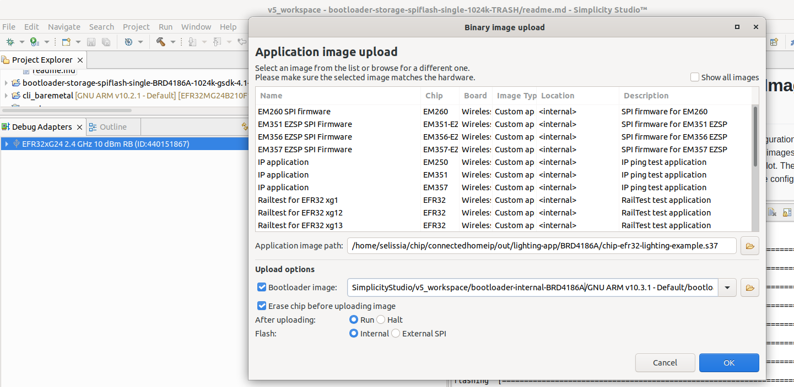

# Creating a Gecko Bootloader for Use in Matter OTA Software Update

The Matter OTA Software Update functionality on EFR32 devices requires the use of a Gecko Bootloader built with correct configuration parameters. The key parameters are the storage slot size and (in case of internal storage) storage slot address. The current document lists the steps required to build the Gecko Bootloader for Matter OTA Update and discusses the configuration parameter selection. For a detailed discussion of Gecko Bootloader refer to *UG489: Silicon Labs Gecko Bootloader User's Guide for GSDK 4.0 and Higher*.

The Gecko Bootloader is built with Silicon Labs Simplicity Studio. These instructions assume that you have installed Simplicity Studio 5, the Simplicity Commander tool (installed by default with Simplicity Studio), the GSDK and associated utilities, and that you are familiar with generating, compiling, and flashing an example application in the relevant version.

## Bootloader Project In Studio

### Creating the Project

In Simplicity Studio, click **Project > New > Silicon Labs Project Wizard** to create a new project. Select the correct Target Board, SDK and the Toolchain.

In the next screen, select the example project the bootloader will be based on. For a bootloader using external storage, select **Bootloader SoC SPI Flash Storage
(single image with slot size of 1024K)**. For a bootloader using internal storage, select **Bootloader - SoC Internal Storage (single image on 512kB device)**.

### Configuring Storage Components and Parameters

In the newly created project, select the project's .slcp file, click the **Software Components** tab, and select **Platform > Bootloader > Storage**. In the **Bootloader Storage Slot** component (it should be already installed), configure Slot 0's **Start Address** and **Slot size**.

- For external storage bootloaders, the **Start Address** should be 0 and **Slot size** should be 1048576. Both values are set by default.
- For internal storage bootloaders, see the **Internal Bootloader: Image Size, Selecting Storage Slot Address and Size** section. In the **Common Storage** component, leave **Start address of bootload info** at 0.

### Configuring Other Components

Silicon Labs recommends installing the **GBL Compression (LZMA)** component under **Platform > Bootloader > Core**. This allows the bootloader to handle compressed GBL
files. This component is required for internal storage bootloaders.

At this point, the project contains all the components necessary to support the Matter OTA Software Update functionality. Other components can now be added to support additional features such as Secure Boot. Refer to *UG489: Silicon Labs Gecko Bootloader User's Guide for GSDK 4.0 and Higher* for the description of various bootloader features and the steps to enable them.

### Building and Flashing the Bootloader

Build the project by clicking on the hammer icon in the Studio toolbar. Flash the bootloader to the board using the **Upload Application** option from the **Debug Adapters** view.

## Internal Bootloader: Image Size, Selecting Storage Slot Address and Size

The internal storage bootloader for Matter OTA Software Update is supported on MG24 boards only. In this use case, both the running image and the downloadable update image must fit on the internal flash at the same time. This in turn requires that both images are built with a reduced feature set such as disabled logging and Matter shell (see [here](./02-ota-software-update.md#Internal-Storage-Bootloader) for the list of features). Using LZMA compression when building the GBL file further reduces the downloaded image size.

When building an internal storage bootloader, the two key configuration parameters are the **Slot Start Address** and **Slot Size** in the **Bootloader Storage Slot** component. The storage slot must not overlap with the running image and the NVM section of the flash. In other words, the slot start address must be greater than the end of the running image address and the sum of the start address and the slot size must be less than the address of the NVM section.


The simplest way to get the relevant addresses for the running image and NVM is by using the Simplicity Commander tool:

- Build the running image for the Matter application.
- Erase the chip and flash the running image to it (For example: use Simplicity Studio's **Debug Adapters** view context menu to flash the application image and some bootloader valid for the device board. Make sure to select the **Erase chip before uploading image** option).
- In Simplicity Commander, select **Device Info > Flash Map**. The blank area in the middle of the flash (between the running image in the beginning and NVM at the end) is available for the bootloader storage slot. Each block represents a flash page (8K on MG24 boards). Hovering over a block shows the block's start and end address.
- Set the **Slot Start Address** to be the address of the first available block. Calculate the **Slot Size** to be the difference between the end address of the last free block and the **Slot Start Address**. The **Slot Size** must be greater that the size of the GBL file for the update image.
- (Optional) Set the **Slot Start Address** to the beginning of the second or third available block to account for potential growth of the application image. This way, the bootloader won't have to be reconfigured for every increase in the image size. The storage slot must still be able to accommodate the GBL image for the update.

Another way to calculate the Storage Slot parameters is by examining the application's .map file:

- Build the running image for the Matter application.
- In the application .map file, find the highest address preceding the .data section, round it up to align on the 8K page boundary (e.g. 0x00000000080f1704 would round up to 0x00000000080f2000), and then add 0x2000 to get the next page block address. The result would be the Slot Start Address. The address of the .nvm section in the .map file is the end of the space available for the Storage Slot. The Slot Size is the difference of the .nvm address and the Slot Start Address.

## Example

This example is for an internal storage bootloader for the Matter lighting app on BRD4186C.

- Build the application in Simplicity Studio after disabling all optional features such as the Matter QR Code, Matter Display, Matter Shell, and OpenThread CLI components.

- Build the GBL file for the update image and note its size.

    ```shell
    $ commander gbl create --compress lzma ~/chip/connectedhomeip/out/lighting-app/BRD4186A/chip-efr32-lighting-example.gbl --app ~/chip/connectedhomeip/out/lighting-app/BRD4186A/chip-efr32-lighting-example.s37
    ```

    ```shell
    $ ls -la out/lighting-app/BRD4186A/chip-efr32-lighting-example.gbl
    451176 Jul 19 16:39 out/lighting-app/BRD4186A/chip-efr32-lighting-example.gbl
    ```

- Flash the application image and bootloader. Erase the flash.

    

- In Simplicity Commander, display the flash map.

    

- The address of the first available page is 0x080b8000. The end address of the last available block is 0x08172000. This means you can set the Slot Start Address to 0x080b8000 and the Slot Size to 761856 (761856 = 0x08172000 - 0x080b8000). The slot size is sufficient for our GBL file (451176 bytes).
- Create a project base on the **Bootloader - SoC Internal Storage (single image on 512kB device)** example. Configure the Bootloader Storage Slot component and set Slot Address and Slot Size.

    

- Enable the "GBL Compression (LZMA)" component.
- Build the project.
