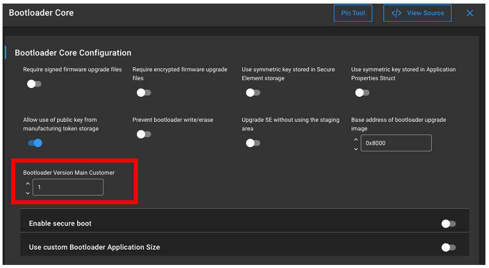
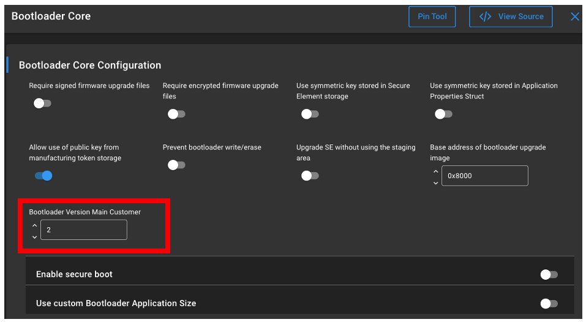
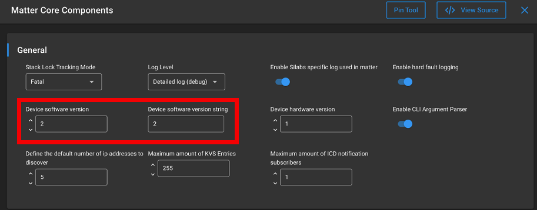
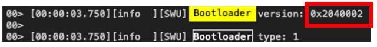
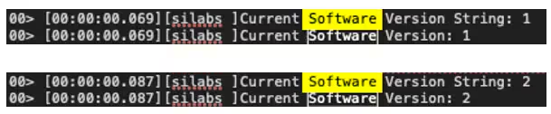
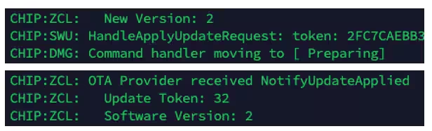

# Matter OTA Software Update with Silicon Labs Example Applications

This page outlines the steps for a scenario that demonstrates the The Over The Air (OTA) Software Update functionality in Matter.

The Over The Air (OTA) Software Update functionality is enabled by default for all Silicon Labs example applications. Its inclusion in an application is controlled by the OTA Requestor component in a Matter project in Simplicity Studio.

## Overview

The OTA Software Update scenario requires the following binaries:

- **The running image**: a regular application built with the default/older software version value. This application will be updated to the one with a higher software version. In the OTA Software Update process it acts as the OTA Requestor.
- **The update image**: a regular application built with a **higher software version value**.
- **Chip-tool**: the controller that announces the OTA-Provider's address to the application thus triggering the OTA Software Update.
- **OTA-Provider**: the server that carries the update image and from which the OTA Requestor will download the updated software.
- **Bootloader**: Silicon Labs Gecko Bootloader image that supports OTA; supports the external (SPI-flash) or the internal storage option.

The demo scenario requires the use of the Silicon Labs Simplicity Commander tool.

### Outline of the steps for the OTA Software Update Scenario

- Create the running image.
- Create the update image with software version value incremented.
- Create the OTA file from the update image.
- Create/obtain a bootloader that supports Matter OTA Software Update.
- Start the OTA-Provider passing to it the OTA file. Commission the OTA-Provider.
- Bring up your device with the running image, commission the device.
- Use the chip-tool to issue the Announce OTA Provider command to the device and trigger the OTA Software Update Process.

Note: In a production environment the Announce OTA Provider command is not used. Instead, the OTA Provider address is configured on the device by the Matter Controller and the device queries the Provider for an available image every 24 hours.

## Setting up the OTA Environment

### Setting up the chip-tool

The chip-tool binary is a part of the Silicon Labs' Matter Hub Raspberry Pi Image available as a part of the Release Artifacts page. For building the chip-tool for Linux or Mac consult the documentation in <https://github.com/project-chip/connectedhomeip>.

### Setting up the OTA-Provider

The chip-ota-provider-app binary for a Raspberry Pi is a part of the Artifacts package available with the Matter Extension release. For building the chip-ota-provider-app for Linux or Mac consult the documentation in <https://github.com/project-chip/connectedhomeip>.

### Building Application Images Using Simplicity Studio

The running image and the update image are regular Matter application images and are built using the standard procedure. The only additional configuration required is the use of a higher software version in the update image. The software version is configured in a Studio Matter project by navigating to Software Components -> Silicon Labs Matter -> Stack -> Matter Core Components, clicking "Configure" and setting the "Device software version" and "Device software version string" parameters.  

See the following page for detailed steps: [build OTA application using studio](./05-build-ota-application-using-studio.md).

### Obtaining the Bootloader binary

- Build or download the Gecko Bootloader binary which can be obtained in one of the following ways:
  - Follow the instructions in [Creating the Bootloader for Use in Matter OTA](01-ota-bootloader.md).
  - Pre-built binaries (only valid for the external SPI-flash storage OTA update) are available on the [Matter Artifacts page](/matter/{build-docspace-version}/matter-prerequisites/matter-artifacts).
  - Bootloader (only valid for the external SPI-flash storage OTA update) is built as a part of any Matter Solution in Simplicity Studio.

- Using the Commander tool or Simplicity Studio, upload the bootloader to the device running the application.

## Running the OTA Download demo scenario

- Create a bootable image file (using the Lighting application image as an example):

    ```shell
    commander gbl create chip-efr32-lighting-example.gbl --app chip-efr32-lighting-example.s37
    ```

- Create the Matter OTA file from the bootable image file:

    ```shell
    commander ota create --type matter --input chip-efr32-lighting-example.gbl --vendorid 0xFFF1 --productid 0x8005 --swstring "2.0" --swversion 2 --digest sha256 -o chip-efr32-lighting-example.ota
    ```

- In a terminal, start the Provider app and pass to it the path to the Matter OTA file created in the previous step:

    ```shell
    rm -r /tmp/chip_kvs_provider
    ```

    ```shell
    chip-ota-provider-app  --KVS /tmp/chip_kvs_provider -f chip-efr32-lighting-example.ota
    ```

- In a separate terminal, run the chip-tool commands to provision the Provider:

    ```shell
    chip-tool pairing onnetwork 1 20202021
    ```

    ```shell
    chip-tool accesscontrol write acl '[{"fabricIndex": 1, "privilege": 5, "authMode": 2, "subjects": [112233], "targets": null}, {"fabricIndex": 1, "privilege": 3, "authMode": 2, "subjects": null, "targets": null}]' 1 0
    ```

- For Matter over OpenThread, bring up the OpenThread Border Router and get its operational dataset. For Matter over WiFi, bring up the AP.

- If the application device had been previously commissioned, hold button 0 for six seconds to factory-reset the device.

- Commission the device.
  
  For Matter over OpenThread:

    ```shell
    chip-tool pairing ble-thread 2 hex:<operationalDataset> 20202021 3840
    ```

    where operationalDataset is obtained from the OpenThread Border Router.

    For Matter over Wi-Fi:

    ```shell
    chip-tool pairing ble-wifi 2 "SSID" "PSK" 20202021 3840
    ```

- Once the commissioning process completes, enter:

    ```shell
    chip-tool otasoftwareupdaterequestor announce-otaprovider 1 0 0 0 2 0
    ```

- The application device will connect to the Provider and start the image download. Once the image is downloaded, the device will reboot into the downloaded image.

Note: In a production environment the Announce OTA Provider command is not used. Instead, the OTA Provider address is configured on the device by the Matter Controller, for example:

```shell
    chip-tool otasoftwareupdaterequestor write default-otaproviders '[{"fabricIndex": 1, "providerNodeID": 1, "endpoint": 0}]' 2 0
```

With this configuration the device will query the OTA-Provider for an available image every 24 hours and if an update image is available the OTA Software Update process will start.

## Internal Storage Bootloader

Internal storage bootloader for Matter OTA software update is supported on MG24/MG26 boards. In this use case, both the running image and the downloadable update image must fit on the internal flash at the same time. This in turn requires that both images are built with a reduced feature set, such as disabled logging and Matter shell. See [Creating the Bootloader for Use in Matter OTA](01-ota-bootloader.md) for more details.

Installing the Lower Power Mode component in the project's Software Components tool in Simplicity Studio will uninstall the following optional components and reduce the image size:

```shell
    Matter QR Code Display, 
    Matter Display, 
    Matter Shell, 
    OpenThread CLI.
```

Disabling logging in the configuration of the Matter Core Components component also helps to reduce the image size.

Using LZMA compression when building the .gbl file ( passing `--compress lzma` parameter to the `commander gbl create` command) further reduces the downloaded image size.

When building an internal storage bootloader, the two key configuration parameters are the Slot Start Address and Slot Size in the Bootloader Storage Slot component. The storage slot must not overlap with the running image and the NVM section of the flash. In other words, the slot start address must be greater than the end of the running image address and the sum of the start address and the slot size must be less than the address of the NVM section. The simplest way to get the relevant addresses for the running image and NVM is by using the Silicon Labs `Simplicity Commander` (**Device Info > Main Flash > Flash Map**).

The pre-built bootloader binaries are configured with slot start address of 0x080EC000 and slot size of 548864.

## Managing the Software Version

For the Provider to successfully serve the image to a device during the OTA Software Update process, the Software Version parameter that the .ota file was built with must be greater than the CHIP_DEVICE_CONFIG_DEVICE_SOFTWARE_VERSION parameter set in the application's `sl_matter_config.h` file which is a config file for the Matter Core Components component in the Matter Studio project. The Software Version parameter is set by the `-vn` parameter passed to the `commander ota create` command. For example, if the application's running image was built with CHIP_DEVICE_CONFIG_DEVICE_SOFTWARE_VERSION set to 1 and if the `.ota` file is built with `-vn 2` then the Provider will serve the update image when requested.

For the OTA Software Update subsystem to consider an update to be successful and for the NotifyUpdateApplied command to be transmitted, the CHIP_DEVICE_CONFIG_DEVICE_SOFTWARE_VERSION in the updated image must exceed the software version of the running image (continuing the above example, the image for the update must be built with CHIP_DEVICE_CONFIG_DEVICE_SOFTWARE_VERSION set to 2).

The CHIP_DEVICE_CONFIG_DEVICE_SOFTWARE_VERSION is configured in a Studio Matter project by navigating to Software Components -> Silicon Labs Matter -> Stack -> Matter Core Components, clicking "Configure" and setting the "Device software version"

## Managing the Vendor and Product ID

Starting the ota-provider-app with the `--otaImageList` command line option allows the user to supply a JSON file specifying the Software Version, Vendor, and
Product ID that identify the image served by the Provider. See the ota-provider-app for Linux in examples directory.

Example provider configuration file:

```cpp
        { "foo": 1, // ignored by parser
          "deviceSoftwareVersionModel":
          [
           { 
            "vendorId": 65521, "productId": 32773, "softwareVersion": 1, "softwareVersionString": "1.0.0", "cDVersionNumber": 18, "softwareVersionValid": true, "minApplicableSoftwareVersion": 0, "maxApplicableSoftwareVersion": 100, "otaURL": "chip-efr32-lighting-example.ota" 
            }
          ]
        }
```

For more info see the documentation for the ota-provider-app example in <https://github.com/project-chip/connectedhomeip>.

## Multi-Chip OTA Images

Multi-Chip OTA is implemented only for EFR32 devices. Multi-chip OTA uses an enhanced script, ota_multi_image_tool.py, which creates .ota files that contain additional TLV headers. These TLV headers describe the binaries to be sent over the air. The enhanced script is located here. It is a wrapper to the original src/app/ota_image_tool.py. Multiple binaries can be packaged in the .ota file. Some Tags are reserved for specific Silicon Labs binaries, and other Tags are available to be used for arbitrary TLVs. The payloads can be encrypted.

The script can be obtained from the Matter Extension github repository.

For more information on creating a Multi-Chip .ota file, see the README.md.

Applications must be built with the OTA Multi Image Requestor component added to the project in Simplicity Studio to enable them to process the TLVs.

The OTA Multi Image Requestor Encryption component should be added to the project if the requestor is meant to process encrypted payloads.

**Combined OTA images are also supported:**

1. Bootloader + application upgrade. This requires a combined image.

    ```shell
    commander gbl create --bootloader <bootloader_image>.s37 --app <new_application_image>.s37 <combined_image>.gbl
    ```

2. Bootloader upgrade only. This still requires a combined image so an unchanged application image should be used with the above command.

3. Application upgrade only. This should be a standalone as described in the sections above.

**Hint**: it can be useful to compress this image to reduce the size needed to OTA. This can be done via the optional flag ```--compress lzma```. If you use LZMA compression for creating the OTA file, make sure that the bootloader has been built with the LZMA compress component.

To create the .ota file, simply follow the method discuessed above using the combined image:

```shell
commander ota create --type matter --input combined_image.gbl --vendorid 0xFFF1 --productid 0x8005 --swstring "2.0" --swversion 2 --digest sha256 -o MatterApp.ota
```

Replace the parameters as needed.

## Matter OTA Tutorial

To showcase all of this together, the following tutorial will outline the steps for a complete OTA upgrade using a combined image. A basic understanding of the Matter setup is assumed.

### Hardware

- Raspberry Pi 4 or a Virtual Machine running Ubuntu OS running the silabs Matterhub image
- 1x Radio co-processor (RCP) connected to the Matterhub
- 1x WPK + BRD4187C (MG24 evaluation kit) as the Matter OTA target device

### Step 1: Creating the Images

#### Bootloader Image

If your version provides Multi-chip OTA functionality and you want to upgrade the bootloader, then you will need to perform this step. Otherwise, you can skip it and proceed to the application image step. You will be using the Bootloader - SoC SPI Flash Storage (single image with slot size of 1024kB) from Simplicity Studio.

To distinguish between different builds of the Gecko Bootloader, it is useful to set a version number. To perform a bootloader upgrade, not only must the running bootloader pass its integrity checks (see UG489 section [4.1.1 Downloading and Applying a Bootloader GBL Upgrade File](https://www.silabs.com/documents/public/user-guides/ug489-gecko-bootloader-user-guide-gsdk-4.pdf)), but the bootloader upgrade image must also have a higher version number than the running bootloader image. A version number can be set using Simplicity Studio by configuring the Bootloader Version Main Customer option of the Bootloader Core component. This macro will be picked up by the config file btl_config.h, where it is combined with the version number of the Gecko Bootloader files provided by Silicon Labs.

**Note**: Ensure your bootloader has the LZMA Compression option installed before building if you are creating the .gbl and .ota files with LZMA Compression enabled.

#### Bootloader Update Verification (Optional)

To verify that your bootloader has been successfully updated, you will have to modify the source code of the project in Simplicity Studio in the "OTAImageProcessorImpl.cpp" file [here](https://github.com/SiliconLabsSoftware/matter_sdk/blob/main/src/platform/silabs/efr32/OTAImageProcessorImpl.cpp#L53). Add the following lines of code:

```c++
BootloaderInformation_t info
```

Then in the beginning of [OTAImageProcessorImpl::IsFirstImageRun](https://github.com/SiliconLabsSoftware/matter_sdk/blob/01a2d4aafaa0b124123caac067831809a1a86720/src/platform/silabs/efr32/OTAImageProcessorImpl.cpp#L115) add:

```c++
bootloader_getInfo(&info); // LINE ADDED: for Multi-OTA test
ChipLogProgress(SoftwareUpdate, "Bootloader version: 0x%lx\n", info.version);
ChipLogProgress(SoftwareUpdate, "Bootloader type: %d\n", info.type);
```

This will allow you to inspect the logs provided through the [JLinkRTTViewer](https://www.segger.com/products/debug-probes/j-link/tools/rtt-viewer/#:~:text=J-Link%20RTT%20Viewer%20is%20the%20main%20GUI%20application%20to%20use) for the verification during OTA.

**Note**: Connect the matter device with JLinkRTTViewer before commissioning to view all the logs.

#### Bootloader (Initial)

The original bootloader must have a lower version number than the new image, so we will set this to 1. The choice of bootloader depends on the target device, in this case ```bootloader-single-internal-storage-1536``` for BRD4187C.



Then build the image and flash the binary file onto the device.

#### Bootloader (New)

Now bump the version number so that is higher than the inital Bootloader Version. For example here the Bootloader Version Main Customer is set to 2.



Now build and save the binary to a known directory.

#### Application Image (Initial)

Verify that your current application image is of a software version you want by inspecting the Device software version and Device software version string number in Matter > Stack > Matter Core Components. Or you can directly inspect these values in "sl_matter_config.h".

Build the project, and flash the binary file to your matter device.

#### Application (New)

For the new application image, configure and set the Device software version and Device software version string to a higher number in Matter > Stack > Matter Core Components. For the purposes of this example the Matter sample application used is the MatterLightOverThread.



Or you can directly modify these values in "sl_matter_config.h".

Then build the application and save the binary file in a known directory.

### Step 2: Creating the OTA file

To create the OTA file, if your version not provides Multi-chip OTA functionality or if you are only upgrading the application image, run the following steps: the file out.s37 -> out.gbl -> out.ota by running the following command:

```shell
commander gbl create MatterLightOverThread.gbl --app MatterLightOverThread.s37
```

If your version provides Multi-chip OTA functionality. The following command combines the bootloader and application image into a single .gbl file with lzma compression enabled.

```shell
commander gbl create --bootloader <bootloader_image>.s37 --app <application_image>.s37 <combined_image>.gbl
```

For either of these cases the ```--compress lzma``` option can be used to reduce the size of the resulting image, just ensure that the bootloader has been built with the LZMA compress component.

Then, run the following command to create the .ota file.

```shell
commander ota create --type matter --input MatterLightOverThread.gbl --vendorid 0xFFF1 --productid 0x8005 --swstring "2.0" --swversion 2 --digest sha256 -o MatterLightOverThread.ota
```

### Step 3: Setting up the Thread network and the OTA Provider application

Run the command to form a new Thread network on the Matter Hub.

```shell
mattertool startThread
```

If instead the chip-tool is used, replace the "mattertool" with "chip-tool" and pass the corresponding parameters.

After that, start the Provider app and pass to it the path to the Matter OTA file created in the previous step:

```shell
chip-ota-provider-app -f ./MatterLightOverThread.ota
```

In a new separate terminal, run the following commands to provision the Provider:

```shell
mattertool pairing onnetwork 1 20202021
mattertool accesscontrol write acl '[{"fabricIndex": 1, "privilege": 5, "authMode": 2, "subjects": [112233], "targets": null}, {"fabricIndex": 1, "privilege": 3, "authMode": 2, "subjects": null, "targets": null}]' 1 0
```

After completing this step, the ProviderNodeID is 1.

### Step 4: Commission the Matter device and config the default OTA Provider

To commission the Matter device, hold Button 0 on the board for 6 seconds to factory-reset the device. After that, run the following command to start the commissioning process and assign the device with the NodeID = 2.

```mattertool bleThread -n 2```

To configure the default OTA provider in the network, run the following command:

```shell
mattertool otasoftwareupdaterequestor write default-otaproviders '[{"fabricIndex": 1, "providerNodeID": 1, "endpoint": 0}]' 2 0
```

### Step 5: Starting the OTA process and verification

To start the OTA process, run the following command:

```shell
mattertool otasoftwareupdaterequestor announce-otaprovider ProviderNodeID VendorID AnnouncementReason Endpoint DestinationNodeID DestinationEndpointID
```

Ex: ```mattertool otasoftwareupdaterequestor announce-otaprovider 1 0 0 0 2 0```

The application device will connect to the Provider and start the image download. After the image download finishes, the device will reboot into the downloaded image. To verify it, you can run either of the following commands to check the software version on the device.

```mattertool basicinformation read software-version 2 0```

```mattertool basicinformation read software-version-string 2 0```

As output the logs should display: ```SoftwareVersion: 2```.

To verify that the bootloader has been successfully updated, look for the following in the JlinkRTTViewer logs:



Similarly, the application update will be visible on the JlinkRTTViewer logs:



On the Matter Hub CLI, ```NotifyUpdateApplied``` should follow the ```HandleApplyUpdateRequest``` shortly after the device reboots with the logs we added.



## Additional Info

Developers can find more resources on the [Silicon Labs Matter Community Page](https://community.silabs.com/s/article/connected-home-over-ip-chip-faq?language=en_US).
