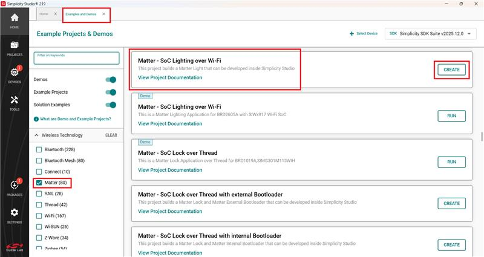
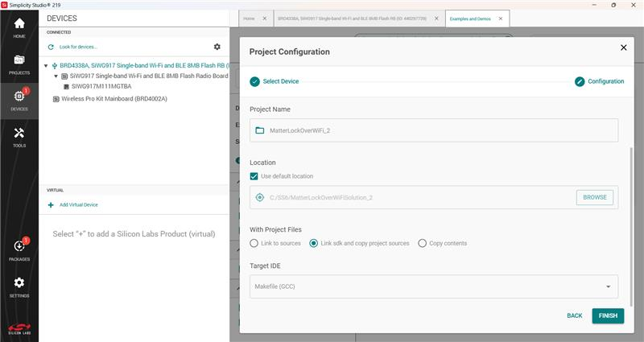
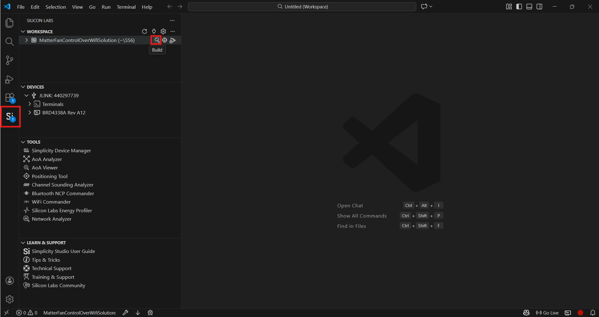
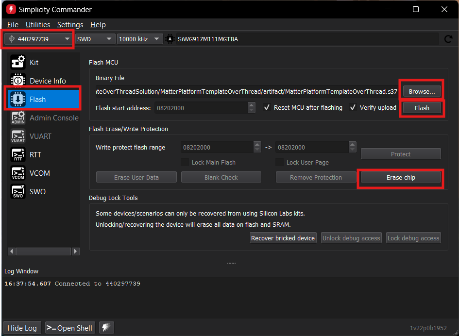

# Getting Started with OTA Updates in Matter Applications Using Simplicity Studio

In the Matter OTA Software Update scenario, the running image (OTA-A) and the update image (OTA-B) are regular Matter application images and are built using the standard procedure. The only additional configuration required is the use of a higher software version in the update image. This page provides information about creation of OTA-A and OTA-B application for EFR32 and SiWx917 SOC Boards.

>**Note**: Examples used are for EFR32. Select BRD4338A Board to create OTA-A and OTA-B application for SiWx917 SOC.

## Create and Build Project for Matter OTA-A Application

1. [Download](https://www.silabs.com/developers/simplicity-studio) and Install Simplicity Studio.
  
2. To install the software packages for Simplicity Studio, refer  [Software Package Installation](/matter/{build-docspace-version}/matter-wifi-getting-started-example/software-installation#installation-of-software-packages)

3. In Simplicity Studio, click on **Matter**, under **Example Projects and Demos**, select a project, and click **Create**.

   
     

4. In the Project Configuration window, Select the board and click **Next**.
   
   - Set -
      - Solution and Project Name.
      - Select Target IDE.
      - Click **Finish**.
      
   

5. Once the project is created, click the **Open in VS Code** option on the top right corner.
    

6. In VS Code, click the Studio Extension on the left panel and select **Build** option (Hammer Icon) in the Workspace tab.

    

7. Once the project is compiled successfully, the binaries can be flashed either using the **Simplicity Commander** from the tools or using the **Flash** option beside the **Build**.

    

8. When using Commander, select the kit and click the **Flash** option in the left panel. Click **Erase chip**.

9. Select the path for the project's **.s37** or **.rps** binary and click **Flash**.
    

> **Note:** By default, device logs are enabled on UART (serial terminal).

## Create and build Project for matter OTA-B application

- Matter OTA-B application will be used to create gbl for EFR32MG2x & *.rps* for SiWx917 SOC OTA file and OTA-A will be used to flash to the matter device.
- For Matter OTA-B application need to change Version in *sl_matter_config.h* file before building.

. In Simplicity Studio, click on **Matter**, under **Example Projects and Demos**, select a project, and click **Create**.

   
     

2. In the Project Configuration window, Select the board and click **Next**.
   
   - Set -
      - Solution and Project Name.
      - Select Target IDE.
      - Click **Finish**.
      
   

3. In the newly created project, navigate to **Software Components > Silicon Labs Matter > Stack > Matter Core Components**, click **Configure**, and set the **Device software version** and **Device software version string** parameters to **2**.  

4.  Once the modification is done for Software version, click the **Open in VS Code** option on the top right corner.
    

5. In VS Code, click the Studio Extension on the left panel and select **Build** option (Hammer Icon) in the Workspace tab.

    

6. Once the project is compiled successfully, go to the Project Explorer view and expand the OTA-B project binaries folder. Using the application **.s37** file, create a **.gbl** file using Simplicity commander.

7. After Creation of OTA-B application, run the OTA Scenario.
