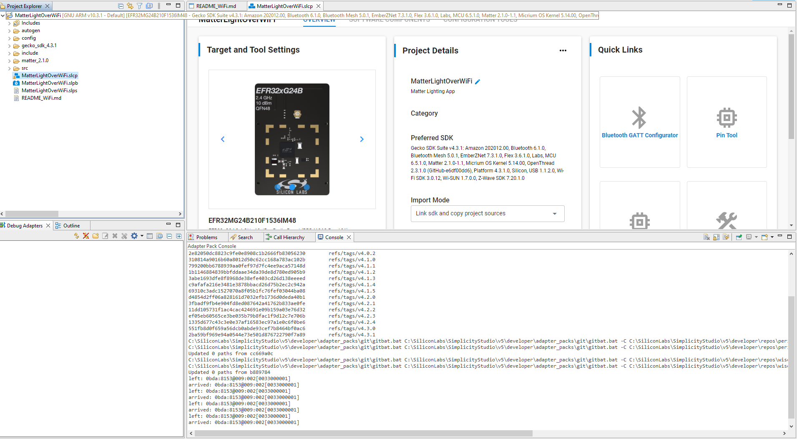
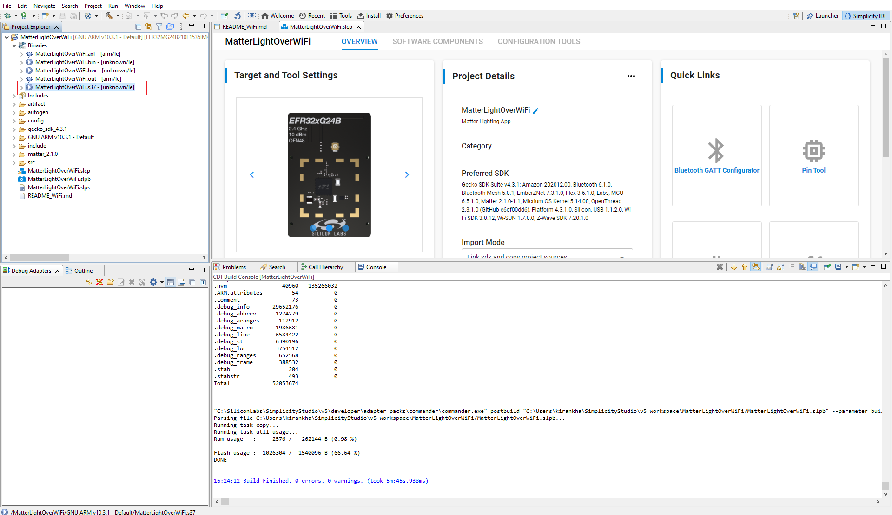
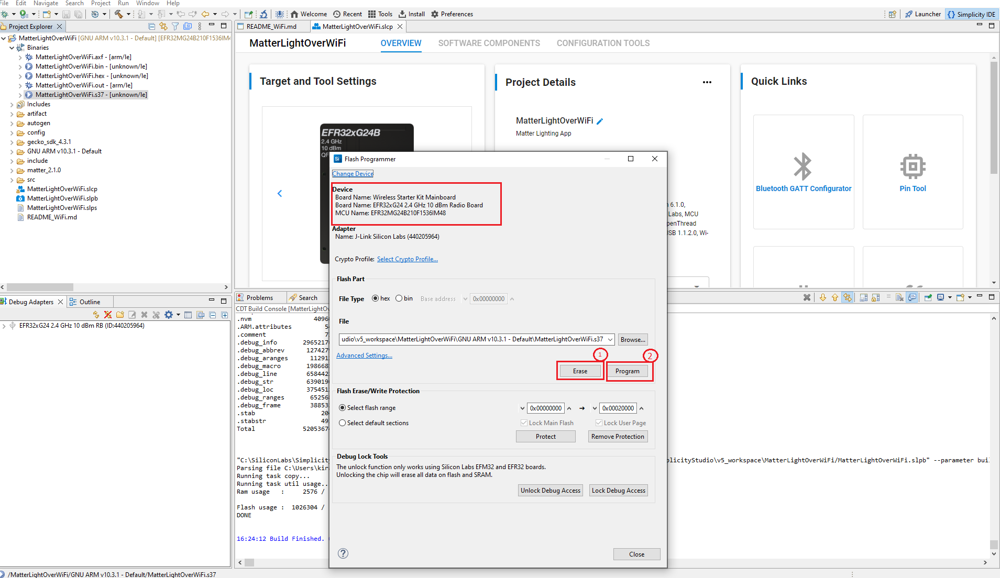

# Building Matter applications for OTA Software Update

In the Matter OTA Software Update scenario, the running image (OTA-A) and the update image (OTA-B) are regular Matter application images and are built using the standard procedure. The only additional configuration required is the use of a higher software version in the update image. This page provides information about creation of OTA-A and OTA-B Application for EFR32 and 917 SOC Boards.

**Note:** Examples used are for EFR32. Select BRD4338A Board to create OTA-A and OTA-B application for 917 SOC.

## Create and Build Project for Matter OTA-A Application

1. [Download](https://www.silabs.com/developers/simplicity-studio) and Install Simplicity Studio.
  
2. To install the software packages for Simplicity Studio, refer  [Software Package Installation](/matter/{build-docspace-version}/matter-wifi-getting-started-example/software-installation#installation-of-software-packages)

3. Log in to Simplicity Studio and connect the board to the computer.

4. Go to the **All Products** section.
  
   

5. Type and select the radio board from the displayed list and select **Start**.
  
   

6. The Launcher page will display the selected radio board's details.
  
   

7. Verify the following in the **General Information** section:
   - The Debug Mode is Onboard Device (MCU).
   - The Preferred SDK is the version you selected earlier.
  
   

8. Click **Example Projects and Demos**, select a project, and then click **Create**.
  
   

9. In the **New Project Wizard** window, click **Finish**.
  
   

10. Once the project is created, right-click the project and select **Build Project** in the Project Explorer tab.
  
    

11. Once the project is compiled successfully, go to the Project Explorer view and expand binaries folder to flash the binary.
  
    

12. Right-click the selected _.s37_ binary and click **Flash to Device**.

**Note:** For EFR32 devices, _.s37_ binary is used and for SiWx917 SOC, select _.rps_ binary and click **Flash to Device**.

    

1.  The Flash programmer window opens. Click **Erase** and then **Program** to start the flashing.
  
    

**Note:** Output of the EFR32 NCP Host application will be displayed on the J-Link RTT Viewer.

## Create and build Project for matter OTA-B application

- Matter OTA-B application will be used to create gbl for EFR32MG2x & .rps for SiWx917 SOC OTA file and OTA-A will be used to flash to the matter device.
- For Matter OTA-B application need to change Version in sl_matter_config.h file before building.

1. [Download](https://www.silabs.com/developers/simplicity-studio) and Install Simplicity Studio.
  
2. To install the software packages for Simplicity Studio, refer  [Software Package Installation](/matter/{build-docspace-version}/software-installation.md#installation-of-software-packages)

3. Log in to Simplicity Studio and connect the board to the computer.

4. Click **All Products**.
  
   

5. Type and select the radio board from the displayed list and click **Start**.
  
   

6. The Launcher page will display the selected radio board's details.
  
   

7. Verify the following in the General Information section:
   - The Debug Mode is Onboard Device (MCU).
   - The Preferred SDK is the version you selected earlier.
  
   

8. Click **Example Projects and Demos**, select a project, and then click **Create**.
  
   

9. In the N**ew Project Wizard** window, click **Finish**.
  
   

10. In the newly created project, navigate to **Software Components > Silicon Labs Matter > Stack > Matter Core Components**, click **Configure**, and set the **Device software version** and **Device software version string** parameters to **2**.  

11. Once the modification is done for Software version, right-click the project and select **Build Project** in the Project Explorer tab.
  
    

12. Once the project is compiled successfully, go to the Project Explorer view and expand the OTA-B project binaries folder. Using the application _.s37_ file, create a .gbl file using Simplicity commander.

13. After Creation of OTA-B application, run the OTA Scenario.
