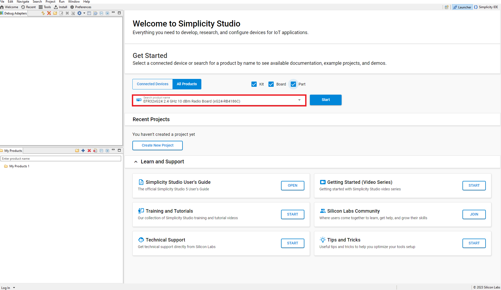
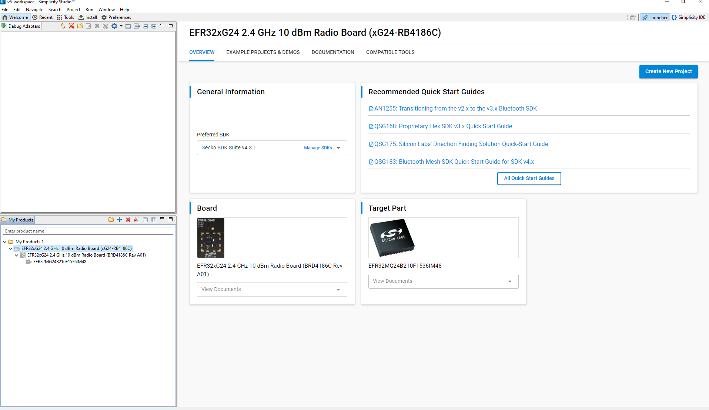
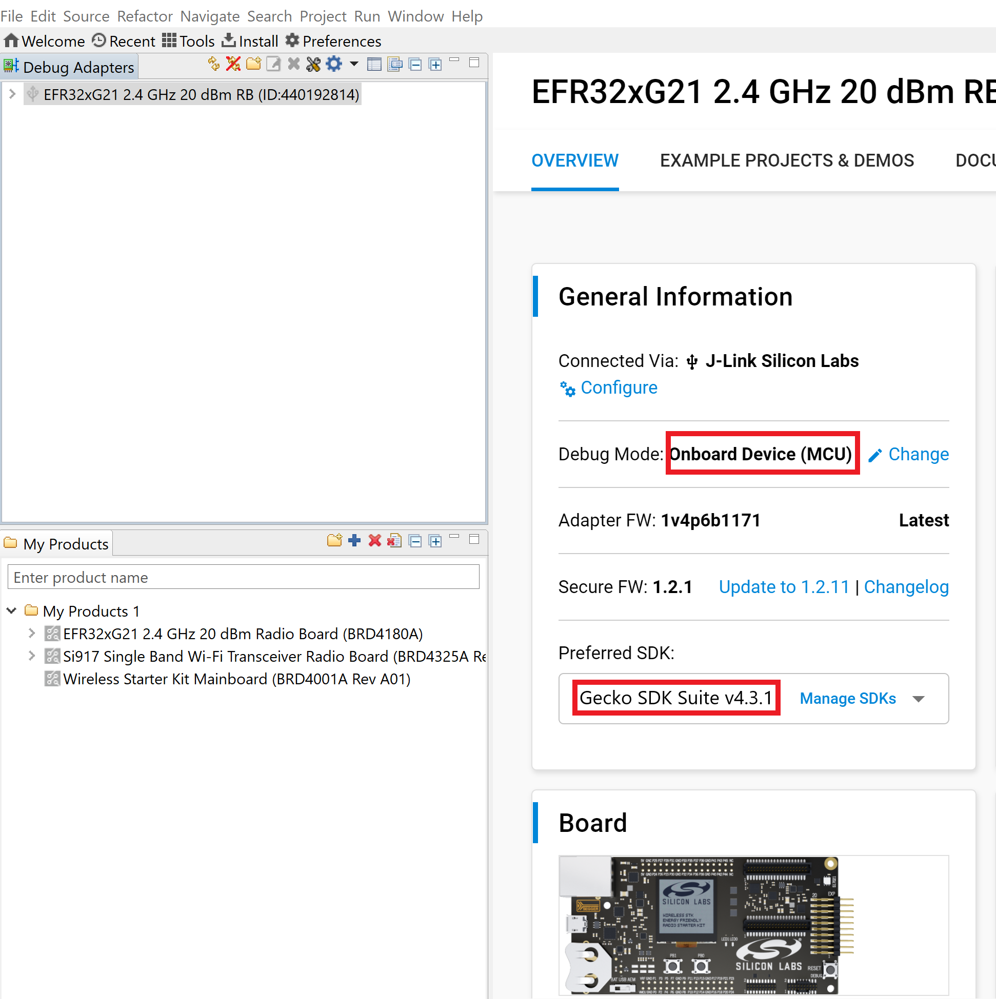

# Building Matter applications for OTA Software Update

In Matter OTA Software Update scenario the running image (OTA-A) and the update image (OTA-B) are regular Matter application images and are built using the standard procedure, the only additional configuration required is the use of a higher software version in the update image. This document gives information about creation of OTA-A and OTA-B Application for EFR32 and 917 SOC Boards.

**Note:** Examples used in this document for EFR32. Select BRD4338A Board to create OTA-A and OTA-B application for 917 SOC.

## Create and Build Project for Matter OTA-A Application

1. [Download](https://www.silabs.com/developers/simplicity-studio) and Install Simplicity Studio.
  
2. To install the software packages for Simplicity Studio, refer  [Software Package Installation](/matter/<docspace-docleaf-version>/matter-wifi-getting-started-example/software-installation#installation-of-software-packages)

3. Log in to Simplicity Studio and connect the board to the computer.

4. Go to the All Products section.
  
   

5. Type and Select the radio board from the displayed list and select Start.
  
   

6. The Launcher page will display the selected radio board's details.
  
   

7. Verify the following in the General Information section:
   - The Debug Mode is Onboard Device (MCU).
   - The Preferred SDK is the version you selected earlier.
  
   

8. Click on Example Projects and Demos Option and Create Project.
  
   

9. In the New Project Wizard window, click Finish.
  
   

10. Once the project is created, right-click on the project and select *Build Project* in the Project Explorer tab.
  
    

11. Once the project is compiled successfully, Go to the Project Explorer view and expand binaries folder to flash the binary.
  
    

12. Right-click on the selected *.s37* binary and click on *flash to device*.
  
    

13. Flash programmer window will be opened, Click on *Erase button and then Program* button to start the flashing.
  
    

**Note:** Output of the EFR32 NCP Host application will be displayed on the J-Link RTT Viewer.

## Create and build Project for matter OTA-B application

- Matter OTA-B application will be used to create gbl for EFR32MG2x & .rps for SiWx917 SOC OTA file and OTA-A will be used to flash to the matter device.
- For Matter OTA-B application need to change Version in sl_matter_config.h file before building.

1. [Download](https://www.silabs.com/developers/simplicity-studio) and Install Simplicity Studio.
  
2. To install the software packages for Simplicity Studio, refer  [Software Package Installation](/matter/<docspace-docleaf-version>/software-installation.md#installation-of-software-packages)

3. Log in to Simplicity Studio and connect the board to the computer.

4. Go to the All Products section.
  
   

5. Type and Select the radio board from the displayed list and select Start.
  
   

6. The Launcher page will display the selected radio board's details.
  
   

7. Verify the following in the General Information section:
   - The Debug Mode is Onboard Device (MCU).
   - The Preferred SDK is the version you selected earlier.
  
   

8. Click on Example Projects and Demos Option and Create Project.
  
   

9. In the New Project Wizard window, click Finish.
  
   

10. In Project Explorer section , open sl_matter_config file which is present in the config folder. Modify the **CHIP_DEVICE_CONFIG_DEVICE_SOFTWARE_VERSION 2** and **CHIP_DEVICE_CONFIG_DEVICE_SOFTWARE_VERSION_STRING "1"**

    **Note:**
        Make sure always CHIP_DEVICE_CONFIG_DEVICE_SOFTWARE_VERSION should be greater than CHIP_DEVICE_CONFIG_DEVICE_SOFTWARE_VERSION_STRING

11. Once the modification is done for Software version, right-click on the project and select *Build Project* in the Project Explorer tab.
  
    

12. Once the project is compiled successfully, Go to the Project Explorer view and expand OTA-B project binaries folder , using application .s37 file Need to Create .gbl file using Simplicity commander.

13. After Creation of OTA-B Application run the OTA Scenario.
