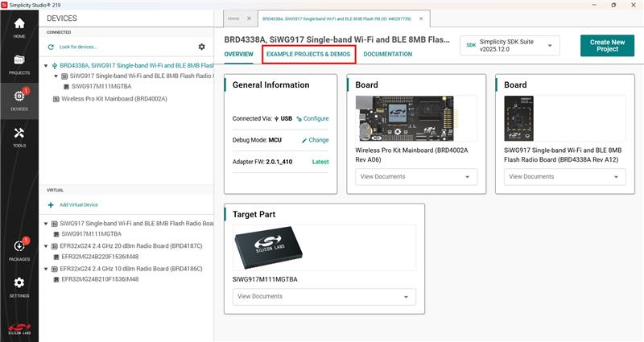
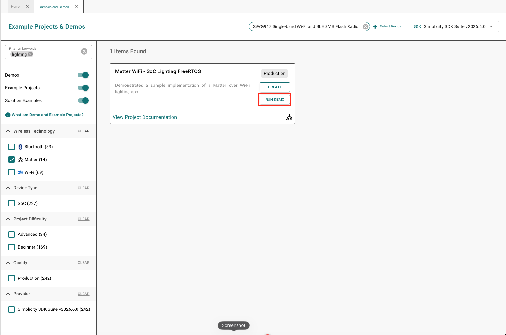
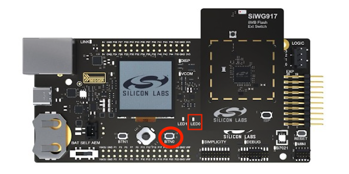
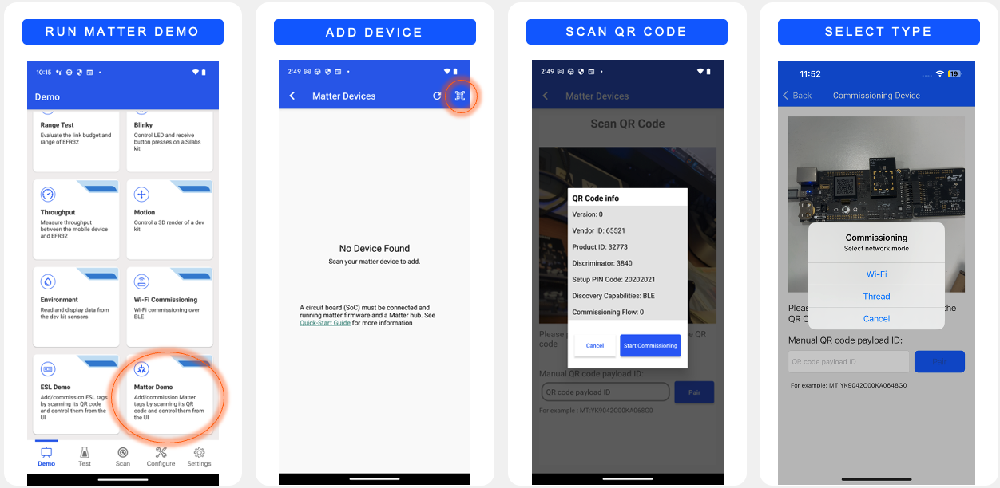
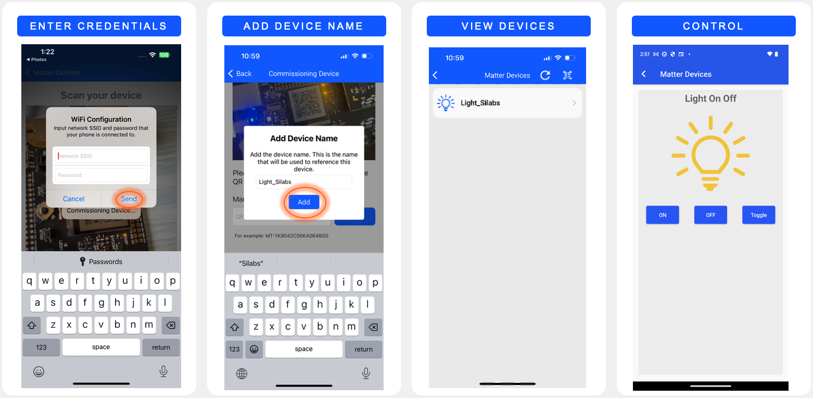

# Matter over Wi-Fi Quick-Start Demo

This Quick-Start Guide will demo the out-of-box experience for adding an SiWx917 SoC Matter Accessory Device to both Google and Apple ecosystems.

## Software Requirements

- Simplicity Studio v6 with SiSDK - 2025.12.2 + Silicon Labs Matter - 2.8.1 + WiSeConnect - 4.0.1
- Simplicity Connect mobile App on Smartphone

## Hardware Requirements

- Android smartphone OR iPhone connected to 2.4 GHz Wi-Fi
- 1 x Silabs WSTK + SiWx917 SoC (BRD4338A) Wi-Fi 6 and Bluetooth LE 8MB Flash Radio Board

> **Note:** Refer to [SiWx917](https://www.silabs.com/development-tools/wireless/wi-fi/siwx917-pro-kit?tab=techdocs) SoC for more details.

### (Optional) Ecosystem Requirements

- Google Account + 'Home' App on Smartphone
- Google Nest Hub

**or**

- Apple Account + 'Home' App on iPhone
- Home Pod device

## Flashing the SiWx917 SoC Matter Accessory Device

### Step 1: Connect the Silabs WSTK + SiWx917 SoC to PC via USB

### Step 2: Launch Simplicity Studio

The SiWx917 SoC will appear in the **Devices** tab.

Click the **Example Projects & Demos** tab and filter for *Matter*.

For this quick start guide, select the **Matter - SoC Siwx917 Lighting Example over Wi-Fi** demo. A number of other apps are also available including a Lock, Thermostat, Appliance, and Window Covering. When ready, click **Run** to flash the device. When the device is flashed, a QR code will appear on the WSTK screen. If no QR appears on the screen, the connectivity firmware may need to be updated. Follow the steps here for [Upgrading the Connectivity Firmware on SoC Devices](https://docs.silabs.com/matter/latest/matter-wifi-run-demo/loading-firmware-for-ncp-and-soc-boards#upgrading-the-connectivity-firmware-on-so-c-devices).

### Step 3: Prepare the Device for Commissioning

Hold **BTN0** on the WSTK for 6 seconds to factory reset the device. You will notice **LED0** will blink 3 times. The device is now ready to be commissioned to an ecosystem via the appropriate smartphone app.

## Commissioning with the Simplicity Connect App

The mobile phone running Simplicity Connect must be connected to a 2.4 GHz Wi-Fi network. Scan the Matter device’s QR code from the mobile device, select **Start Commissioning**, and select **Wi-Fi** as the Network Mode.

 Then enter the SSID and password of the Wi-Fi network that the smartphone is connected to and click the send button. The app will prompt you to enter a **Device Name**. Once complete, the device appears in the device list. You can now select the device and control it from the Simplicity Connect app.

The light can now be controlled from the Simplicity Connect app.

## Google Nest Hub

Open the Google Home application on a smartphone connected to the Google Nest Hub device, and follow the steps below to add the Matter Accessory Device. For issues related to the Google Home app or for the latest instructions, see [Set up and manage Matter-enabled devices in the Google Home app - Google Nest Help](https://support.google.com/googlenest/answer/13127223?hl=en#zippy=%2Cset-up-your-rd-party-matter-enabled-device-with-the-google-home-app).

The Matter Lighting app is now connected to the ecosystem and can be controlled from the home app on the smartphone.

## Apple Home Pod

Open the Home application on an iPhone device connected to the Apple Home Pod and follow the steps below to add the Matter Accessory Device. For issues related to the Apple Home app or for the latest instructions, see [Pair and manage your Matter accessories - Apple Support](https://support.apple.com/en-us/102135).

Once commissioning completes, the Apple Home app prompts you to select one room for the Matter application. Select any room you wish, and enter the Application name (ex: Light, Lock, etc.,). The Matter Lighting app is now connected to the ecosystem and can be controlled from the Home app.

## Taking it Further

After successfully running the Matter Lighting app to the ecosystem, the next step is to create, build, and flash a Matter sample project from Simplicity Studio. This section describes creating a new Matter project, building it in the Silicon Labs Extension for the Visual Studio Code IDE, and flashing it to the EFR32 SoC device. 

For instructions on installing Simplicity Studio and the Silicon Labs Extension for the Visual Studio Code IDE, refer to the [Simplicity Studio 6 Getting Started Guide](https://docs.silabs.com/ssv6ug/latest/ssv6ug-overview/) and [Simplicity Studio Extension for VS Code](https://docs.silabs.com/ss-vscode/latest/ss-vscode-start/).

### Step 1: Create a Matter Sample Project

1. Open Simplicity Studio and repeat the same steps as [above](#flashing-the-siwx917-soc-matter-accessory-device).
2. Instead of selecting **Run** for the demo, click **Create** for the **Matter - SoC Lighting over WiFi** example.
3. Review the Project Configuration and click **Finish**. Simplicity Studio creates a new Solution called MatterLightOverWiFiolution with the MatterLightOverWiFi project inside the workspace.
4. After the project is created, click the **Open in VS Code** button to open the project in the Silicon Labs Extension for the Visual Studio Code IDE.

### Step 2: Build the Project in the Silicon Labs Extension for the Visual Studio Code IDE

1. Once the MatterLightOverWiFiSolution is open, hover over the solution and click the **Build** button.

   

2. Ensure that the build completes successfully without any errors.

### Step 3: Flash the Device

1. After building the project, the output will include an `.rps` file in the artifact folder.
2. Connect the Silabs WSTK + 917 SoC to the PC via USB.
3. Hover over either of the binaries in the Binaries folder to reveal the Flash button. One of these is only the application while the other includes the application and the external bootloader. Click **Flash** to flash the device.

Once the device is flashed, it is ready for commissioning and further testing.

> **Note:** By default, device logs are enabled on UART (serial terminal). Refer to [Logging Configurations](/matter/{build-docspace-version}/matter-overview-guides/matter-logging-configuration) to configure the logging destination to JLink or UART.
