# Matter over Thread Quick-Start Demo

This Quick-Start Guide demonstrates the out-of-box experience for adding an EFR32MG24 Matter Accessory Device to ecosystems. Other boards are also supported. For the full list of Matter capable hardware, refer to the [Silicon Labs Matter Selector Guide](https://www.silabs.com/wireless/matter/selector-guide). This demo uses the **Matter - SoC Lighting over Thread** example application available in Simplicity Studio. The guide walks through flashing the EFR32 SoC device, commissioning it to an ecosystem using the Simplicity Connect mobile app, and controlling it from either Google Home or Apple Home apps.

## Software Requirements

- Simplicity Studio v6 with SiSDK - 2025.12.2 + Silicon Labs Matter - 2.8.1
- Simplicity Connect mobile App on Smartphone

## Hardware Requirements

- Android smartphone OR iPhone
- 1 x Silabs WSTK + EFR32MG24 2.4 GHz 20 dBm RB (BRD4187C)

>**Note**: Refer to [EFR32MG24 Tech Docs](https://www.silabs.com/development-tools/wireless/efr32xg24-pro-kit-20-dbm?tab=techdocs) for more details.

### (Optional) Ecosystem requirements

- Google Account + 'Home' App on Smartphone
- Google Nest Hub

**or**

- Apple Account + 'Home' App on iPhone
- Home Pod device

## Flashing the EFR32 SoC Matter Accessory Device

### Step 1: Connect the Silabs WSTK + EFR32 SoC to PC via USB

### Step 2: Launch Simplicity Studio

If the following screen does not appear automatically, click the **Home** icon If the Matter extension is installed, you should see the Matter tile like in the image below. 

Click the Matter tile. The **Example Projects & Demos** tab will appear already filtered for Matter.

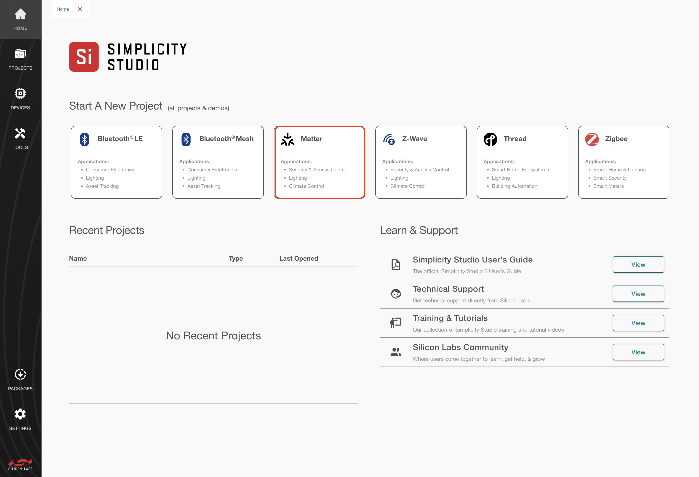

Click **Select Device** and the connected devices should appear.

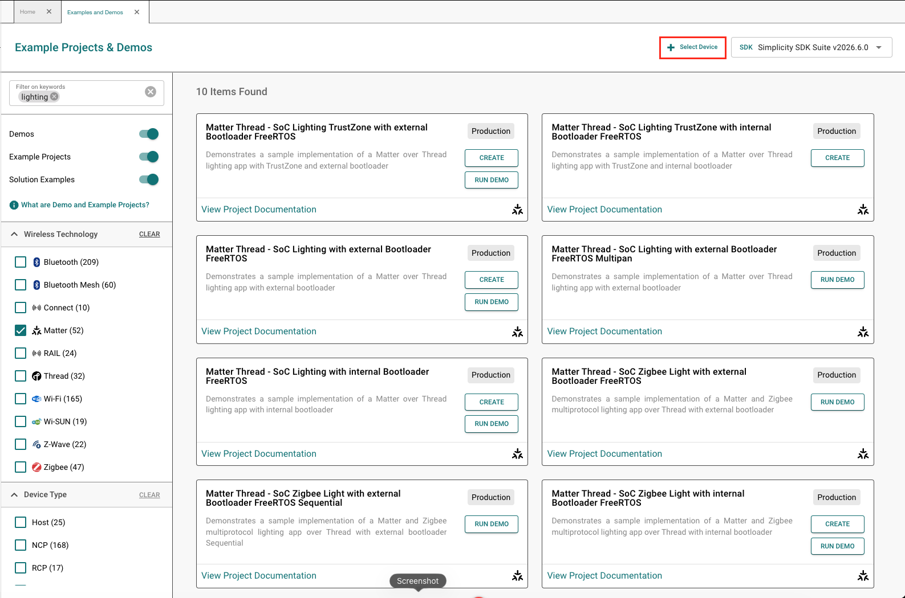

Select the appropriate device, in this case BRD4187C.

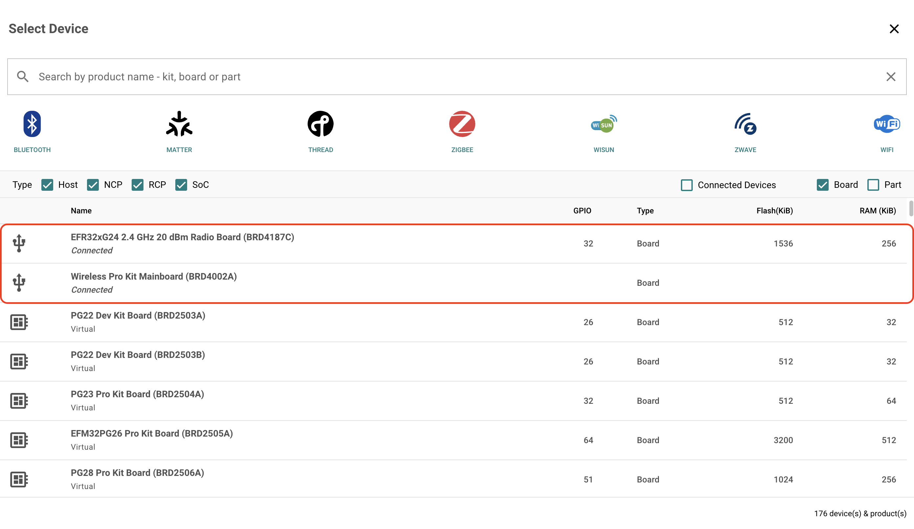

Type **lighting** into the keyword search and you will see the following screen.

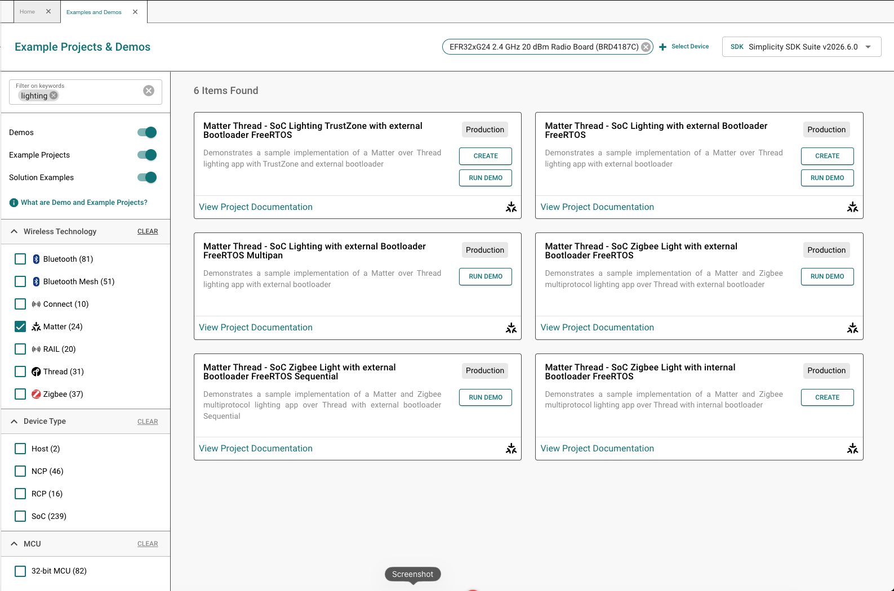

For this quick start guide, select the **Matter - SoC Lighting over Thread** demo. A number of other apps are also available including a Lock, Thermostat, Appliance, and Window Covering. When ready, click **Run** to flash the device. When the device is flashed, a QR code will appear on the WSTK screen.

### Step 3: Prepare the Device for Commissioning

Hold **BTN0** on the WSTK for 6 seconds to factory reset the device. You will notice **LED0** will blink 3 times. The device is now ready to be commissioned to an ecosystem via the appropriate smartphone app.

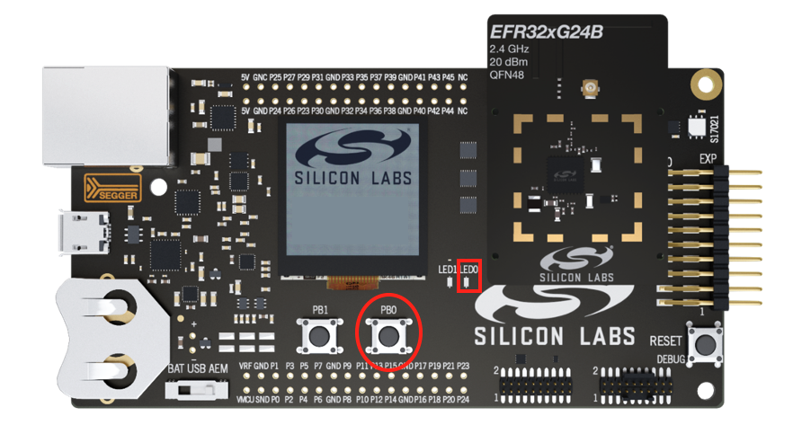

## Commissioning with the Simplicity Connect App

The mobile phone running Simplicity Connect must be connected to the same Wi-Fi network as the Matter Hub. Open a terminal in the Matter hub and start by running this command to get the dataset.

```
$ mattertool startThread
```

- Copy the generated dataset (refer to the image above for the dataset). This dataset will be used on Android and iOS devices during the commissioning of Matter devices.

- At this point, the Matter device is already on the network and requires network credentials for Thread.

- After flash, you will see the QR code on the device.
  
  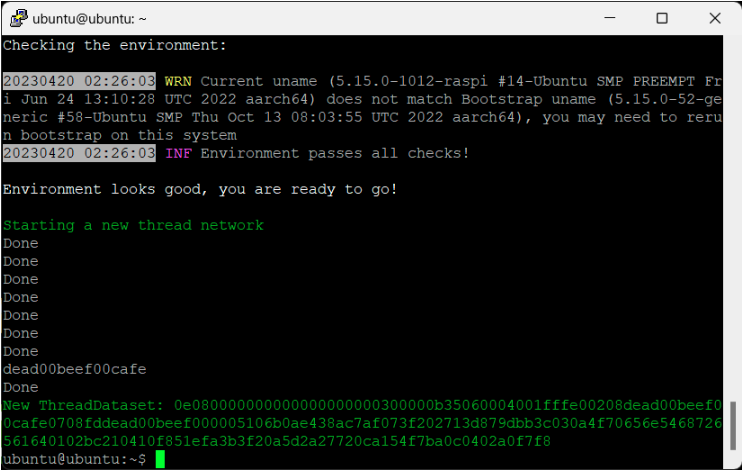

Once the QR code is scanned, the application will display two options to commission the device. If you select **THREAD**, then you must enter the dataset which is created in the (Section 2.2.3.). Enter the dataset in text field and click **Send**.

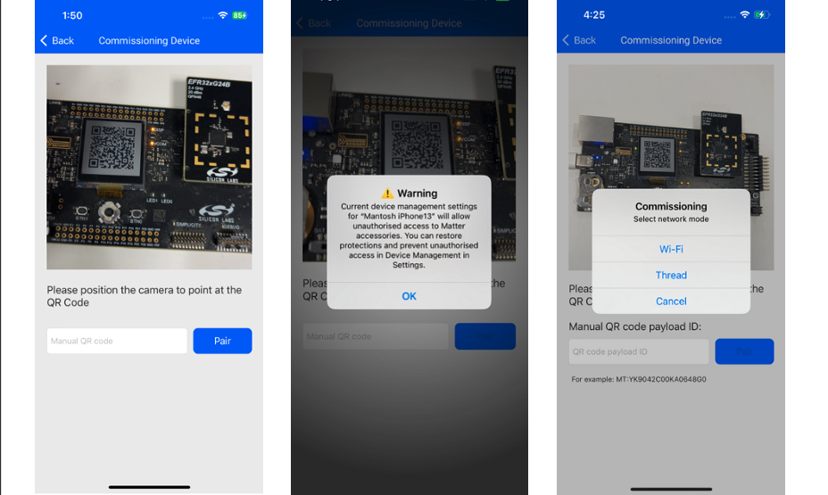

After the Matter device is successfully commissioned, you will receive a popup where you can enter desired name.

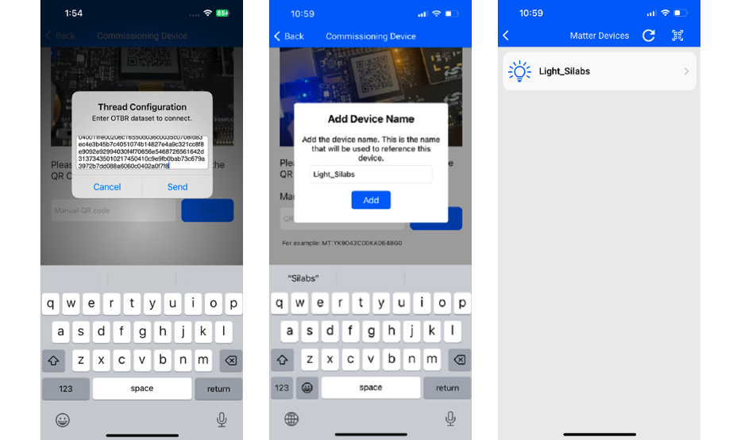

Once commissioned, the light can be controlled from the Simplicity Connect app.

## Google Nest Hub

Open the Google Home application on a smartphone connected to the Google Nest Hub device and follow the steps below to add the Matter Accessory Device. For issues related to the Google Home app or for the latest instructions, see [Set up and manage Matter-enabled devices in the Google Home app - Google Nest Help](https://support.google.com/googlenest/answer/13127223?hl=en#zippy=%2Cset-up-your-rd-party-matter-enabled-device-with-the-google-home-app).

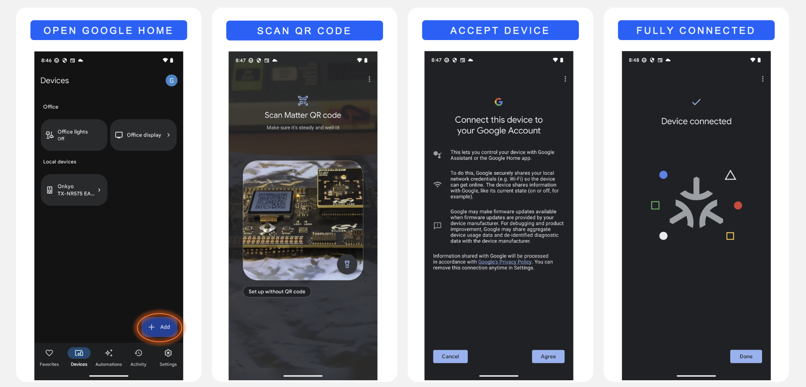

The Matter Lighting app is now connected to the ecosystem and can be controlled from the home app on the smartphone.

## Apple Home Pod

Open the **Home** application on an iPhone device connected to the Apple Home Pod and follow the steps below to add the Matter Accessory Device. For issues related to the Apple Home app or for the latest instructions, see [Pair and manage your Matter accessories - Apple Support](https://support.apple.com/en-us/102135).

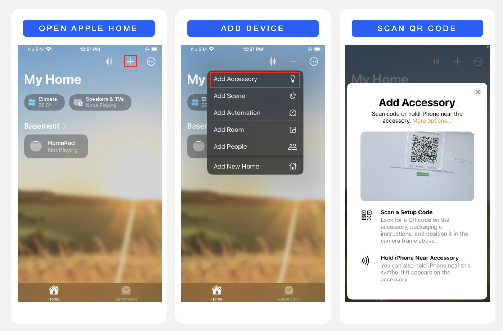

Once commissioning completes, the Apple Home app prompts you to select one room for the Matter application. Select any room you wish, and enter the Application name (ex: Light, Lock, etc.,). The Matter Lighting app is now connected to the ecosystem and can be controlled from the Home app.

## Taking it Further

After successfully running the Matter Lighting app to the ecosystem, the next step is to create, build, and flash a Matter sample project from Simplicity Studio. This section describes creating a new Matter project, building it in the Silicon Labs Extension for the Visual Studio Code IDE, and flashing it to the EFR32 SoC device. 

For instructions on installing Simplicity Studio and the Silicon Labs Extension for the Visual Studio Code IDE, refer to the [Simplicity Studio 6 Getting Started Guide](https://docs.silabs.com/ssv6ug/latest/ssv6ug-overview/) and [Simplicity Studio Extension for VS Code](https://docs.silabs.com/ss-vscode/latest/ss-vscode-start/).

### Step 1: Create a Matter Sample Project

1. Open Simplicity Studio and repeat the same steps as [above](#flashing-the-efr32-soc-matter-accessory-device).
2. Instead of selecting **Run** for the demo, click **Create** for the **Matter - SoC Lighting over Thread with external Bootloader** example.
3. Review the Project Configuration and click **Finish**. Simplicity Studio creates a new Solution called MatterLightOverThreadSolution with the MatterLightOverThread project inside the workspace.
   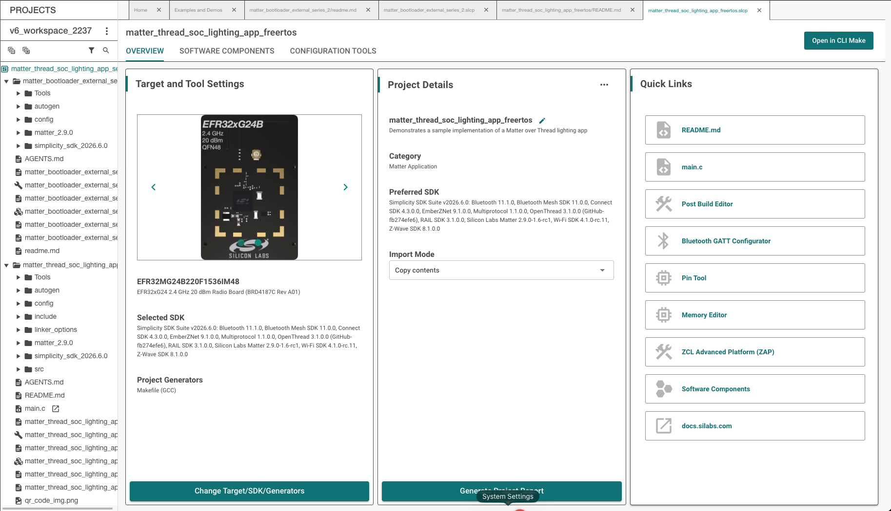
4. After the project is created, click the **Open in VS Code** button to open the project in the Silicon Labs Extension for the Visual Studio Code IDE.

### Step 2: Build the Project in the Silicon Labs Extension for the Visual Studio Code IDE

1. Once the MatterLightOverThreadSolution is open, hover over the solution and click the **Build** button.

   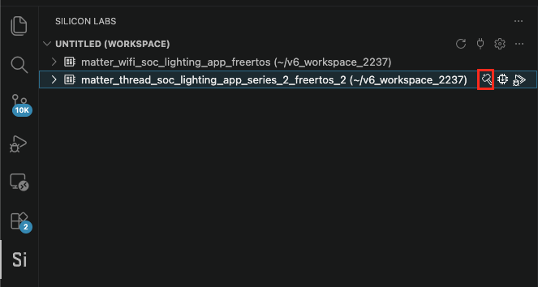

2. Ensure that the build completes successfully without any errors.

### Step 3: Flash the Device

1. After building the project, the output will include an `.s37` file in the Binaries folder.
2. Connect the Silabs WSTK + EFR32 SoC to the PC via USB.
3. Hover over either of the binaries in the Binaries folder to reveal the Flash button. One of these is only the application while the other includes the application and the external bootloader. Click **Flash** to flash the device.

   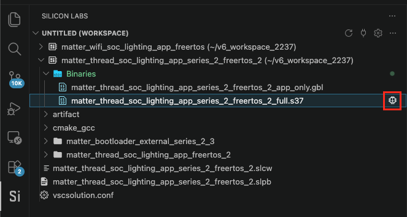
4. A successful flash will looks like the image below.

   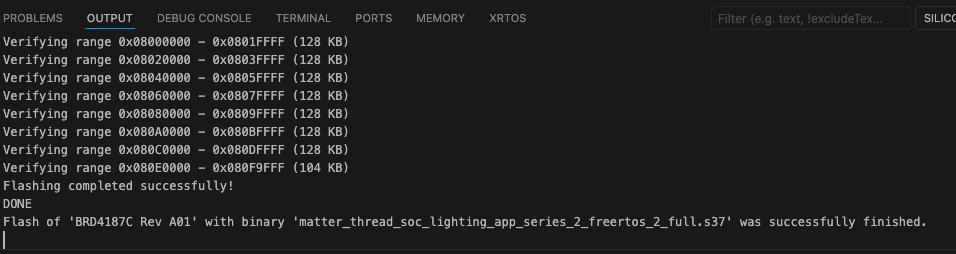

Once the device is flashed, it is ready for commissioning and further testing.

> **Note:** By default, device logs are enabled on UART (serial terminal). Refer to [Logging Configurations](/matter/{build-docspace-version}/matter-overview-guides/matter-logging-configuration) to configure the logging destination to JLink or UART.
