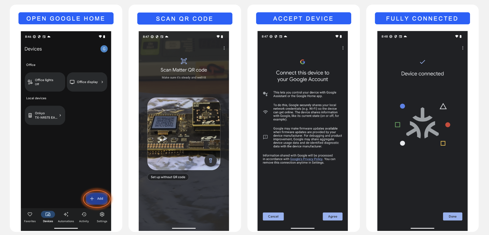
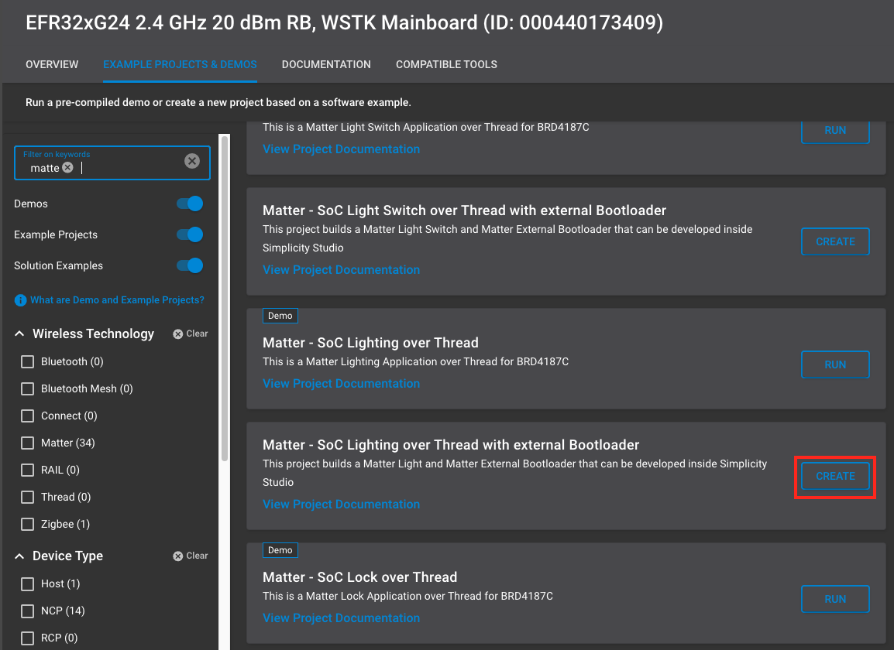

# Matter over Thread Quick-Start Demo

This Quick-Start Guide will demo the out-of-box experience for adding an EFR32MG24 Matter Accessory Device to ecosystems.

## Software Requirements

- Simplicity Studio v5 with SiSDK - 2024.06 + Silicon Labs Matter - 2.3.0 + WiSeConnect - 3.3.0
- Simplicity Connect mobile App on Smartphone

## Hardware Requirements

- Android smartphone OR iPhone
- 1 x Silabs WSTK + EFR32MG24 2.4 GHz 20 dBm RB (BRD4161A)

> **Note:** Refer to [EFR32MG24 Tech Docs](https://www.silabs.com/development-tools/wireless/efr32xg24-pro-kit-20-dbm?tab=techdocs) for more details.

### (Optional) Ecosystem requirements

- Google Account + 'Home' App on Smartphone
- Google Nest Hub

**or**

- Apple Account + 'Home' App on iPhone
- Home Pod device

## Flashing the EFR32 SoC Matter Accessory Device

### Step 1: Connect the Silabs WSTK + EFR32 SoC to PC via USB

### Step 2: Launch Simplicity Studio

If the following screen does not appear automatically, select the Launcher icon on the top right of the window. The EFR32MG24 will appear in the **Connected Devices** tab.


Click the start button and the following screen will appear. Navigate to the **Example Projects & Demos** tab and filter for *Matter*.


For this quick start guide, select the **Matter - SoC Lighting over Thread** demo. A number of other apps are also available including a Lock, Thermostat, Appliance, and Window Covering. When ready, click **Run** to flash the device. When the device is flashed, a QR code will appear on the WSTK screen.


### Step 3: Prepare the Device for Commissioning

Hold **BTN0** on the WSTK for 6 seconds to factory reset the device. You will notice **LED0** will blink 3 times. The device is now ready to be commissioned to an ecosystem via the appropriate smartphone app.


## Commissioning with the Simplicity Connect App

The mobile phone running Simplicity Connect must be connected to the same Wi-Fi network as the Matter Hub. Open a terminal in the Matter hub and start by running this command to get the dataset.

```
$ mattertool startThread
```

- Copy the generated dataset (refer to the image above for the dataset). This dataset will be used on Android and iOS devices during the commissioning of Matter devices.

- At this point, the Matter device is already on the network and requires network credentials for Thread.

- After flash, you will see the QR code on the device.
  
  

Once the QR code is scanned, the application will display two options to commission the device. If you select **THREAD**, then you must enter the dataset which is created in the (Section 2.2.3.). Enter the dataset in text field and click **Send**.


After the Matter device is successfully commissioned, you will receive a popup where you can enter desired name.


Once commissioned, the light can be controlled from the Simplicity Connect app.

## Google Nest Hub

Open the Google Home application on a smartphone connected to the Google Nest Hub device and follow the steps below to add the Matter Accessory Device. For issues related to the Google Home app or for the latest instructions, see [Set up and manage Matter-enabled devices in the Google Home app - Google Nest Help](https://support.google.com/googlenest/answer/13127223?hl=en#zippy=%2Cset-up-your-rd-party-matter-enabled-device-with-the-google-home-app).



The Matter Lighting app is now connected to the ecosystem and can be controlled from the home app on the smartphone.

## Apple Home Pod

Open the **Home** application on an iPhone device connected to the Apple Home Pod and follow the steps below to add the Matter Accessory Device. For issues related to the Apple Home app or for the latest instructions, see [Pair and manage your Matter accessories - Apple Support](https://support.apple.com/en-us/102135).


Once commissioning completes, the Apple Home app prompts you to select one room for the Matter application. Select any room you wish, and enter the Application name (ex: Light, Lock, etc.,). The Matter Lighting app is now connected to the ecosystem and can be controlled from the Home app.

## Taking it Further

After successfully running the Matter Lighting app to the ecosystem, the next step is to create, build, and flash a Matter sample project from Simplicity Studio.

### Step 1: Create a Matter Sample Project

1. Open Simplicity Studio and select **Create New Project**.
2. Filter for *Matter* and select the **Matter - SoC Lighting over Thread with external Bootloader** sample application and select **Create**.
3. Click **Finish**.
   Simplicity Studio will create a new Solution called MatterLightOverWiFiSolution with the MatterLightOverThreadSolution project inside.
4. Open the project.

   

### Step 2: Build the Project

1. Once the project is open, click the **Build** button in the toolbar.
2. Ensure that the build completes successfully without any errors.

   

### Step 3: Flash the Device

1. After building the project, the output will include an `.s37` file in the GNU ARM v12.2.1 - Default folder.
2. Connect the Silabs WSTK + EFR32 SoC to the PC via USB.
3. Navigate to **Tools** and open Simplicity Commander.
4. Select the desired board according to its serial number and navigate to the **Flash** tab.
5. Click **Browse** and select the `.s37` file from the build output.
6. Click **Flash** to flash the device.

Once the device is flashed, it will be ready for commissioning and further testing.

