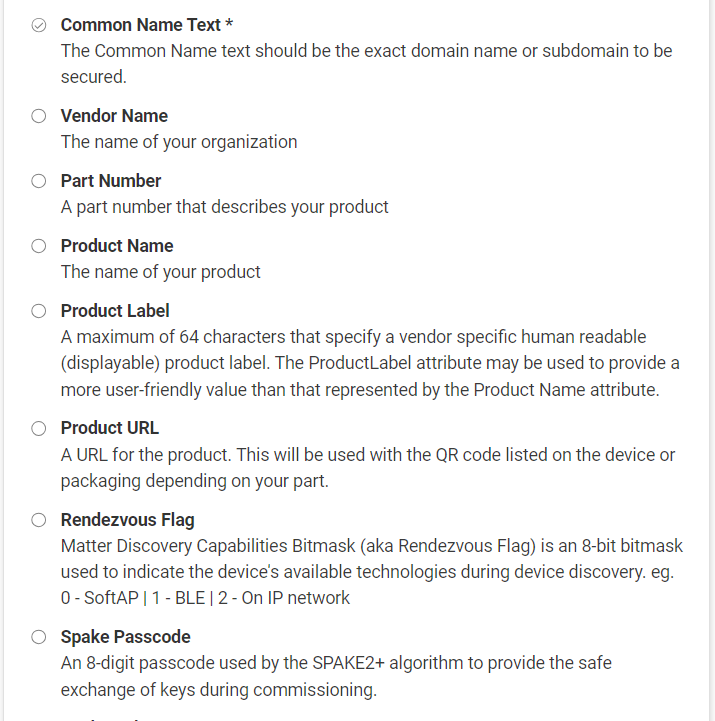
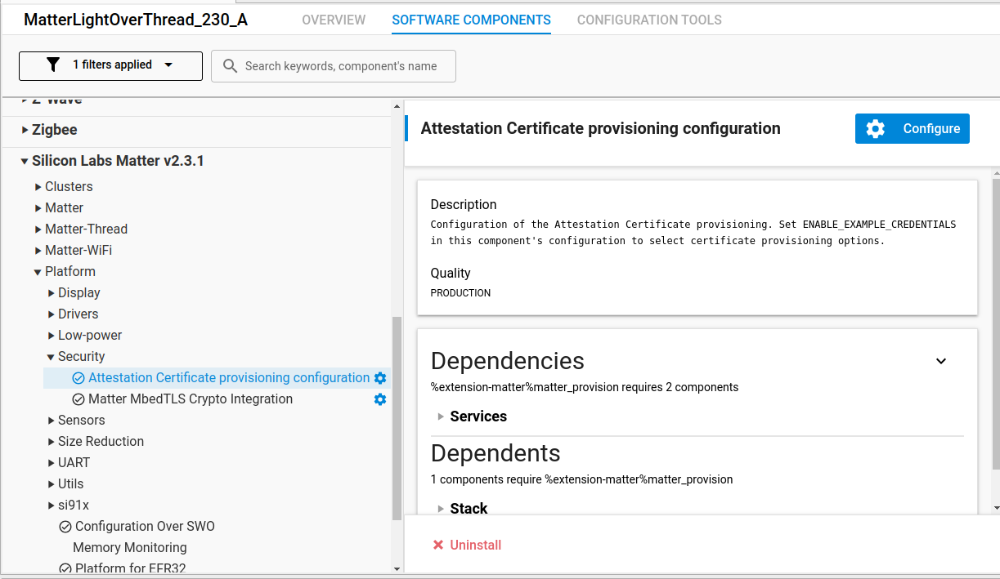

# Provisioning GUI Tool

## Background

The Matter Provisioning Tool (MPT) allows you to:

1. Provision certificates on a device for use in Matter application development.
2. Generate CPMS files to prepare for the production process.

MPT is a python script with a command line interface (CLI), which is found within the Silicon Labs Matter SDK.

- For Matter SDK version 2.2.0 and later, go to the provision directory within the SDK.
- For Matter SDK versions 2.1 and 2.0, go to the cpms directory within the SDK.

The GUI for the MPT is available within Simplicity Studio version 5.8.x and later. Benefits of using the GUI include:

- Provides an efficient interface for executing the most common functions of the MPT.
  - Note: For advanced use cases, you need to use the MPT CLI.
- Provides and configures dependencies required to execute MPT functions (e.g., adds required 3rd party python modules, etc.).
- Supported on these Operating Systems and Architectures:
  - Windows (x86_64)
  - MacOS X (x86_64 & ARM64)
  - Linux (x86_64)

## Installation

You can install the Matter Provisioning Tool GUI feature in a New or Existing Installation of Simplicity Studio. See below for step-by-step instructions.

### New Installation

In a new installation of Simplicity Studio, the feature will be installed using the First-Time Installer Wizard.

1. Download and Install [Simplicity Studio](https://www.silabs.com/developers/simplicity-studio).

2. Launch Simplicity Studio and accept licenses.

     

3. Log in with your Silicon Labs account (optional).  

   

4. Within the First-Time Installer Wizard, select **Install by technology type**.

   

5. Within Technology Type, select **32-bit and Wireless MCUs + Silicon Labs Matter**, and then **Next**.

   

6. Select **Advanced** and then click **Next**.

   

7. In the **Recommended** tab, select **32-bit and Wireless MCUs + Silicon Labs Matter**.

8. In the **Required** tab, confirm that **Matter Provisioning (Beta)** is in list of features, and then click **Next**.

   

9. Accept Licenses and then click **Next**. Simplicity Studio begins installation.

10. Simplicity Studio completes installation. Restart Simplicity Studio.  

    

### Existing Installation

In an existing installation of Simplicity Studio, the MPT can be installed from within the Package Manager. See the step-by-step instructions below.

1. Within the Launcher perspective, click **Install** (toolbar button).  

   

2. Select **Managed installed packages**.  

   

3. Select **Tools** and then **Matter Provisioning (Beta)**. Click **Install** and then restart Simplicity Studio.

   

## Project Setup

Before you can use the Matter Provisioning Tool GUI, you need to perform the steps below.

1. Using the Matter SDK, create a Matter Project that supports provisioning of certificates on the Device. Example of Projects: Matter - SoC Thermostat over Thread.

2. In Launcher perspective, select **Create New Project**, select the **Matter** filter, select **Project**, and then click **Next**. Specify a project name and then click **Finish**.  

   

3. After the project is created, verify that `Project Directory/config/provision/provision.mattpconf` exists. Note:

   1. When the project is created, the file `provision.mattpconf` should be empty.
   2. Not all Matter projects allow provisioning of certificates to the device. SDK Projects selected to allow provisioning of certificates will auto-generate the file `provision.mattpconf` when the project is created.
   3. The presence of the file `provision.mattpconf` within the project will allow the Matter Provisioning Tool GUI to be enabled for the project.

4. You can open the Matter Provisioning Tool GUI in one of two ways:

   1. Double-click the file `provision.mattpconf` within the project.  

      

   2. Double-click the project's SLCP file in the Project Configurator editor. Then navigate to Configuration Tools > Matter Provisioning and click **Open**.

      

## GUI Overview

The following provides a summary of the various sections of the GUI. The GUI consists of two tabs:  Overview and Matter Device Provisioning.

### Overview Tab

The Overview tab provides a description of the Provisioning and Production Process.  

The Overview section provides a description of the processes.  

  

The Matter Device Provisioning section provides a description of the provisioning process.  

  

The Kudelski CA Partnership section describes how to work with Kudelski Security to obtain Device Attestation Certificates (DACs).  

  

The Manufacturing your Matter device with CPMS section describes how to configure your CPMS file.

  

### Matter Device Provisioning Tab

The Matter Device Provisioning tab provides two tools:

1. Provisioning the device during the development process.
2. Generating CPMS files to prepare for the production process

### Tool - Provisioning the Device

Required fields are inputs that you must provide to customize your device provisioning process.  

  

Optional fields are inputs that you can provide to customize your device provision.  

  

Matter Provisioning Checklist indicates which required inputs are satisfied, and which inputs have modified values from defaults.

  

  

  

Matter Attestation - Certification Declaration (CD) indicates which one to use for provisioning the device.  

- Default CD: use generic one provided  
- Upload a CD: provide your own CD  

  

Matter Attestation - Certification Chain indicates format of chain.

- PAA/PAI/DAC: provide certificate chain  
- PKCS 12: provide single archived file with cryptographic objects  

  

PAA/PAI/DAC files - use generic files provided or upload your own files.  

  

PKCS 12 - specify archived file and passcode  

  

Provision Device button will execute the process for provisioning the device.  

  

### Tool - Generate CPMS File

Required fields are inputs that a user must provide to customize their device provisioning process.  

  

Optional fields are inputs that a user can provide to customize their device provision.  

  

Order Production Samples through CPMS section allows user to generate JSON file with CPMS settings.

  

## How To Use

Follow these steps to provision certificates onto a device.

1. Specify values for Required fields.

   - Note: When selecting the Default options for the Certificate Declaration field and Matter PAA/PAI/DAC fields, the Vendor ID (VID) and Product ID (PID) are NOT editable and are set to default values 0x1049 and 0x8005 (Silicon Labs' VID & PID), respectively. This is to ensure that the Vendor ID and Product ID values match the ones in the default certificate files used.
   - When selecting the Upload options for the Certificate Declaration field and Matter PAA/PAI/DAC fields, fields Vendor ID and Product ID are editable and the user must specify the values. This is to ensure that the Vendor ID and Product ID values match the ones in the uploaded certificate files.

     

2. Specify values for any Optional fields.

   

3. For Certificate Declaration (CD), choose either the Default or Upload options. For the Upload a CD option, specify the path to your CD in the field provided.

   

4. For Matter Certificate Chain, choose either the PAA/PAI/DAC or PKCS 12 options.

   - For the PAA/PAI/DAC option, select between Default or Upload options. For the Upload options, specify the path to your certificate files in the respective fields provided.
   - For the PKCS 12 option, specify the path to your archived file in the field provided and your passcode. Note: the passcode is not saved to disk.
  
     

5. Click **Provision Device** to execute the provisioning operation.

   

6. Examine the output of the provisioning operation in the Provision console.

   

   - When the operation completes successfully, the output should indicate that each task completed during the operation. Below are examples of the status message and console output for a successful operation. Status Message:
  
     
  
   - If the operation terminates due to a failure, the output should indicate the error message indicating the cause for the failure. Below are examples of the status message and console output when the operation fails, e.g. incorrect value for commissioning flow. Status Message:

      

7. When the operation completes successfully, you will need to add the **Matter Device Attestation Credential** software component to your project to enable the Matter Device Attestation Credentials.

   - To add the software component, double-click the project's SLCP file to open it in an editor, and then select **Software Components**, search for the keyword "attestation", select **Matter Device Attestation Credential**, and then click **Install**. Example:

     

8. Rebuild your project so the "default hardcoded credentials" embedded in the code project are ignored and superseded with the data that was provisioned.

## Generating CPMS Files

Follow these steps to generate a CPMS file to prepare for the production process.  

1. Specify values for Required Fields.
    - Note: When selecting the Default options for the Certificate Declaration field and Matter PAA/PAI/DAC fields, the Vendor ID (VID) and Product ID (PID) are NOT editable and are set to default values 0x1049 and 0x8005 (Silicon Labs' VID & PID), respectively. This is to ensure that the Vendor ID and Product ID values match the ones in the default certificate files used.  
    - When selecting the Upload options for hte Certificate Declaration field and Matter PAA/PAI/DAC fields, fields Vendor ID and Product ID are editable and the user must specify the values. This is to ensure that the Vendor ID and Product ID values match the ones in the uploaded certificate files.

      

2. Specify values for any Optional fields.

      

3. Click **Generate CPMS file**. In the dialog, specify the path to the directory where you want to save the `cpms.json` file.

      

4. Examine the output of the provisioning operation in the Provision console.

      

    - When the operation completes successfully, the output should indicate that each task completed during the operation. Below are examples of the status message and console output for a successful operation. Status Message:

      

    - If the operation terminates due to a failure, the output should show the error message indicating the cause for the failure. Below are examples of the status message when the operation fails, e.g. invalid path provided. Status Message:

      
