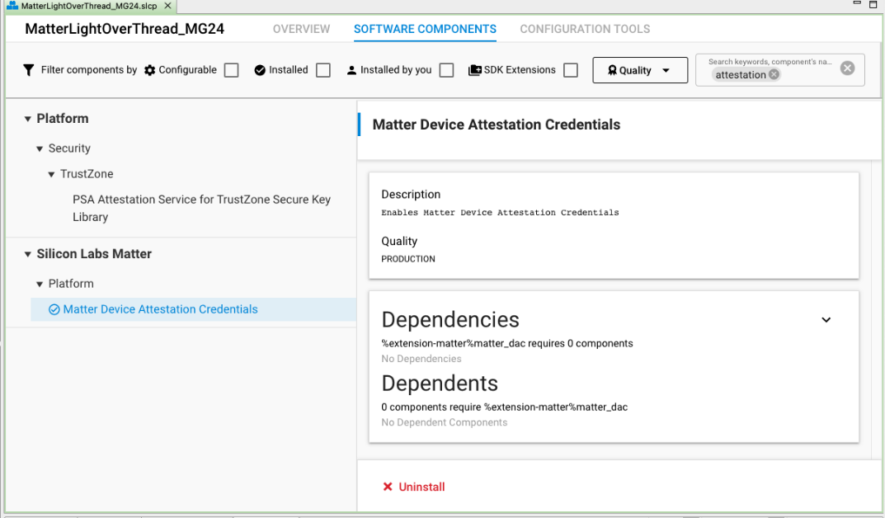

# Test Matter Certificates for Development

## Hardware and Software Requirements

- **Commissioner**

  - Raspberry Pi flashed with the Matter Hub Image

    - Setting Up you Matter Hub: [Developing with Silicon Labs Matter](/matter/<docspace-docleaf-version>/matter-start)

  - WSTK with supported boards for RCP

    - How to set up your RCP: [Developing with Silicon Labs Matter](/matter/<docspace-docleaf-version>/matter-start)

- **Commissionee**

  - WSTK with MG24A or MG24B (Initial boards supported for Matter CPMS Alpha program). The provisioning script currently supports MG12 devices but will no longer do so moving forward. In this tutorial, you will build an application with a BRD4187C.

## Introduction to Provisioning

Matter devices require a minimum amount of data that should be installed. Besides the Vendor ID, Product ID, Discriminator, and other device information, session establishment requires a CD (Certification Declaration), PAI (Product Attestation Intermediate certificate), and DAC (Device Attestation Certificate). There is no requirement about how or where this data is stored, but the Matter stack uses three distinct interfaces to retrieve it:

- [DeviceInstanceInfoProvider](https://github.com/project-chip/connectedhomeip/blob/master/src/include/platform/DeviceInstanceInfoProvider.h)

- [CommissionableDataProvider](https://github.com/project-chip/connectedhomeip/blob/master/src/include/platform/CommissionableDataProvider.h)

- [DeviceAttestationCredsProvider](https://github.com/project-chip/connectedhomeip/blob/master/src/credentials/DeviceAttestationCredsProvider.h)

There is a long list of parameters that may be loaded on the device in-factory, and there are also complex dependencies between different arguments and files. For instance, Vendor ID must be returned by the DeviceInstanceInfoProvider interface, but Vendor ID must also be present in the CD and DAC and must match in all instances. Furthermore, each DAC must be loaded alongside its private key, which is used to sign outgoing messages. The secrecy of the private key is critical for the security of the inter-device communication; therefore, measures must be taken to limit access to this key, and this key should be stored in the most secure part of your device.

In a production environment, different devices should have unique identifiers, passcodes, discriminators, private-keys and DACs, which implies customization during the manufacturing process. To ease the development and manufacturing of customized devices, Silicon Labs provides the [Custom Part Manufacturing Service (CPMS)](https://www.silabs.com/services/custom-part-manufacturing-service).

In a development environment, Silicon Labs provides a Provisioning Tool that is used to generate a Matter Certificate Chain based on Test or Development Certificates provided by the Connectivity Standards Alliance. These certificates can have data modified such as VID, PID, Discriminator, Passcode, etc. For more information and arguments to this tool, refer to [Using CPMS](/matter/<docspace-docleaf-version>/matter-using-cpms).

To provide flexibility, Silicon Labs provides two ways to write Commissionable Data and Device Attestation Credentials to Matter Devices. The following figure depicts these two flows:


These two provisioning flows use the same Python Provisioning Tool script to initiate writing the Commissionable Data and the Device Attestation Data. The Generator Firmware and the Matter Sample application have the ability to store all the required data for a successful commissioning.

The use of a Generator Firmware is intended for Provisioning at Manufacturing and to reduce time writing Matter Credentials as there is no need for a bootloader or Matter Application.

When using a Matter Sample Application for provisioning, the user must ensure that the Matter Device has the flag *use\_provision\_channel = true* upon booting the device. The provision flag may be set to 1 at runtime. This may be accomplished in three ways:

- On example application with two buttons, factory reset by pressing BTN0 and BNT1 at the same time. Besides the regular factory reset, the provision flag is set to 1, and the device will wait for provisioning upon restart.

- The application may set the provision flag to 1 given certain condition, for instance, upon receiving a wireless command.

- When connected through USB or TCP/IP, the provision flag may be overwritten using Simplicity Commander:

```bash
commander nvm3 read -o ./temp/nvm3.s37
commander nvm3 set ./temp/nvm3.s37 --object 0x87228:01 --outfile ./temp/nvm3+.s37
commander flash ./temp/nvm3+.s37
```

A hands-on example of these provisioning flows will be provided in the following Sections.

## Initial Setup

Using your PC for development, including:

- Studio with Matter Extension or SMG - *preferably the latest GSDK version.*
- Clone the matter repo

```bash
git clone https://github.com/SiliconLabs/matter.git
cd matter
git submodule update --init
```

In the matter repo directory:

```bash
source ./scripts/bootstrap.sh
source ./scripts/activate.sh
gn gen out/tools
ninja -C out/tools
cd provision/
```

## Generating Matter Certificates (CD, PAA,PAI,DAC) - Provisioning Script

Reference and detailed explanation of the different processes that take place in the provisioning script are detailed in [https://github.com/SiliconLabs/matter_extension/tree/v2.2.2/provision](https://github.com/SiliconLabs/matter_extension/tree/v2.2.2/provision). The following is an example on how to generate certificates using the chip-cert tool. Start with generating the Certification Declaration as follows:

```bash
./out/tools/chip-cert gen-cd -K credentials/test/certification-declaration/Chip-Test-CD-Signing-Key.pem -C credentials/test/certification-declaration/Chip-Test-CD-Signing-Cert.pem -O credentials/test/certification-declaration/Chip-Test-CD-1049-8005.der -f 1 -V 0x1049 -p 0x8005 -c ZIG20142ZB330001-24 -l 0 -i 0 -n 257 -t 0 -o 0x1049 -r 0x8005
```

This chip-cert command uses the Chip-Test-CD-Signing-Key.pem and Chip-Test-CD-Signing-Cert.pem to sign the output CD which is Chip-Test-CD-1049-8005.der with **Vendor ID:**  0x1049 and **Product ID:** 0x8005.

The next step is to generate the Product Attestation Intermediate (PAI) and Device Attestation Certificate (DAC) using a test Product Attestation Authority (PAA) provided by the Connectivity Standards Alliance and can be found in ~/matter/credentials/test/attestation/Chip-Test-PAA-NoVID-Cert.pem. This PAA will be the root certificate to sign the PAI which will then sign the DAC and we will obtain our Public Key Infrastructure Matter Certificate Chain:

```bash
./out/tools/chip-cert gen-att-cert -t i -l 3660 -c "Matter PAI" -V 0x1049 -P 0x8005 -C ./credentials/test/attestation/Chip-Test-PAA-NoVID-Cert.pem -K ./credentials/test/attestation/Chip-Test-PAA-NoVID-Key.pem -o ./credentials/test/attestation/pai_cert.pem -O ./credentials/test/attestation/pai_key.pem
```

If you plan on using different PID for different Matter devices you can remove the -P 0x8005 from the PAI and this will provide more flexibility to generate DACs with different PIDs under the same PAI. You can use the following command to generate a DAC using the PAI Cert and the PAI key:

```bash
./out/tools/chip-cert gen-att-cert -t d -l 3660 -c "Matter DAC" -V 0x1049 -P 0x8005 -C ./credentials/test/attestation/pai_cert.pem -K ./credentials/test/attestation/pai_key.pem -o ./credentials/test/attestation/dac_cert.pem -O ./credentials/test/attestation/dac_key.pem
```

To verify the Certificate Chain you can also use chip-cert:

```bash
./out/tools/chip-cert validate-att-cert --dac credentials/test/attestation/dac_cert.pem --pai credentials/test/attestation/pai_cert.pem --paa credentials/test/attestation/Chip-Test-PAA-NoVID-Cert.pem
```

If the chain is correctly verified, no errors should be output from this command.

Once you have finished generating you Certificates, you can proceed with installing the Provisioning Tool in order to flash the Matter Commissionable Data and the Device Attestation Data onto your device.

## Provisioning Tool

>Important: Please review the required installations in the [Provisioner Script](https://github.com/SiliconLabs/matter_extension/tree/v2.2.2/provision#provisioner-script) section.

### Required Installation

- Simplicity Commander:

  - Please install Simplicity Commander and add it to you environment variables.

  - example for Mac:

    ```bash
    export PATH=$PATH:"/Applications/SimplicityStudio.app/Contents/Eclipse/developer/adapter_packs/commander/Commander.app/Contents/MacOS/"
    ```

- SEGGER:

  - You can use the dlibjlinkarm.dylib in Simplicity Studio Eclipse/developer/adapter_packs/jlink/ or,

  - You can download SEGGER depending on your OS [here](https://www.segger.com/downloads/jlink/).

  - Once you have the dlibjlinkarm.dylib please try one of these options so the provisioning script can use jlink:

    ```bash
    # Option A: Copy the library to your libraries directory.
    $ cp libjlinkarm.dylib /usr/local/lib/

    # Option B: Add SEGGER's J-Link directory to your dynamic libraries path.
    $ export DYLD_LIBRARY_PATH=/Applications/SEGGER/JLink:$DYLD_LIBRARY_PATH
    ```

- SPAKE2 + generator: This tool is already part of the files in the cloned repo.

- Pylink

  - Please follow the [PyLink Installation Instructions](https://pylink.readthedocs.io/en/latest/installation.html).


### Running the Provisioning Tool

Once you have generated the PAA, PAI and DAC and have installed the provisioning tool you can use it to write the Commissionable Data and the Device Attestation Data. As previously mentioned, there are two provisioning flows possible, following are the necessary steps to correctly provision your device.

Go to the ~/matter/provision/directory:

### Generator Firmware

To choose different provisioning flows, the provisioning script has the argument option -gf to direct the script:

```bash
python3 ./provision.py --inputs defaults.json ---pai_cert ../credentials/test/attestation/pai_cert.pem --dac_cert ../credentials/test/attestation/dac_cert.pem --dac_key ../credentials/test/attestation/dac_key.pem --certification ../credentials/test/certification-declaration/Chip-Test-CD-1049-8005.der --discriminator 0xab2 --gen_fw images/efr32mg24_psa123_nvm3k2.s37 
```

>Note: Only the BLE channel is available for self provisioning

### Flashing Matter Certificates with BLE provision channel

>Note: To use the BLE provisioning channel, Mac users will need Bluetooth developer mode to be set up. See [Using chip-tool on macOS, or CHIP Tool on iOS](https://github.com/project-chip/connectedhomeip/blob/master/docs/guides/darwin.md#using-chip-tool-on-macos-or-chip-tool-on-ios) for more information.

1. Build a sample application from the main ```/matter``` directory:
   ```bash 
   ./scripts/examples/gn_silabs_example.sh ./examples/lighting-app/silabs ./out/lighting-app/ BRD4187C
   ```
2. Put the device into provisioning mode in one of the following two ways
   1. Factory-reset by pressing both BTN0 and BTN1 for six seconds \
   OR
   2. Write 1 to the NVM3 key 0x87228. This is useful in boards with less than two buttons, and can be accomplished using Simplicity Commander: 
   ```bash 
   
   commander nvm3 read -o ./temp/nvm3.s37
   commander nvm3 set ./temp/nvm3.s37 --object 0x87228:01 --outfile ./temp/nvm3+.s37
   commander flash ./temp/nvm3+.s37 
   
   ```
3. From the ```matter/provision``` directory, get the BLE UUID via the bluet.py tool: 
    ```bash 
    
    python3 bluet.py scan 
   
    ```
4. Flash the Certificates onto the device by using the sample app as the generator firmware. \
    *Example using default generated certificates:*
    ```bash
    
    python3 ./provision.py -v "2.0" --channel bt:<bluetooth UUID> --vendor_id <VID> --product_id <PID> -g --gen_fw <../path_to_application_firmware>

    ``` 
    *Example using supplied certificates and arguments:*
    ```bash
    
    ./provision.py -v "2.0" -i inputs/silabs.json -ic ../credentials/test/attestation/pai_cert.pem -dc ../credentials/test/attestation/dac_cert.pem -dk ../credentials/test/attestation/dac_key.pem -cd ../credentials/test/certification-declaration/Chip-Test-CD-1049-8005.der -d 0xab2 --channel bt:0CA515E1-8159-AF32-FA9C-FA2F51913CC1 --gen_fw ../out/lighting-app/BRD4187C/matter-silabs-lighting-example.s37
   
    ```
5. Re-flash the Matter application image:
   ```bash
   
   commander flash ../out/lighting-app/BRD4187C/matter-silabs-lighting-example.s37
   
   ```

#### Provisioning Tool Output
:::collapsed{summary="Click to expand and view BLE output."}

```bash
# Provision Protocol v2.0

* options(6/16):
  + version: "2.0"
  + action: "auto"
  + inputs: inputs/silabs.json
  + device: "0xab2"
  + channel: "bt:0CA515E1-8159-AF32-FA9C-FA2F51913CC1"
  + gen_fw: ../out/lighting-app/BRD4187C/matter-silabs-lighting-example.s37

* attestation_credentials(4/14):
  + certification: ../credentials/test/certification-declaration/Chip-Test-CD-1049-8005.der
  + pai_cert: ../credentials/test/attestation/pai_cert.pem
  + dac_cert: ../credentials/test/attestation/dac_cert.pem
  + dac_key: ../credentials/test/attestation/dac_key.pem

  > openssl x509 -inform pem -outform der -in /Users/username/matter/provision/temp/pai_cert.pem -out /Users/username/matter/provision/temp/pai_cert.der

  > openssl x509 -inform pem -outform der -in /Users/username/matter/provision/temp/dac_cert.pem -out /Users/username/matter/provision/temp/dac_cert.der

  > openssl ec -inform pem -in /Users/username/matter/provision/temp/dac_key.pem -outform der -out /Users/username/matter/provision/temp/dac_key.der

* Open BLUETOOTH channel to 0CA515E1-8159-AF32-FA9C-FA2F51913CC1

-------- Init --------
Package #1
     (1/2) 0103 flash_page_size           (2/2) 3303
     (2/2) 0104 base_address              (2/2) 3304

Incoming(2):
  + flash_page_size: 8192
  + base_address: 0x817e800

-------- Write --------
Package #1
    (1/26) 0111 version                   (6/6) 051103322e30
    (2/26) 0141 serial_number             (2/2) 0141
    (3/26) 0142 vendor_id                 (4/4) 25421049
    (4/26) 0143 vendor_name               (2/2) 0143
    (5/26) 0144 product_id                (4/4) 25448005
    (6/26) 0145 product_name              (2/2) 0145
    (7/26) 0146 product_label             (2/2) 0146
    (8/26) 0147 product_url               (2/2) 0147
    (9/26) 0148 part_number               (2/2) 0148
   (10/26) 0151 hw_version                (2/2) 2151
   (11/26) 0152 hw_version_str            (2/2) 0152
   (12/26) 0153 manufacturing_date        (2/2) 0153
   (13/26) 0154 unique_id                 (2/2) 0354
   (14/26) 0161 discriminator             (4/4) 27610f01
   (15/26) 0162 spake2p_passcode          (6/6) 376203b29051
   (16/26) 0163 spake2p_iterations        (6/6) 3563000005dc
   (17/26) 0164 spake2p_salt            (27/27) 05641855314242533055795543424c5a586b675532467364413d3d
   (17/26) 0165 spake2p_verifier       (44/135) 05658445426f4245537047472b58554f6863773844586b342b3443376a51384b...
Package #2
   (18/26) 0165 spake2p_verifier       (91/135) 7a3445444b324936516e5656496e7872315666474961326874335649496a3167...
   (19/26) 0166 setup_payload             (2/2) 0366
   (20/26) 0167 commissioning_flow        (2/2) 1167
   (21/26) 0168 rendezvous_flags          (2/2) 1168
   (22/26) 0181 firmware_info             (2/2) 0181
   (22/26) 0195 dac_cert               (22/480) 099501dc308201d83082017ea00302010202081de673
Package #3
   (22/26) 0195 dac_cert              (121/480) 40ea69ac85300a06082a8648ce3d04030230413113301106035504030c0a4d61...
Package #4
   (22/26) 0195 dac_cert              (121/480) 1106035504030c0a4d61747465722044414331143012060a2b0601040182a27c...
Package #5
   (22/26) 0195 dac_cert              (121/480) 6fb526063287b4f59e2c698609d26c98605cc786950a5803a8b45e5e06845bd0...
Package #6
   (23/26) 0195 dac_cert               (95/480) f650b4256590e71679300a06082a8648ce3d0403020348003045022070a1075c...
   (23/26) 0193 pai_cert               (26/447) 099301bb308201b73082015da0030201020208412d73bf33b427
Package #7
   (23/26) 0193 pai_cert              (121/447) 92300a06082a8648ce3d040302301a3118301606035504030c0f4d6174746572...
Package #8
   (23/26) 0193 pai_cert              (121/447) 12060a2b0601040182a27c02020c04383030353059301306072a8648ce3d0201...
Package #9
   (23/26) 0193 pai_cert              (121/447) 0101ff040830060101ff020100300e0603551d0f0101ff040403020106301d06...
Package #10
   (24/26) 0193 pai_cert               (58/447) 5c544c0df4431be9ce6c24c4bbf546954588ee55e00153022100c7f8ed02cd2a...
   (24/26) 0182 certification          (63/246) 0582f33081f006092a864886f70d010702a081e23081df020103310d300b0609...
Package #11
   (24/26) 0182 certification         (121/246) 0149103602050580182403002c04135a494732303134325a423333303030312d...
Package #12
   (25/26) 0182 certification          (62/246) afa6222e31fee82765c0ca47ea466be755f4a474b3f2981834aa16bc02204f44...
   (25/26) 0196 dac_key                (59/124) 059679307702010104201c171fc0b0c840085a9d31da5a37d3e6871149f08b6e...
Package #13
   (26/26) 0196 dac_key                (65/124) 049288583b781e4f22c6d3e50c76a759af4a5f5356637509f3a091dba4db22f8...

Incoming(4):
  + unique_id: 0xf30180a9b14531927e48f309fefc2068
  + discriminator: 0xf01
  + spake2p_passcode: 0x3b29051
  + setup_payload: 0x488228000420e0a3206507

-------- Finish --------

* Bluetooth channel closed.

```
:::

>Note: If using RTT and you have connected more than one device, provide the --serial_number \<j-link no\>. If using bluetooth use --channel bt:\<bluetooth UUID\>.

>Note: Invalid chip-cert path (--cert_tool): '../out/tools/chip-cert' (The provisioning script uses the cert-tool. If the activate.sh script has not been successfully run, this error will occur.)

### Building a Sample Application - SMG

To build a lighting app using SMG, you can run these commands for an MG24. This example is using a BRD4787C. Go to the matter directory and execute the following command (in the matter directory):

```bash
cd ..
./scripts/examples/gn_silabs_example.sh ./examples/lighting-app/silabs/ ./out/lighting-app/ BRD4187C chip_build_platform_attestation_credentials_provider = true
```

**chip\_build\_platform\_attestation\_credentials\_provider = true** instructs the software to use the credentials that have been provided by the provisioning tool in the last page of flash.

Your application will be in /out/lighting-app/BRD4187C.

### Building a Sample Application - Studio - Matter Extension

#### Create a New Lighting Over Thread Project


#### Install Matter Device Attestation Credentials Component



This component is meant for the firmware to refer to the credentials injected by the provisioning tool.

Once this is completed, you can build your image and flash the \<image\>.s37 using Simplicity Studio.

### Store Commissionable Data (NVM3), Attestation Data CD,PAI, DAC (Main Flash)
To use the provisioning tool to store commissionable data and the attestation data in the device, see the following usage of the provisioning script. For more information on the arguments, refer to the [Provisioning Script readme](https://github.com/SiliconLabs/matter/tree/release_2.3.0-1.3/provision#readme).

```bash
python3 ./provision.py --vendor_id 0x1049 --product_id 0x8005 --certification ./samples/light/1/cd.bin --pai_cert ./samples/light/1/pai_cert.der --dac_cert ./samples/light/1/dac_cert.der -dk ./samples/light/1/dac_key.der --spake2p_passcode 62034001 --spake2p_salt 95834coRGvFhCB69IdmJyr5qYIzFgSirw6Ja7g5ySYA= --spake2p_iterations 15000 --discriminator 0xf01 --prod_fw ../out/lighting-app/BRD4187C/matter-silabs-lighting-example.s37
```
:::collapsed{summary="Click to expand and view output."}
```bash
# Provision Protocol v2.0

* options(2/16):
  + action: "auto"
  + prod_fw: ../out/lighting-app/BRD4187C/matter-silabs-lighting-example.s37

* instance_info(2/12):
  + vendor_id: 0x1049
  + product_id: 0x8005

* commissionable_data(4/8):
  + discriminator: 0xf01
  + spake2p_passcode: 0x3b29051
  + spake2p_iterations: 15000
  + spake2p_salt: "95834coRGvFhCB69IdmJyr5qYIzFgSirw6Ja7g5ySYA="

* attestation_credentials(4/14):
  + certification: ./samples/light/1/cd.bin
  + pai_cert: ./samples/light/1/pai_cert.der
  + dac_cert: ./samples/light/1/dac_cert.der
  + dac_key: ./samples/light/1/dac_key.der

  > openssl x509 -inform der -outform pem -in /Users/username/matter/provision/temp/pai_cert.der -out /Users/username/matter/provision/temp/pai_cert.pem

  > openssl x509 -inform der -outform pem -in /Users/username/matter/provision/temp/dac_cert.der -out /Users/username/matter/provision/temp/dac_cert.pem

  > openssl ec -inform der -in /Users/username/matter/provision/temp/dac_key.der -outform pem -out /Users/username/matter/provision/temp/dac_key.pem

  > commander device info

Device: (efr32mg24) ram:0x20000000, flash:0x08000000|0x00180000, stack:0x8000, image:/Users/username/matter/provision/images/efr32mg24_psa123_nvm3k2.s37

  > commander flash /Users/username/matter/provision/images/efr32mg24_psa123_nvm3k2.s37 --device efr32mg24b020f1536im48

  > commander device reset --device efr32mg24b020f1536im48

* Open DEFAULT connection to efr32mg24b020f1536im48

-------- Init --------
Package #1
     (1/4) 0101 flash_address             (6/6) 350108000000
     (2/4) 0102 flash_size                (6/6) 350200180000
     (3/4) 0103 flash_page_size           (2/2) 3303
     (4/4) 0104 base_address              (2/2) 3304

Incoming(2):
  + flash_page_size: 8192
  + base_address: 0x817e000

-------- Write --------
Package #1
    (1/26) 0111 version                   (6/6) 051103322e30
    (2/26) 0141 serial_number             (2/2) 0141
    (3/26) 0142 vendor_id                 (4/4) 25421049
    (4/26) 0143 vendor_name               (2/2) 0143
    (5/26) 0144 product_id                (4/4) 25448005
    (6/26) 0145 product_name              (2/2) 0145
    (7/26) 0146 product_label             (2/2) 0146
    (8/26) 0147 product_url               (2/2) 0147
    (9/26) 0148 part_number               (2/2) 0148
   (10/26) 0151 hw_version                (2/2) 2151
   (11/26) 0152 hw_version_str            (2/2) 0152
   (12/26) 0153 manufacturing_date        (2/2) 0153
   (13/26) 0154 unique_id                 (2/2) 0354
   (14/26) 0161 discriminator             (4/4) 27610f01
   (15/26) 0162 spake2p_passcode          (6/6) 376203b29051
   (16/26) 0163 spake2p_iterations        (6/6) 356300003a98
   (17/26) 0164 spake2p_salt            (47/47) 05642c3935383334636f52477646684342363949646d4a7972357159497a4667...
   (17/26) 0165 spake2p_verifier       (24/135) 0565842b305632315a7273446b43304c534776677155395a
Package #2
   (18/26) 0165 spake2p_verifier      (111/135) 736849703063764c4c767559494a78436d7747495a514555307534772f557572...
   (19/26) 0166 setup_payload             (2/2) 0366
   (20/26) 0167 commissioning_flow        (2/2) 1167
   (21/26) 0168 rendezvous_flags          (2/2) 1168
   (22/26) 0181 firmware_info             (2/2) 0181
   (22/26) 0195 dac_cert                (2/485) 0995
Package #3
   (22/26) 0195 dac_cert              (121/485) 01e1308201dd30820183a00302010202083805301e26c96289300a06082a8648...
Package #4
   (22/26) 0195 dac_cert              (121/485) 170d3334303231383233353935395a30463118301606035504030c0f4d617474...
Package #5
   (22/26) 0195 dac_cert              (121/485) 7b56c5c1e2c77ca4ae1d021c8a85b92af28c8fbc73cd05829a4479d7aabf66e7...
Package #6
   (23/26) 0195 dac_cert              (120/485) d2301f0603551d230418301680141f53696c0755a60b88ae4fe906746d58b545...
   (23/26) 0193 pai_cert                (1/447) 09
Package #7
   (23/26) 0193 pai_cert              (121/447) 9301bb308201b73082015da003020102020879e6400bf1fb1115300a06082a86...
Package #8
   (23/26) 0193 pai_cert              (121/447) 31143012060a2b0601040182a27c02010c043130343931143012060a2b060104...
Package #9
   (23/26) 0193 pai_cert              (121/447) 64b2d093aa5a729fc5efdc471015a366306430120603551d130101ff04083006...
Package #10
   (24/26) 0193 pai_cert               (83/447) 082a8648ce3d04030203480030450220470473bbf3ecda15de7e3623704d28a9...
   (24/26) 0182 certification          (38/247) 0582f43081f106092a864886f70d010702a081e33081e0020103310d300b0609...
Package #11
   (24/26) 0182 certification         (121/247) 040201304c06092a864886f70d010701a03f043d152400012501491036020505...
Package #12
   (25/26) 0182 certification          (88/247) 0201300a06082a8648ce3d04030204483046022100b7e65f921b866cfc6556ba...
   (25/26) 0196 dac_key                (33/124) 0596793077020101042045d0fffd0120e2f76baec25a7cc08e6eed6ef0d1af69...
Package #13
   (26/26) 0196 dac_key                (91/124) 672c553b4433f27964a00a06082a8648ce3d030107a14403420004bcc389addc...

Incoming(4):
  + unique_id: 0xf452918ec6334f82d5dbd6ac722a64db
  + discriminator: 0xf01
  + spake2p_passcode: 0x3b29051
  + setup_payload: 0x488228000420e0a3206507

-------- Finish --------

* Connection closed.

Writing Production Firmware...
  > commander flash ../out/lighting-app/BRD4187C/matter-silabs-lighting-example.s37 --device efr32mg24b020f1536im48

  > commander device reset --device efr32mg24b020f1536im48
  ```

You can see in the provisioning tool output the Payload Setup

```bash
Setup:
  + unique_id: 0xf452918ec6334f82d5dbd6ac722a64db
  + discriminator: 0xf01
  + spake2p_passcode: 0x3b29051
  + setup_payload: 0x488228000420e0a3206507
```
:::

### Matter Commissioning - Using MatterHub (RaspberryPi)

#### Start a Thread Network

```bash
mattertool startThread
```

This will provide you with the Thread Network Dataset.

```bash
mattertool pairing ble-thread 1111 hex:0e080000000000000000000300000b35060004001fffe00208dead00beef00cafe0708fddead00beef000005106dab1ff61b8a77e5795876fdac64ac69030a4f70656e5468726561640102cfd20410208a97470bc964ef4a6655c6c63c89d90c0402a0f7f8 0x3b29051 0xf01 --paa-trust-store-path /home/ubuntu/temp
```

Where:

**1111** is the Node Id that will be assigned to the MAD being commissioned

**hex:0e080000000000000000000300000b35060004001fffe00208dead00beef00cafe0708fddead00beef000005106dab1ff61b8a77e5795876fdac64ac69030a4f70656e5468726561640102cfd20410208a97470bc964ef4a6655c6c63c89d90c0402a0f7f8** is the dataset of the thread network created

**0x3b29051** is the passcode

**0xf01** is the discriminator

**/home/ubuntu/temp/** is the folder where the corresponding PAA is located in the Commissioner.