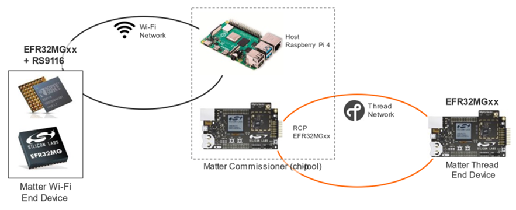
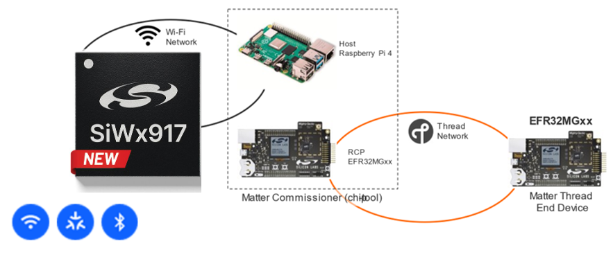

# Silicon Labs Matter

The Matter protocol leverages existing IP technologies, including Wi-Fi and Thread, to build a unified wireless connectivity ecosystem for smart homes. Internet Protocol (IP)-based networking provides manufacturers with simplified development while improving device compatibility for consumers.

Silicon Labs supports Matter on both 802.15.4 (Thread) and 802.11 (Wi-Fi) transport protocols. The Thread development use case differs from Wi-Fi because the Thread protocol requires an OpenThread Border Router (OTBR).

Device: SiWx917 SoC

## Path for Development

These pages are for developing Matter applications with the Matter Extension. The Matter Extension is the preferred development path and is available through Simplicity Studio and Standalone via SLC-CLI. The Matter Extension was previously released as an extension of the Gecko SDK (GSDK). Moving forward, the Matter Extension will be an extension of Silicon Labs Simplicity SDK (SiSDK).

Simplicity Studio is a GUI-based development experience in which you can create production-ready projects from a well-tested library. The Simplicity Studio development path also natively supports development on the Windows operating system. As a result, Windows users should use Simplicity Studio for their development environment. SLC-CLI offers command-line access to application configuration and generation of the Matter Extension.

The [Silicon Labs Matter GitHub repo](https://github.com/SiliconLabs/matter) will no longer be updated to reflect newer Matter versions **after Matter 1.3**. As a result, it is no longer a recommended path for Matter Development of **new products**.

## Other Resources

**To see release notes** containing a list of features and known issues, go to [Matter Release Notes on Silicon Labs Matter Extension](https://github.com/SiliconLabs/matter_extension/releases/tag/v2.5.1).

**If you are new to Matter** or would like more information about Silicon Labs Matter-based products, see the [Matter content on silabs.com](https://www.silabs.com/wireless/matter).

**For background information on the Matter standard**, see the [Connectivity Standard Alliance page](https://csa-iot.org/all-solutions/matter/).

**To quickly make a simple Matter network**, see the [quick-start guides](/matter/{build-docspace-version}/matter-overview).

**To develop your own customized applications** with Matter over Thread and Matter over Wi-Fi, see the [Matter Developer's Guide](/matter/{build-docspace-version}/matter-developers-guide-overview).
