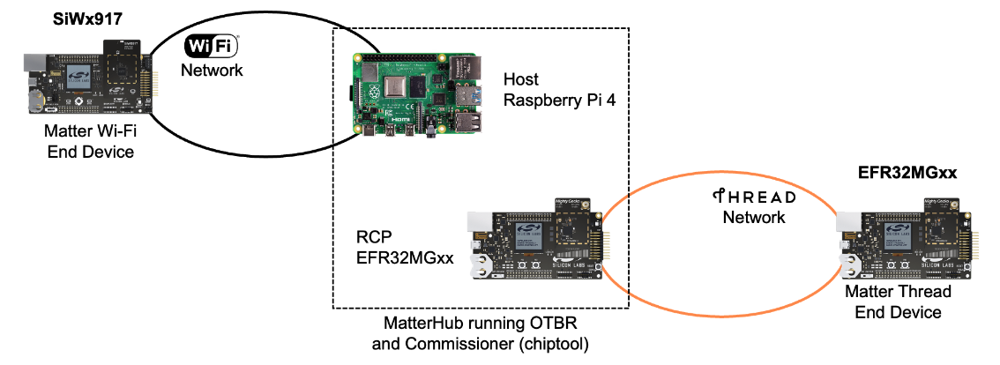

# Silicon Labs Matter

The Matter protocol leverages existing IP technologies, including Wi-Fi and Thread, to build a unified wireless connectivity ecosystem for smart homes. Internet Protocol (IP)-based networking provides manufacturers with simplified development while improving device compatibility for consumers.

Silicon Labs supports Matter on both 802.15.4 (Thread) and 802.11 (Wi-Fi) transport protocols. The Thread development use case differs from Wi-Fi because the Thread protocol requires an OpenThread Border Router (OTBR).

## Path for Development

These pages are for developing Matter applications with the Matter Extension. The Matter Extension is the preferred development path and is available through Simplicity Studio and Standalone via SLC-CLI. The Matter Extension was previously released as an extension of the Gecko SDK (GSDK). Moving forward, the Matter Extension will be an extension of Silicon Labs Simplicity SDK (SiSDK).

Simplicity Studio is a GUI-based development experience in which you can create production-ready projects from a well-tested library. The Simplicity Studio development path also natively supports development on the Windows operating system. As a result, Windows users should use Simplicity Studio for their development environment. SLC-CLI offers command-line access to application configuration and generation of the Matter Extension.

## Getting Started: Development Workflow

Want to get a Matter application up and running quickly? Here's a high-level overview of the typical workflow from setup to a working commissioned device:

1. **Understanding the Matter Protocol**
   - Read documentation to undertsand the basics of Matter: [Matter Fundamentals](/matter/{build-docspace-version}/matter-fundamentals)

2. **Install Studio and Setup Development Environment**
   - Follow the quick-start guide for overview and setup: [Matter Overview](/matter/{build-docspace-version}/matter-overview) 
   - Covers hardware and software requirements, Simplicity Studio installation, Matter Extension setup, and tools

3. **Create Sample Application/Solution**
   - Choose Wi-Fi or Thread as desired protocol to create, build, and flash your Matter application
   - Follow the quick-start documentation for creating a demo for desired wireless protocol: [Quick-Start Demos](/matter/{build-docspace-version}/matter-quick-start-demo)
   
    > **Note**: If you plan on implementing custom app behavior, proceed to step 4 after generating project and before building and flashing

4. **[Optional] Customize Matter App Behavior and Logic**
   - Use Project Configurator and other Studio tools to customize your app logic: [Developing with Project Configurator](https://docs.silabs.com/simplicity-studio-5-users-guide/latest/ss-5-users-guide-developing-with-project-configurator/)
   - If necessary, add custom source files for your application logic
   - Follow documentation to develop a custom matter device with ZAP and corresponding callbacks: [Custom Matter Device Development](/matter/{build-docspace-version}/matter-references/custom-matter-device) 

5. **Build and Flash**
   - Refer back to documentation for quick-start demo for your desired protocol, and complete steps for building and flashing app 
     - [Thread Quick-Start Demo](/matter/{build-docspace-version}/matter-quick-start-demo/02-thread-quick-start-demo#step-2-build-the-project)
     - [WiFi Quick-Start Demo](/matter/{build-docspace-version}/matter-quick-start-demo/01-wifi-quick-start-demo#step-2-build-the-project)
   - Ensure bootloader is present on the device
     - Bootloader is included for solution based examples
     - If you are not using a solution based example, flash the bootloader from [Matter Software Artifacts](matter/{build-docspace-version}/matter-prerequisites/matter-artifacts#matter-bootloader-binaries)
     - Follow Commander instructions for flashing this bootloader through CLI: [Device Flashing](https://docs.silabs.com/simplicity-commander/latest/simplicity-commander-commands/device-flashing-commands)

6. **Commission**
   - Commission your device using a Matter commissioner (e.g. matterhub): [Commissioning](/matter/{build-docspace-version}/matter-overview-guides/matter-commissioning)

## Other Resources

**To see release notes** containing a list of features and known issues, go to [Matter Release Notes on Silicon Labs Matter Extension](https://github.com/SiliconLabs/matter_extension/releases/tag/v2.7.0).

**If you are new to Matter** or would like more information about Silicon Labs Matter-based products, see the [Matter content on silabs.com](https://www.silabs.com/wireless/matter).

**For background information on the Matter standard**, see the [Connectivity Standard Alliance page](https://csa-iot.org/all-solutions/matter/).
