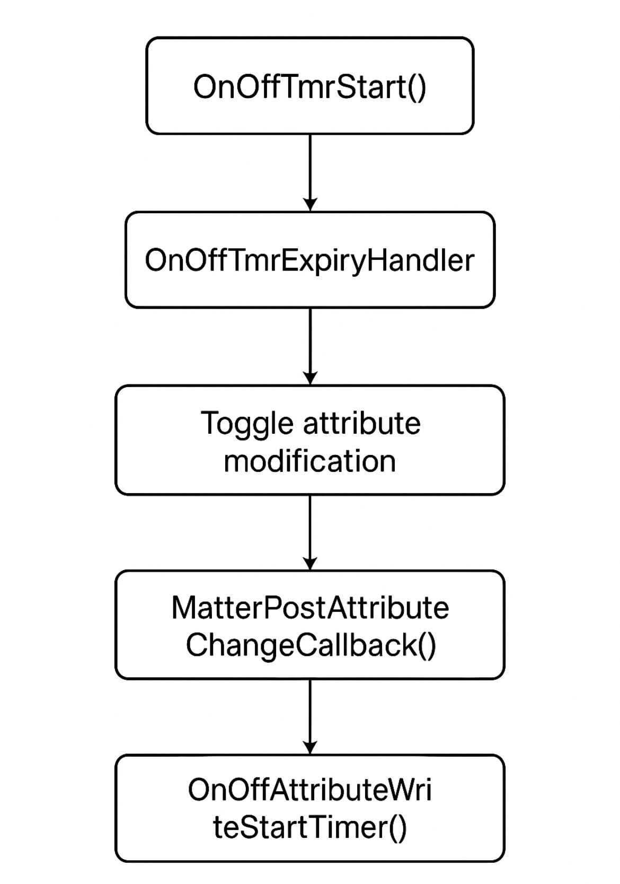

# Matter Application Cluster Logic 

The architecture of a Matter application is structured in layers, with the application layer positioned above network transport layer (such as Thread or Wi-fi). This application layer defines the device's behavior using a structured data model that describes its capabilities. At the core of this model are clusters, which group together related attributes, commands, and events to represent specific features. For example, a cluster might control power (on/off), adjust brightness, or report temperature. These clusters are standardized and reusable, ensuring consistent behavior across different devices and manufacturers. For more information, see the [Matter data model](https://docs.silabs.com/matter/latest/matter-fundamentals-data-model/) documentation.


To organize these features within a device, Matter introduces the concept of endpoints. An endpoint represents a specific functional part of the device and can include one or more clusters. For example, a smart light might have an endpoint that includes both the On/Off and Level Control clusters. More complex devices may use multiple endpoints to represent different capabilities, such as a thermostat that also includes a fan controller or a humidity sensor.

To simplify the process of defining and configuring endpoints and clusters, developers use the ZCL Advanced Platform (ZAP). ZAP offers a user-friendly interface for selecting clusters, assigning them to endpoints, and configuring their attributes and commands. It also generates the necessary code to integrate with the Matter SDK, streamlining development.

The following sections demonstrate how to extend the functionality of an existing door lock endpoint by adding the On/Off cluster.

## Step 1: Create the Application

Before you begin, ensure that Simplicity Studio is installed on your PC and you have downloaded the Simplicity SDK and the Matter extension. For more information on these requirements, see [here](https://docs.silabs.com/matter/1.0.5/matter-studio/).

To create the Matter Door Lock App, launch Simplicity Studio and connect a supported Silicon Labs development board (for example, EFR32MG2x) to your computer via USB. This guide uses MG24 as the platform. Next, navigate to the **Launcher** tab, select your connected device, and select the correct SDK.


Select **Create New Project**, then use the filter to search for "Matter". Locate the "Matter - SoC Lock over Thread with External Bootloader" project. Click **Next**, then select **Finish**. 


The sample application has been successfully created in Simplicity Studio. You can now proceed to Step 2.

## Step 2: Add and Modify the On/Off Cluster 

After step 1, your project's `.slcp` file should automatically be opened. Navigate to **Configuration Tools**, scroll down to "ZCL Advanced Platform (ZAP)", and click **Open**.


This opens the project's .zap configuration file. You should see two endpoints already enabled:
- Endpoint 0: Reserved exclusively for Utility Clusters. These special clusters are specifically used for enclosing a node’s servicing functionality such as the discovery process, addressing, diagnostics, and software updates.
- Endpoint 1: Configured to be a Matter Door Lock. It has mandatory clusters along with the Door Lock cluster (0x0101).

 Click on Endpoint #1 then open the **General Tab**. 


Enable the On/Off cluster (0x0006) as both a Server and Client. This should add mandatory attributes and commands as required by the specification for this cluster. You can view these by selecting the **Configure** icon.


By configuring both client and server roles for the On/Off cluster, the device can transmit On/Off commands and store On/Off attributes. Normally, a light bulb acts as a server because it stores the On/Off state and responds to commands to change it. A light switch acts as a client because it sends commands to the bulb to turn it on or off but doesn't store the state itself.  This guide mainly focuses on attribute storing and manipulation.

Finally, save the `.zap` file. The tool will automatically generate the necessary code files to reflect your updated cluster configuration. For more information, see [ZCL Advanced Platform (ZAP) Tool for Matter](https://docs.silabs.com/matter/latest/matter-references/matter-zap).


## Step 3: Analyze the Auto-generated Code

Now that the On/Off cluster has been successfully added to the Sample Door Lock project, it's time to leverage the new features/code. Here's a summary of what happens after the cluster is added:

- Attributes, commands, and events for the cluster are added to your application’s data model.
- Code is generated for attribute storage, command handling, and event notification.
- Callback stubs are generated for you to implement application-specific behavior.
- You interact with the cluster by filling in these stubs and using the generated data structures.

Additionally, a corresponding component is automatically added to your project. This occurs because enabling a cluster in ZAP updates your project configuration to include the necessary software components and libraries required to support that cluster’s functionality. For clusters, this functionality is implemented in the `<matter_extension>/third_party/matter_sdk/src/app/clusters` directory. For the On/Off cluster, the server command handlers and related logic can be found in the `/on-off-server/on-off-server.cpp` file.

## Step 4: Add Application Logic 

Locate your project's `src/AppTask.cpp` file. This file acts as the central hub for application-specific logic, initialization, and event processing in a Matter application on Silicon Labs platforms. Start by adding two helper functions: a one-shot timer to expire in 10 seconds and the `OnOffTmrExpiryHandler` handler function.

```C++
#include "app-common/zap-generated/attributes/Accessors.h"
#include "timers.h"
TimerHandle_t OnOffAttributeChangeTimer;

void OnOffTmrExpiryHandler(TimerHandle_t xTimer){
    static bool current_state = 1; // Initialize as on
    current_state ^= 1; // Toggle the current state of OnOff on timer expiry
    SILABS_LOG("OnOff attribute toggled to %d", current_state);
    chip::app::Clusters::OnOff::Attributes::OnOff::Set(1, current_state); // Modify the attribute
}

void OnOffTmrStart(){

    // Initiate timer
    OnOffAttributeChangeTimer = xTimerCreate("OnOffTmr",   // timer name
                                  pdMS_TO_TICKS(10000),   // == default timer period (mS)
                                  false,                    // no timer reload (==one-shot)
                                  nullptr,                 // init timer id = app task obj context
                                  OnOffTmrExpiryHandler);  // timer callback handler

    xTimerStart(OnOffAttributeChangeTimer, 1); // Start timer
}
```

Make sure to include `app-common/zap-generated/attributes/Accessors.h` in your `AppTask.cpp` file so you can access cluster attributes. 

Next we will need an AppTask function to initiate the timer. Add the following function to your AppTask.cpp file:

```C++
void AppTask::OnOffAttributeWriteStartTimer()
{
    OnOffTmrStart();
}
```

This function will have to be defined in AppTask.h as well as part of the AppTask class.

Now, locate the `MatterPostAttributeChangeCallback()` function in the `src/ZclCallbacks.cpp` file. This function is invoked by the application framework after an attribute value has been changed. Because you are modifying the OnOff attribute in the `OnOffTmrExpiryHandler()` function, use this callback to re-initiate the timer so that the attribute continues to toggle. To achieve this, call `AppTask::OnOffAttributeWriteStartTimer()`, which is part of the AppTask context.

To implement this functionality, first obtain the AppTask instance using `AppTask::GetAppTask()`. Modify the `MatterPostAttributeChangeCallback()` function as shown below:

```C++
void MatterPostAttributeChangeCallback(const chip::app::ConcreteAttributePath & attributePath, uint8_t type, uint16_t size,
                                       uint8_t * value)
{
    ClusterId clusterId     = attributePath.mClusterId;
    AttributeId attributeId = attributePath.mAttributeId;
    
    // Auto-generated code 

    if (clusterId == OnOff::Id && attributeId == OnOff::Attributes::OnOff::Id){
      AppTask::GetAppTask().OnOffAttributeWriteStartTimer();
    }

}
```
Make sure to #include "AppTask.h" at the top of the `ZclCallbacks.cpp` file to call the `AppTask::GetAppTask()` function. For more information on the AppTask, refer to AppTask.h.

Finally, add a call to `OnOffTmrStart()` at the end of the `AppTask::AppInit()` function to start the attribute write sequence. The following image illustrates the code flow:



In the flowchart above, `OnOffAttributeWriteStartTimer()` calls `OnOffTmrStart()` to restart the timer.

## Step 5: Interact with the On/Off Cluster 

After building your project, flash the compiled firmware onto your target board. Once the device is running, you should observe log messages approximately every 10 seconds indicating that the OnOff cluster's OnOff attribute is being written to. This confirms that the cluster is active and functioning as expected.

Next, commission the device to a Matter hub and begin interacting with the OnOff cluster. To do this, follow the instructions in the **Creating the Matter Network** section of the [Silicon Labs Matter Light Switch Example Guide](https://docs.silabs.com/matter/2.6.0/matter-light-switch-example/02-thread-light-switch-example#creating-the-matter-network).

Once the custom Door Lock node is successfully commissioned to the network, you can read the value of the OnOff attribute using the following command:

```
mattertool onoff read on-off <node_id> 1
```

Replace <node_id> with the actual node ID assigned to your device during commissioning.