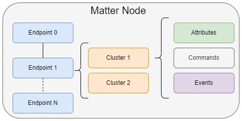

# Matter Application Cluster Logic 

The architecture of a Matter application is organized into layers, with the application layer sitting on top of the network transport layer (such as Thread or Wifi). This application layer is where the device’s behavior is defined, using a structured data model to describe what the device can do. At the core of this model are clusters, which group together related attributes, commands, and events to represent specific features. For instance, a cluster might handle turning a device on or off, adjusting brightness, or reporting temperature. These clusters are standardized and reusable, which helps ensure consistent behavior across different devices and manufacturers. More information on the matter data model can be found [here](https://docs.silabs.com/matter/latest/matter-fundamentals-data-model/).



To organize these features within a device, Matter introduces the concept of endpoints. An endpoint represents a specific functional part of the device and can include one or more clusters. For example, a smart light might have an endpoint that includes both the On/Off and Level Control clusters. More complex devices can have multiple endpoints to represent different capabilities—like a thermostat that also includes a fan controller or a humidity sensor.

To make it easier to define and configure these endpoints and clusters, developers use a tool called the ZCL Advanced Platform, or ZAP. ZAP provides a user-friendly interface for selecting clusters, assigning them to endpoints, and configuring their attributes and commands. It also generates the necessary code to integrate with the Matter SDK, streamlining the development process. In the sections that follow, we’ll walk through how to extend the functionality of an existing door lock endpoint by adding the On/Off cluster.

## Step 1: Create the Application

Before getting started, users must ensure that they have Simplicity Studio installed in a PC and have downloaded the Simplicity SDK along with the matter extension. More instructions on these requirements can be found [here](https://docs.silabs.com/matter/1.0.5/matter-studio/).

To create the Matter Door Lock App, open up Simplicity Studio and connect a supported Silicon Labs development board (e.g. EFR32MG2x) to your computer via USB. This guide will use an MG24 as the platform. Navigate to the *Launcher* tab, select your device, and select the correct SDK.


Select *Create New Project*, filter by "Matter", and locate the Matter - SoC Lock over Thread with External Bootloader project. Select "Next" then Click finish. 


The sample application has now been created by Studio and you can move on to step 2.

## Step 2: Add and Modify the On/Off Cluster 

After step 1, your project's .slcp file should automatically be opened. Navigate to "Configuration Tools" then scroll down to "ZCL Advanced Platform (ZAP)" and select "Open".


This opens up the project's .zap configuration file. There should be two endpoints enabled already:
- 0: Reserved exclusively for Utility Clusters. These special clusters are specifically used for enclosing a node’s servicing functionality: the discovery process, addressing, diagnostics, and software updates.
- 1: Endpoint is configured to be a Matter Door Lock. It has mandatory clusters along with the Door Lock cluster (0x0101).

 Click on Endpoint #1 then open the "General Tab". 


Enable the On/Off cluster (0x0006) as both a Server and a Client. This should add mandatory attributes and commands as required by the spec for this cluster, these can be viewed by selecting the "Configure" icon.


By configuring both a client and server for the On/Off cluster, the device should be able to transmit On/Off commands and store On/Off attributes. For this guide, we will mainly focus on the attribute storing and manipulation.

Save the .zap file. The tool will automatically generate the necessary code files for your application, reflecting the new cluster configuration. For more information, reference [ZCL Advanced Platform (ZAP) Tool for Matter](https://docs.silabs.com/matter/2.3.1/matter-references/matter-zap).


## Step 3: Analyze the Auto-generated Code

Now that the new On/Off cluster has been added to the Sample Door Lock project, it's time to leverage the new features/code. Here's a summary of what happens following the cluster addition:

- Attributes, commands, and events for the cluster are added to your application’s data model.
- Code is generated for attribute storage, command handling, and event notification.
- Callback stubs are generated for you to implement application-specific behavior.
- You interact with the cluster by filling in these stubs and using the generated data structures.

You will also notice that following the cluster enablement, a corresponding component is automatically added to your project. This happens because enabling a cluster in ZAP updates your project configuration to include the necessary software components and libraries required to support that cluster’s functionality. For clusters, this functionality is implemented in the <matter_extension>/third_party/matter_sdk/src/app/clusters directory. For the On/Off cluster, the server command handlers and related logic can be found in te /on-off-server/on-off-server.cpp file.

## Step 4: Add Application Logic 

Locate your projects src/AppTask.cpp file. This file acts as the central hub for application-specific logic, initialization, and event processing in a Matter application on Silicon Labs platforms. We will begin by creating two helper functions, one that starts a one-shot timer to expire in 10 seconds and invokes a handler, **OnOffTmrExpiryHandler**.

```C++
#include "app-common/zap-generated/attributes/Accessors.h"
#include "timers.h"
TimerHandle_t OnOffAttributeChangeTimer;

void OnOffTmrExpiryHandler(TimerHandle_t xTimer){
    static bool current_state = 1; //initialize as on
    current_state ^= 1;
    chip::app::Clusters::OnOff::Attributes::OnOff::Set(1, current_state);
}

void OnOffTmrStart(){

    OnOffAttributeChangeTimer = xTimerCreate("OnOffTmr",   // timer name
                                  pdMS_TO_TICKS(10000),   // == default timer period (mS)
                                  true,                    // no timer reload (==one-shot)
                                  nullptr,                 // init timer id = app task obj context
                                  OnOffTmrExpiryHandler);  // timer callback handler

    xTimerStart(OnOffAttributeChangeTimer, 1);
}
```

Make sure to include app-common/zap-generated/attributes/Accessors.h in your AppTask.cpp file so you can access cluster attributes. 

Next we will need an AppTask function to initiate the timer. Add the following function to your AppTask.cpp file:

```C++
void AppTask::OnOffAttributeWriteStartTimer()
{
    OnOffTmrStart();
}
```

This function will have to be defined in AppTask.h as well.

Now locate the MatterPostAttributeChangeCallback() function in the src/ZclCallbacks.cpp file. This function is called by the application framework after it changes an attribute value.
Modify it as below:

```C++
void MatterPostAttributeChangeCallback(const chip::app::ConcreteAttributePath & attributePath, uint8_t type, uint16_t size,
                                       uint8_t * value)
{
    ClusterId clusterId     = attributePath.mClusterId;
    AttributeId attributeId = attributePath.mAttributeId;
    
    // More auto-generated code 

    if (clusterId == OnOff::Id && attributeId == OnOff::Attributes::OnOff::Id){
      AppTask::GetAppTask().OnOffAttributeWriteStartTimer();
    }

}
```
Make sure to #include "AppTask.h" at the top of ZclCallbacks.cpp to call the AppTask:: function. 

The last step is to add a call to OnOffTmrStart() at the end of the AppTask::AppInit() function to start the attribute write sequence. 

## Step 5: Interact with the On/Off Cluster 

After building your project, flash the compiled firmware onto your target board. Once the device is running, you should observe log messages approximately every 10 seconds indicating that the OnOff cluster's OnOff attribute is being written to. This confirms that the cluster is active and functioning as expected.

The next step is to commission the device to a Matter hub and begin interacting with the OnOff cluster. To do this, follow the instructions outlined in the Creating the Matter Network section of the [Silicon Labs Matter Light Switch Example Guide](https://docs.silabs.com/matter/2.6.0/matter-light-switch-example/02-thread-light-switch-example#creating-the-matter-network).

Once the custom Door Lock node is successfully commissioned to the network, you can read the value of the OnOff attribute using the following command:

mattertool onoff read on-off <node_id> 1

Replace <node_id> with the actual node ID assigned to your device during commissioning.