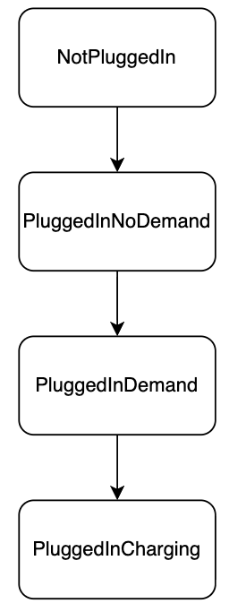
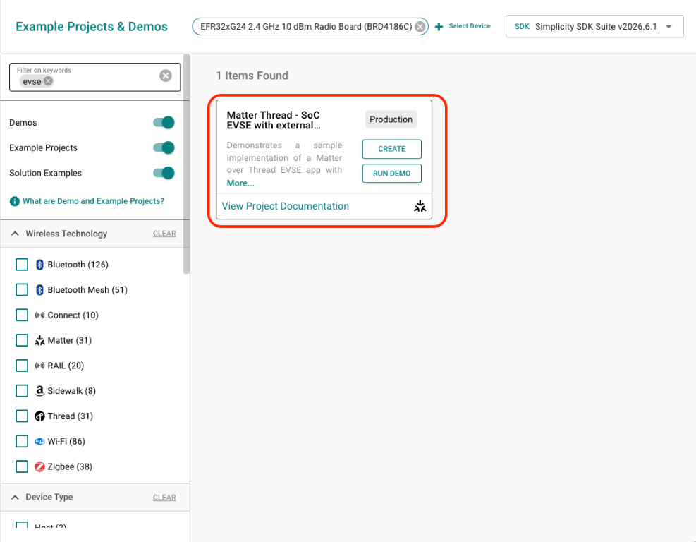
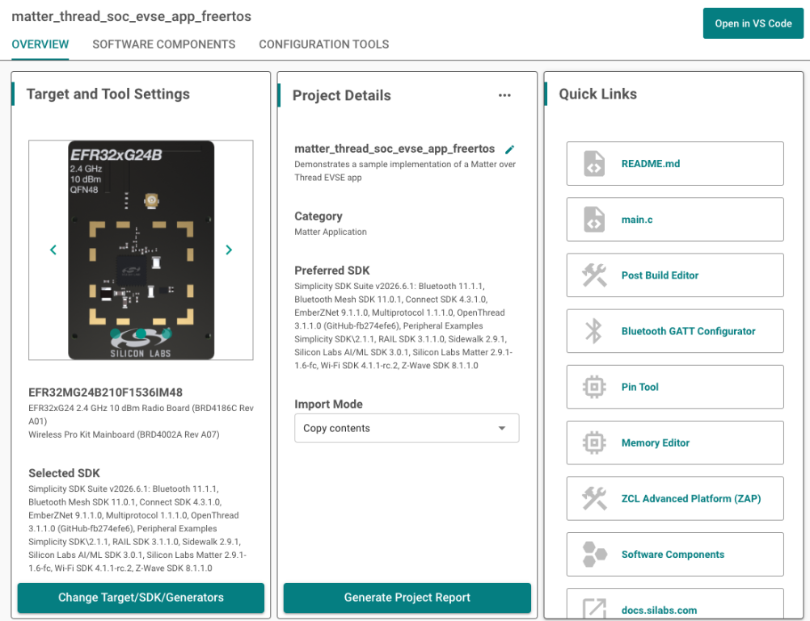
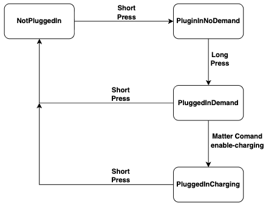

# Overview

The Matter over Thread EVSE sample demonstrates an Electric Vehicle Supply Equipment device running on a Silicon Labs EFR32 SoC.

The base sample includes the Matter EVSE functionality, but it does not simulate a connected electric vehicle. In this guide, we extend the application with a simple simulated EV so the EVSE states can be exercised without external EV hardware.

The simulated EV uses BTN1 for interaction:
| BTN1 Action | Result |
| --- | --- |
| Short Press | Connect or Disconnect EV |
| Long Press | Toogle EV Charge Demand |

LED1 indicates whether the simulated EV is connected.

Using the simulated EV together with Matter commands such as EnableCharging and Disable, the following EVSE states can be demonstrated:



The existing EVSE state machine handles the transition to PluggedInCharging when the EV is requesting energy and charging is enabled.

# Matter Over Thread EVSE Example 

In Simplicity Studio, create the EVSE Example

1. Connect one compatible dev board to your development computer. This example uses a BRD4187C.

2. Once it displays in the Devices panel, select it.

3. This will bring up the Example Projects and Demos tab, check the Matter filter under Wireless Technology, and enter evse in the Filter on keywords box. Select the Matter Thread - SoC EVSE with external Bootloader FreeRTOS solution and click Create.



4. Name your project and click Finish (no other changes are required at this time).

5. Once the solution is created, you will be redirected to the Projects view with the matter_thread_soc_lighting_app_freertos.slcp file open. If not simply open the file yourself.



# Extend the Application with CustomerAppTask

The EVSE example provides CustomerAppTask.h and CustomerAppTask.cpp for adding application-specific behavior. Use these files instead of modifying the generated AppTask.cpp.

Silicon Labs uses an *Impl() override pattern. To customize an existing application function:

1. Find the corresponding *Impl() method in autogen/AppTaskImpl.h.
2. Copy the exact method signature into the private: section of CustomerAppTask.h.
3. Implement the method in CustomerAppTask.cpp.

If a method is not overridden, the default Silicon Labs implementation continues to be used.

For example:

```cpp
class CustomerAppTask : public AppTaskImpl<CustomerAppTask>
{
public:
	static CustomerAppTask & GetAppTask() { return sAppTask; }

private:
	friend class AppTaskImpl<CustomerAppTask>;

	CHIP_ERROR AppInitImpl();

	static CustomerAppTask sAppTask;
};
```

This approach keeps the EV simulation changes isolated from the base EVSE application and prevents application-specific changes from being lost when generated files are regenerated or the project is upgraded. For more information on App Customization please reference [Extending Base App Implementation](/matter/{build-docspace-version}/matter-references/custom-matter-device/#extending-base-app-implementation).

# Add the Simulated EV

The EVSE sample provides the Matter EVSE functionality, but it does not include a physical or simulated electric vehicle. BTN1 is reserved for an Energy Management action, but the base application does not use it to simulate EV connection or demand.
To exercise the EVSE state machine without external EV hardware, add a minimal simulated EV. The simulator tracks only the two EV-side conditions needed for this demonstration:
- Whether an EV is connected
- Whether the EV has charge demand

The Matter EVSE implementation remains responsible for determining whether charging is allowed and for transitioning into the charging state.

## Update SimulatedEv.h
 ```cpp
#pragma once

class SimulatedEv
{
public:
    struct Snapshot
    {
        bool connected = false;
        bool demand    = false;
    };

    void ToggleConnected();
    void ToggleDemand();

    Snapshot GetSnapshot() const { return mState; }

private:
    Snapshot mState;
};
 ```

## Update SimulatedEv.cpp

```cpp
#include "SimulatedEv.h"

void SimulatedEv::ToggleConnected()
{
    mState.connected = !mState.connected;

    // An unplugged EV cannot request energy.
    if (!mState.connected)
    {
        mState.demand = false;
    }
}

void SimulatedEv::ToggleDemand()
{
    // Demand is only meaningful while an EV is connected.
    if (mState.connected)
    {
        mState.demand = !mState.demand;
    }
}
```

The simulator starts disconnected with no charge demand. No explicit initialization function is required because the snapshot members default to `false`

## Add the Source File to the Build

Make sure SimulatedEv.cpp is included in the application build. Adding the file to the project directory alone is not sufficient if it is not part of the source list.

# Update Customer AppTask.h

The following methods are used for the simulated EV integration:

- `AppInitImpl()` registers the custom `CustomerAppTask` button handler after the base application is initialized.
- `ButtonEventHandlerImpl()` forwards both BTN1 press and release events to the Energy Management action Event Handler.
- `EnergyManagementActionEventHandlerImpl()` determines whether BTN1 was short- or long-pressed and updates the simulated EV accordingly.
- `UpdateSimulatedEv()` maps the simulated EV connection and demand state to the corresponding EVSE state.

```cpp
class CustomerAppTask : public AppTaskImpl<CustomerAppTask>
{
public:
    static CustomerAppTask & GetAppTask() { return sAppTask; }

private:
    friend class AppTaskImpl<CustomerAppTask>;

    CHIP_ERROR AppInitImpl();

    void ButtonEventHandlerImpl(uint8_t button, uint8_t btnAction);

    void EnergyManagementActionEventHandlerImpl(AppEvent * aEvent);

    void UpdateSimulatedEv();

    static CustomerAppTask sAppTask;
};
```

# Update Customer.cpp
Required headers:


```cpp
#include "CustomerAppTask.h"
#include "SimulatedEv.h"

#include <EnergyEvseMain.h>
#include <EVSEManufacturerImpl.h>
#include <platform/silabs/platformAbstraction/SilabsPlatform.h>

#include "FreeRTOS.h"
#include "task.h"
```

Define the BTN1 identifier, long-press duration, LEDWidget instance, and simulated EV instance:


```cpp
#define APP_CONTROL_BUTTON  0
#define APP_CONTROL_BUTTON  1
#define SIM_EV_LED          1

using namespace ::chip::DeviceLayer::Silabs;

namespace {

SimulatedEv sSimEv;
LEDWidget sSimEvLed;

TickType_t sButtonPressTick = 0;
constexpr uint32_t kLongPressMs = 1000;

} // namespace
```

# Initialize the LEDWidget Instance

Override the AppInitiImpl() to initialize the LED instance and set the LED off. 


```cpp
CHIP_ERROR CustomerAppTask::AppInitImpl()
{
    CHIP_ERROR err = AppTask::AppInit();

    if (err == CHIP_NO_ERROR)
    {
        sSimEvLed.Init(SIM_EV_LED);
        sSimEvLed.Set(false);
    }

    return err;
}
```

# Forward BTN1 Press and Release Events
The default EVSE button handler forwards BTN1 only when it receives a button-press event. To distinguish a short press from a long press, the application needs both the press and release events.
Override the button handler so that both BTN1 actions reach the Energy Management action event handler while preserving the default BTN0 behavior:


```cpp
void CustomerAppTask::ButtonEventHandlerImpl(uint8_t button, uint8_t btnAction)
{
    AppEvent event           = {};
    event.Type               = AppEvent::kEventType_Button;
    event.ButtonEvent.Action = btnAction;

    if (button == APP_CONTROL_BUTTON)
    {
        // Forward both press and release events for BTN1.
        event.Handler = &CustomerAppTask::EnergyManagementActionEventHandler;
        AppTask::GetAppTask().PostEvent(&event);
    }
    else if (button == APP_FUNCTION_BUTTON)
    {
        // Preserve the default BTN0 behavior.
        event.Handler = BaseApplication::ButtonHandler;
        AppTask::GetAppTask().PostEvent(&event);
    }
}
```
# Detect Short and Long Presses

Use the press and release timestamps to determine which simulated EV action to perform, for a short press the Ev will Toggle the connected state. And for a long press the Ev will toggle the demand state:


```cpp
void CustomerAppTask::EnergyManagementActionEventHandlerImpl(AppEvent * aEvent)
{
    auto action = static_cast<SilabsPlatform::ButtonAction>(
        aEvent->ButtonEvent.Action);

    if (action == SilabsPlatform::ButtonAction::ButtonPressed)
    {
        sButtonPressTick = xTaskGetTickCount();
        return;
    }

    if (action != SilabsPlatform::ButtonAction::ButtonReleased)
    {
        return;
    }

    TickType_t elapsedTicks = xTaskGetTickCount() - sButtonPressTick;

    if (elapsedTicks >= pdMS_TO_TICKS(kLongPressMs))
    {
        // Long press: toggle EV charge demand.
        SILABS_LOG("SimEV: LONG PRESS");

        sSimEv.ToggleDemand();

        auto state = sSimEv.GetSnapshot();

        SILABS_LOG("SimEV: connected=%u demand=%u",state.connected,state.demand);
    }
    else
    {
        // Short press: connect or disconnect the EV.
        SILABS_LOG("SimEV: SHORT PRESS");
        sSimEv.ToggleConnected();   

        auto state = sSimEv.GetSnapshot();
        sSimEvLed.Set(state.connected);


        SILABS_LOG("SimEV: connected=%u demand=%u",state.connected,state.demand);
    }

    UpdateSimulatedEv();
}
```

A long press is therefore recognized when BTN1 is released after being held for at least 1 second.

# Report the Simulated EV State
UpdateSimulatedEv() translates the two simulated EV conditions into the hardware-facing EVSE states:


```cpp
void CustomerAppTask::UpdateSimulatedEv()
{
    auto state = sSimEv.GetSnapshot();

    chip::DeviceLayer::PlatformMgr().LockChipStack();

    auto * manufacturer =
        chip::app::Clusters::EnergyEvse::GetEvseManufacturer();

    if (manufacturer != nullptr)
    {
        auto * delegate = manufacturer->GetEvseDelegate();

        if (delegate != nullptr)
        {
            if (!state.connected)
            {
                delegate->HwSetState(
                    chip::app::Clusters::EnergyEvse::StateEnum::kNotPluggedIn);
            }
            else if (state.demand)
            {
                delegate->HwSetState(
                    chip::app::Clusters::EnergyEvse::StateEnum::kPluggedInDemand);
            }
            else
            {
                delegate->HwSetState(
                    chip::app::Clusters::EnergyEvse::StateEnum::kPluggedInNoDemand);
            }
        }
    }

    chip::DeviceLayer::PlatformMgr().UnlockChipStack();
}
```

The simulated EV reports only the physical EV conditions. The EVSE delegate handles higher-level transitions such as PluggedInCharging.

# Expected Behavior

The application can now exercise the first three EVSE states directly:



## Commission and Test EVSE Charging with the Matter Controller

Before testing the simulated EV states, commission the device onto the Thread network using mattertool.

## Start the Thread Network

On the Matter Hub:

```
mattertool startThread
```

This creates the Thread network and stores the operational dataset used for commissioning.

## Commission the Device

Commission the EVSE device with:

```
mattertool bleThread -n <node-id>
```

For example:

```
mattertool bleThread -n 1
```

mattertool bleThread performs BLE commissioning and provisions the device onto the Thread network.

## Verify the Initial EVSE State

Read the EVSE state:

```
mattertool energy-evse read state <node-id> <endpoint-id>
```

Expected:

State = 0    -> NotPluggedIn

## Verify EV Connection

Short press BTN1, then read the state again:

```
mattertool energy-evse read state <node-id> <endpoint-id>
```

Expected:

State = 1    -> PluggedInNoDemand

## Verify EV Demand

Long press BTN1, then read the state:

```
mattertool energy-evse read state <node-id> <endpoint-id>
```

Expected:

State = 2    -> PluggedInDemand

Matter defines this as the EV being plugged in and requesting current while the EVSE is not currently allowing current to flow.

## Enable Charging

Enable charging through the Matter Energy EVSE cluster:

```
mattertool energy-evse enable-charging null <minimum-current-mA> <maximum-current-mA> <node-id> <endpoint-id>
```
For example:

```
mattertool energy-evse enable-charging null 6000 32000 1 1
```

A null ChargingEnabledUntil value enables charging without an expiration time.

Verify the state:

```
mattertool energy-evse read state 1 1
```

Expected:

State = 3    -> PluggedInCharging

## Disable Charging

Disable charging with:

```
mattertool energy-evse disable <node-id> <endpoint-id>
```

For example:

```
mattertool energy-evse disable 1 1
```

Because the EV remains connected and still has demand, the EVSE should return to:

State = 2    -> PluggedInDemand

The Disable command stops power flow and changes the EVSE supply state to disabled.