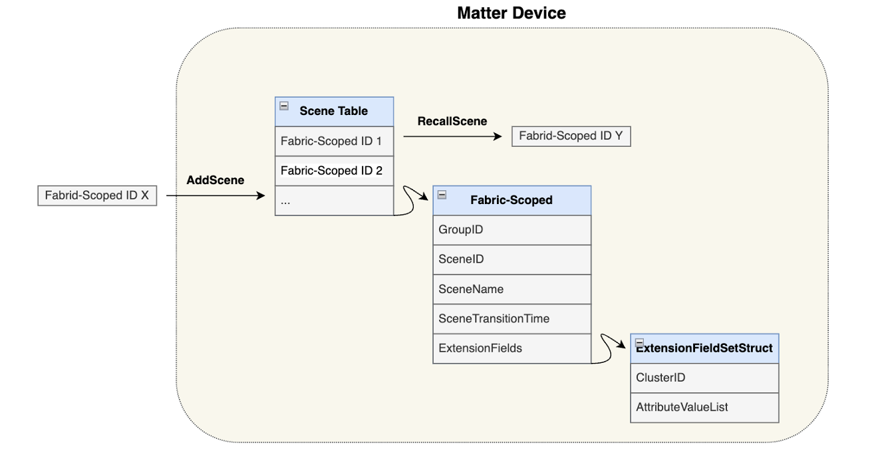
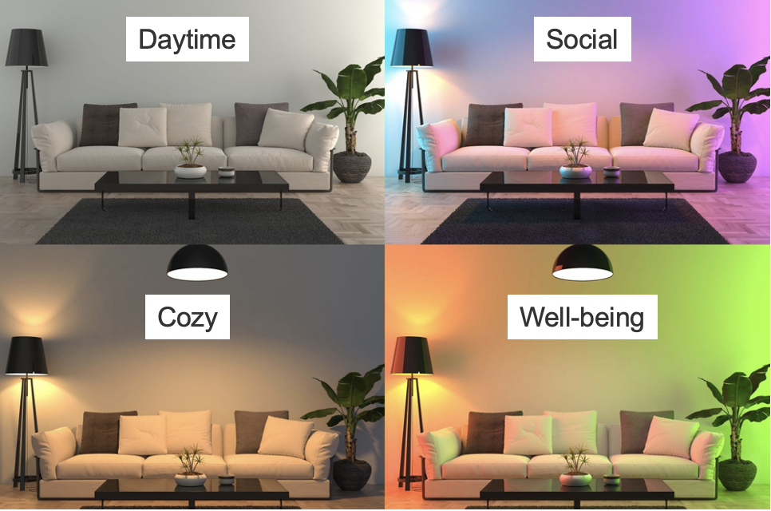
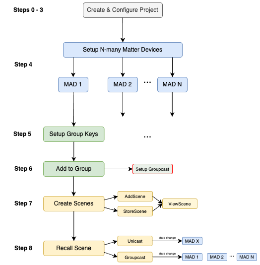
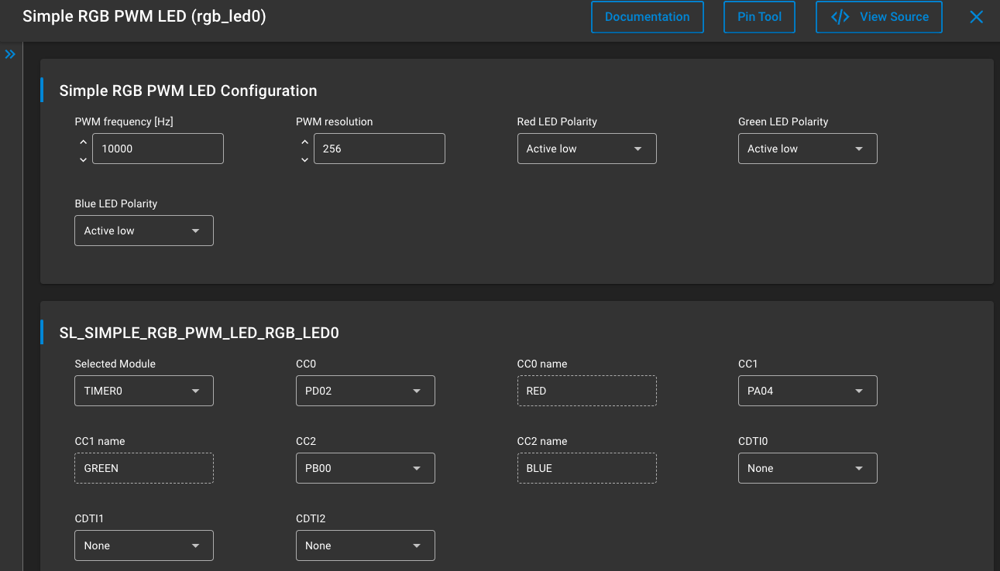
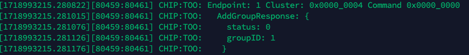

# Matter Scenes Quick Start Guide

This quick-start guide will walk through a simple application example of a Matter network with two lighting devices. It will be used to create and manage a simple scene using the Scenes cluster for Matter.

## What is the Scenes cluster?

The Scenes Management Cluster is defined by the CSA in the Matter Application Cluster Specification. It  allows for us to store a set of attribute-value pairs pertaining to one or more clusters on the same endpoint as the Scenes Management Cluster. The Matter controller can recall a stored scene which will result in these values being written to the specified attributes in order to express the desired scene.  

The Scene Table stores Fabric-Scoped IDs which contain all the information associated with a given scene, in particular:

* **GroupID:** identifier for the group the scene applies to, this is 0 if there is no group accosiated
* **SceneID:** unique identifier for a particular scene
* **SceneName:** name of the scene
* **SceneTransitionTime:** The amount of time (in milliseconds) that it will take a cluster to change from the current state to the requested state
* **ExtensionFields:** This is a struct containing the ClusterIDs and Attribute Values for a clusters which participate in a scene.



A common use case for using the scenes cluster would is in lighting. A combination of colors accross a group of Matter light bulbs can be configured as a scene and recalled on demand.



## Hands-On Turorial - Thread

The following hands-on tutorial will walk through the process of storing and recalling a scene for a group of Matter lighting over Thread devices.

### Prerequisites

* Familiarity with the Simplicty Studio Matter Extenion
* Understanding of how to use the [Matterhub](../sld406-matter-light-switch-example/02-thread-light-switch-example.md)

### Requirements

* Gecko SDK 4.4.2 + Matter extension 2.3.0 (or newer)
* Raspberry Pi 4 + MatterHub Image
* 1x Silabs WTSK EFR32xG21 (BRD4108B) in RCP configuration
* 2x [EFR32xG24-DK2601B Dev Kit](https://www.silabs.com/development-tools/wireless/efr32xg24-dev-kit?tab=overview)

> **Note**: The procedure is largely the same if WPK + MG24 radio boards are used as the Matter lighting devices, however the drivers for the LED and handler code may change depending on the board.

### Overview



### Step 1: Create & configure the Lighting Project

#### ZAP Configuration

In Simplicity Studio, create a new MatterLightOverThread application. From the application .slcp file and navigate to _Configuration Tools_ > _ZCL Advanced Platform (ZAP)_.

The Group Key Management cluster (under General) should already be enabled as a server on Endpoint 0.

On Endpoint 1:

* Enable Scenes Management cluster (under General) as a Server
* Ensure Color Control cluster (under Lighting) is enabled
* Ensure the Groups cluster (under General) is enabled as a server on Endpoint 1

> **NOTE:** Any ZCL attribute that is to be included in a scene must be marked with the Scenes ("S") designation in the Quality column of the cluster specification.

#### RGB PWM Configuration

The BRD2601B has RGB PWM LED capabilities. To make use of the drivers and APIs, you will have to follow the following steps.

1. uninstall the WSTK LED Support component in Software Components > Silicon Labs Matter v2.3.0 > Platform > WSTK LED. This will automatically remove the Simple LED driver under Platform > Driver > LED, and prevent pintool conflicts.
2. Install the RGB PWM LED component under Software Components > Platform > Driver > LED > Simple RGB PWM LED. This will generate the APIs and drivers for the RBG PWM LED.

The component should look like this:



The RGB PWM LED instance that has been created can be found in _MatterLightOverThread/autogen/sl_simple_rgb_pwm_led_instances.h._

The documentation for the APIs that have been generated can be found here: [Simple RGB PWM LED Driver](https://docs.silabs.com/gecko-platform/5.0.0/platform-driver/simple-rgb-pwm-led#simple-rgb-pwm-led-driver). The file that contains these APIs can be found in the directory: _MatterLightOverThread/simplicity_sdk_xxxx/platform/driver/leddrv/inc/sl_simple_rgb_pwm_led.h_.

### Step 2: Add the ColorTransformer class

The RGB PWM LED operates in the RGB color space, however the Matter Color Control Cluster does not operate in the RGB color space, so a transformation is required to convert the RGB values into something that can be recognized by Matter. In this example we will use the xyY color space as defined by the Commission Internationale de l’Éclairage (CIE) specification which is also recognized in the Matter specification.

Inside of the src/ directory of the MatterLightOverThread project, create a new class called _ColorTransformer_ with the corresponding .cpp and .h files. Copy and paste the following to the ColorTransformer.h file.

```c++
/*
 * ColorTransformer.h
 *
 */
 
#include <cstdint>
#include <algorithm>
#include <cmath>
 
#ifndef SRC_COLORTRANSFORMER_H_
#define SRC_COLORTRANSFORMER_H_
 
#define MATTER_COLOR_MAX 65535.0
#define PRECISION 255.0
 
// look up table for gamma correction [0, 128]
const uint8_t gamma_lut[256] = {
    0,   0,   0,   0,   0,   0,   0,   0,   0,   0,   0,   0,   0,   0,   0,   0,
    1,   1,   1,   1,   1,   1,   1,   1,   1,   1,   1,   1,   2,   2,   2,   2,
    2,   2,   2,   2,   3,   3,   3,   3,   3,   3,   3,   4,   4,   4,   4,   4,
    5,   5,   5,   5,   5,   6,   6,   6,   6,   6,   7,   7,   7,   7,   8,   8,
    8,   8,   9,   9,   9,   9,  10,  10,  10,  10,  11,  11,  11,  12,  12,  12,
   13,  13,  13,  14,  14,  14,  15,  15,  15,  16,  16,  16,  17,  17,  17,  18,
   18,  19,  19,  19,  20,  20,  20,  21,  21,  22,  22,  23,  23,  23,  24,  24,
   25,  25,  26,  26,  26,  27,  27,  28,  28,  29,  29,  30,  30,  31,  31,  32,
   32,  33,  33,  34,  34,  35,  35,  36,  36,  37,  37,  38,  39,  39,  40,  40,
   41,  41,  42,  43,  43,  44,  44,  45,  45,  46,  47,  47,  48,  49,  49,  50,
   50,  51,  52,  52,  53,  54,  54,  55,  56,  56,  57,  58,  58,  59,  60,  60,
   61,  62,  62,  63,  64,  64,  65,  66,  67,  67,  68,  69,  70,  70,  71,  72,
   73,  73,  74,  75,  76,  76,  77,  78,  79,  80,  80,  81,  82,  83,  84,  84,
   85,  86,  87,  88,  88,  89,  90,  91,  92,  93,  94,  94,  95,  96,  97,  98,
   99, 100, 101, 101, 102, 103, 104, 105, 106, 107, 108, 109, 110, 111, 112, 112,
  113, 114, 115, 116, 117, 118, 119, 120, 121, 122, 123, 124, 125, 126, 127, 128,
 };
 
 
class ColorTransformer
{
public:
  ColorTransformer ();
 
  // Function to convert CIE xy to RGB
  static void xyToRGB(uint16_t cx, uint16_t cy, uint16_t *pr, uint16_t *pg, uint16_t *pb)
  {
      // Conversion
      float x = static_cast<float>(cx) / MATTER_COLOR_MAX;
      float y = static_cast<float>(cy) / MATTER_COLOR_MAX;
 
      float Y = MATTER_COLOR_MAX;
      float X = x * (Y / y);
      float Z = (1.0f - x - y) * (Y / y);
     
      float r = X * 3.2404542f + Y * -1.5371385f + Z * -0.4985314f;
      float g = X * -0.9692660f + Y * 1.8760108f + Z * 0.0415560f;
      float b = X * 0.0556434f + Y * -0.2040259f + Z * 1.0572252f;
 
      float max = std::max(std::max(r, g), b);
 
      uint8_t r_i= static_cast<uint8_t>(r * PRECISION / max);
      uint8_t g_i = static_cast<uint8_t>(g * PRECISION / max);
      uint8_t b_i = static_cast<uint8_t>(b * PRECISION / max);
         
      // Gamma correction
      *pr = gamma_lut[r_i];
      *pg = gamma_lut[g_i];
      *pb = gamma_lut[b_i];
  }
 
  virtual
  ~ColorTransformer ();
};
 
#endif /* SRC_COLORTRANSFORMER_H_ */
```

### Step 3 Implement Callbacks

Within the src/ZclCallbacks.cpp file, include the ColorTransformer.h file, and initialize the following variables:

```c++
// Color Transformer
#include "ColorTransformer.h"
 
// Customer Application
#include "sl_simple_rgb_pwm_led.h"
#include "sl_simple_rgb_pwm_led_instances.h"
#include "sl_led.h"
.
.
// Initialize color mode x-y
uint16_t cx = 0xFFFF;
uint16_t cy = 0xFFFF;
 
// Initialize RGB
uint16_t r = 0xFFFF;
uint16_t g = 0xFFFF;
uint16_t b = 0xFFFF;
 
// Initialize xy color mode flag
bool xyFlag = false;
```

Then, inside `MatterPostAttributeChangeCallback` in _src/ZclCallbacks.cpp_ implement the on/off functionality of the LED:

```c++
if (clusterId == OnOff::Id && attributeId == OnOff::Attributes::OnOff::Id)
    {
/* code to add */
        if (*value) { // turn on LED
            sl_led_turn_on((sl_led_t *)&sl_simple_rgb_pwm_led_rgb_led0);
        } else {// turn off LED
            sl_led_turn_off((sl_led_t *)&sl_simple_rgb_pwm_led_rgb_led0);
        }
/* ----------- */
 
#ifdef DIC_ENABLE
        dic_sendmsg("light/state", (const char *) (value ? (*value ? "on" : "off") : "invalid"));
#endif // DIC_ENABLE
        LightMgr().InitiateAction(AppEvent::kEventType_Light, *value ? LightingManager::ON_ACTION : LightingManager::OFF_ACTION);
 
 
    }
```

Similarly, add code to handle the attributes: EnhancedColorMode, CurrentX, and CurrentY of the Color Control Cluster:

```c++
else if (clusterId == ColorControl::Id)
    {
        ChipLogProgress(Zcl, "Color Control attribute ID: " ChipLogFormatMEI " Type: %u Value: %u, length %u",
                        ChipLogValueMEI(attributeId), type, *value, size);
 
        // get the color mode
        if ((attributeId == ColorControl::Attributes::EnhancedColorMode::Id)) {
            xyFlag = (bool)*value;
        }
 
        else if (xyFlag && (attributeId == ColorControl::Attributes::CurrentX::Id)) {
            cx = *(reinterpret_cast<uint16_t*>(value));
            xSet = true;
        }
 
        else if (xyFlag && (attributeId == ColorControl::Attributes::CurrentY::Id)) {
            cy = *(reinterpret_cast<uint16_t*>(value));
            ySet = true;
        }
 
        if (xyFlag && xSet && ySet) {
            ColorTransformer::xyToRGB(cx, cy, &r, &g, &b);
            sl_led_set_rgb_color(&sl_simple_rgb_pwm_led_rgb_led0, r, g, b);
 
            xSet = false;
            ySet = false;
        }
    }
```

Lastly, it is necessary to initialize the LED. Head over to src/AppTask.cpp and add the following:

```c++
#include "sl_simple_rgb_pwm_led.h"
#include "sl_simple_rgb_pwm_led_instances.h"
#include "sl_led.h"
```

Then, inside the init function `AppTask::Init()` of src/AppTask.cpp, add the following:

```c++
CHIP_ERROR AppTask::Init()
{
    CHIP_ERROR err = CHIP_NO_ERROR;

    sLightLED.Set(LightMgr().IsLightOn());
     
/* code to add */
    // Initialize LED
    sl_led_init((sl_led_t *)&sl_simple_rgb_pwm_led_rgb_led0);
 
    // Set initial color to white and turn off
    uint16_t red = 255; // max red
    uint16_t green = 255; // no green
    uint16_t blue = 255; // max blue
    sl_led_set_rgb_color(&sl_simple_rgb_pwm_led_rgb_led0, red, green, blue);
    sl_led_turn_off((sl_led_t *)&sl_simple_rgb_pwm_led_rgb_led0);
/* ----------- */
 
// Update the LCD with the Stored value. Show QR Code if not provisioned
    return err;
}
```

This will initialize the LED to be white.

### Step 4: Build and Flash 

Build the project and flash the binary to as many matter devices as you wish to have in your scene. in this demo we will have 2 lighting devices. Ensure that the devices have been flashed with a  bootloader prior flashing the application for the first time.

### Step 5: Set up Group Keys

Setting up the group keys can become tedious as the number of devices increases, as such the process can be scripted to allieviate this:

```sh
#!/bin/bash

# check valid format
if [[ $# -ne 2 ]]
then
    echo "Invalid format. ARG1 = GroupID, ARG2 = NodeID"
    echo "Example <GroupID = 1> <NodeID = 1>: ./groupKeySetup.sh 1 1"
    exit 1
fi

# take in a node ID
groupID="$1"
nodeID="$2"

# set up group keys
$HOME/scripts/matterTool.sh accesscontrol write acl '[{"fabricIndex": 1, "privilege": 5, "authMode": 2, "subjects": [112233], "targets": null },{"fabricIndex": 1, "privilege": 4, "authMode": 3, "subjects": [1], "targets": null }]' $nodeID 0
$HOME/scripts/matterTool.sh groupkeymanagement key-set-write '{"groupKeySetID": 42, "groupKeySecurityPolicy": 0, "epochKey0": "d0d1d2d3d4d5d6d7d8d9dadbdcdddedf", "epochStartTime0": 2220000,"epochKey1": "d1d1d2d3d4d5d6d7d8d9dadbdcdddedf", "epochStartTime1": 2220001,"epochKey2": "d2d1d2d3d4d5d6d7d8d9dadbdcdddedf", "epochStartTime2": 2220002 }' $nodeID 0
$HOME/scripts/matterTool.sh groupkeymanagement write group-key-map '[{"groupId": '$groupID', "groupKeySetID": 42, "fabricIndex": 1}]' $nodeID 0
```

It is important to set up the group keys in groupkeymanagement before adding groups because devices need an associated keyset in order to receive and decrypt encrypted multicast commands that are sent to groups. Without a properly configured keyset, devices will not be able to join the group and receive groupcast messages. The server will return an error (status code 139 = 0x8b: UNSUPPORTED_ACCESS) if a group is added without a corresponding keyset. Setting the keys first allows groups to be encrypted and devices to listen for and decrypt group commands.

Access Control List (ACL) entries define the access rights of different subjects (devices) on a fabric. Each entry includes a fabric index, privilege level, authentication mode, subjects, and targets. These fields are configurable depending on your setup. More info on accesscontrol commands can be found [here](https://github.com/project-chip/connectedhomeip/blob/master/docs/guides/access-control-guide.md). 

This command is used to write Access Control List (ACL) entries:

```sh
mattertool accesscontrol write acl '[{"fabricIndex": 1, "privilege": 5, "authMode": 2, "subjects": [112233], "targets": null },{"fabricIndex": 1, "privilege": 4, "authMode": 3, "subjects": [1], "targets": null }]' <NodeID> <Endpoint>
```

The following  command is used to write a group key set to enable secure communication within a group. The group key set includes a group key set ID, security policy, and epoch keys with their start times.

```sh
mattertool groupkeymanagement key-set-write '{"groupKeySetID": 42, "groupKeySecurityPolicy": 0, "epochKey0": "d0d1d2d3d4d5d6d7d8d9dadbdcdddedf", "epochStartTime0": 2220000,"epochKey1": "d1d1d2d3d4d5d6d7d8d9dadbdcdddedf", "epochStartTime1": 2220001,"epochKey2": "d2d1d2d3d4d5d6d7d8d9dadbdcdddedf", "epochStartTime2": 2220002 }' <NodeID> <Endpoint>
```

The following command is used to map a group key set to a group. The mapping includes a group ID, group key set ID, and fabric index.

```sh
$ mattertool groupkeymanagement write group-key-map '[{"groupId": <GroupID>, "groupKeySetID": 42, "fabricIndex": 1}]' <NodeID> <Endpoint>
```

For the commands above, replace **NodeID*** with the NodeID of your matter device and **GroupID** for the Group you wish to add. The **Endpoint** corresponds to the endpoint that contains the Group Key Management cluster; this is Endpoint 0 by default.

### Step 6: Add groups to the group table

Before adding any scenes to a device, you must first add the device to a group.

```sh
mattertool groups add-group <GroupID> <GroupName> <NodeID> <Endpoint>
```

For example, we can add two (or more) devices pertaining to a group:

```sh
mattertool groups add-group 1 "LightsGroup" 1 1
 
mattertool groups add-group 1 "LightsGroup" 2 1
```

After adding devices to a group, the following is visible in the Matter Hub logs:



A status of 0 indicates success. To further verify this, you can read the group table:

```sh
mattertool groupkeymanagement read group-table <NodeID> <Endpoint>
```

In order to allow groupcasting, we must add and bind the keyset:

```sh
mattertool groupsettings add-keysets 0x0042 0 0x000000000021dfe0 hex:d0d1d2d3d4d5d6d7d8d9dadbdcdddedf
 
mattertool groupsettings bind-keyset 0x0001 0x0042
```

### Step 7 Creating a Scene

#### Adding a Scene

```sh
mattertool scenesmanagement add-scene <GroupID> <SceneID> <TransitionTime> <SceneName> <ExtensionFieldSets> <NodeID> <Endpoint>
```

>Note: The ExtensionFieldSet can take on one or more cluster(s) with each cluster taking on one or more attribute(s)

The format of the ExtensionFieldSets argument is as follows:

```sh
'[{"clusterID": "<ClusterID1>", "attributeValueList":[{"attributeID": <AttributeID1>, "attributeValue": <AttributeValue1>}, {attributeID": <AttributeID2>, "attributeValue": <AttributeValue2>}]}]'
```

For example the Level Control Cluster has a clusterID 0x0008, the attribute is CurrentLevel with attributeID 0x0000. The type value is INT8U. For maximum illumination, the value should be set to 0xFE. The ExtensionFieldSets for this would then look like:

```sh
'[{"clusterID": "0x0300", "attributeValueList":[{"attributeID": "0x0001", "attributeValue": "0xFE"}]}]'
```

For a more realistic example, suppose we wish to add a scene with the following attributes configured:
* On/Off (Cluster ID: 0x0006):
  * OnOff (Attribute ID: 0x0000, attributeValue: 0x01)
* Level Control (Cluster ID: 0x0008):
  * CurrentLevel (Attribute ID: 0x0000, attributeValue: 0xFE)
* Color Control (Cluster ID: 0x0300):
  * CurrentX (AttributeID: 0x0003, attributeValue: 0x45a2)
  * CurrentY (AttributeID: 0x0004, attributeValue: 0x1be7)
  * EnhancedColorMode (AttributeID: 0x4001, attributeValue: 0x01)

> Note: The EnhancedColorMode attribute must have a value 0x01 when using the XY color space as per the specification.

The resulting add-scene command would look as follows:

```sh
mattertool scenesmanagement add-scene 1 1 1 "Purple" '[{"clusterID": "0x0006", "attributeValueList":[{"attributeID": "0x0000", "attributeValue": "0x01"}]},{"clusterID": "0x0008", "attributeValueList":[{"attributeID": "0x0000", "attributeValue": "0xfe"}]},{"clusterID": "0x0300", "attributeValueList":[{"attributeID": "0x0003", "attributeValue": "0x45a2"},{"attributeID": "0x0004", "attributeValue": "0x1be7"},{"attributeID": "0x4001", "attributeValue": "0x01"}]}]' 1 1
```

You might also want a scene that simple turns off all the lights:

```sh
mattertool scenesmanagement add-scene 1 2 1000 "Off" '[{"clusterID": "0x0006", "attributeValueList":[{"attributeID": "0x0000", "attributeValue": "0x00"}]},{"clusterID": "0x0008", "attributeValueList":[{"attributeID": "0x0000", "attributeValue": "0x00"}]}]' 1 1
```

After executing an add-scene command, a response is returned with status: 0 in the CHIP TOOL logs. This indicates that a scene has been successfully created.

