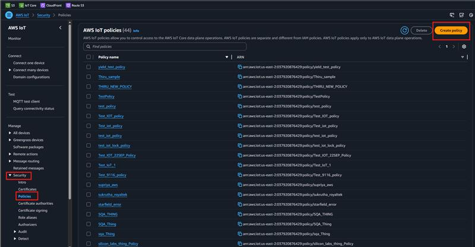
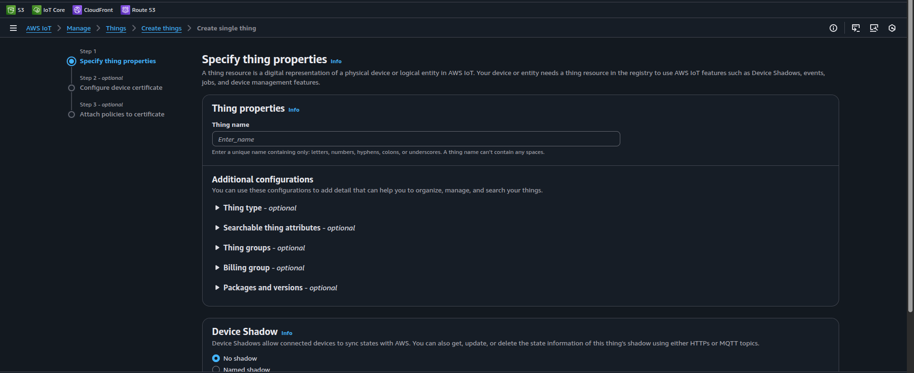
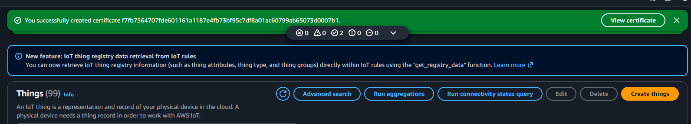
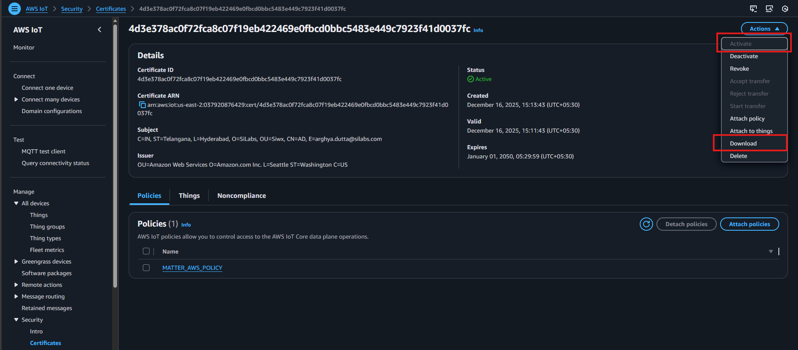

# Setting Up AWS Certificates

AWS IoT Core provides secure, bi-directional communication for Internet-connected devices (such as sensors, actuators, embedded devices, wireless devices, and smart appliances) to connect to the AWS Cloud over MQTT. Refer to [AWS IoT Documentation](https://docs.aws.amazon.com/iot/) for more details.

## Device Registration and Certificate Generation

1. Open [AWS](https://aws.amazon.com/).
2. Log in using your AWS credentials.
3. Go to **AWS IoT**.
4. In the left panel, go to **Security > Policies** and select **Create Policy**.

   

   - Enter the policy name (e.g., `MATTER_AWS_POLICY`). In the policy statements, select **JSON** and replace the contents with the JSON provided below:

      ```shell
       {
         "Version": "2012-10-17",
         "Statement": [
          {
            "Effect": "Allow",
            "Action": "*",
            "Resource": "*"
          }
        ]
       }
      ```

5. Once done, select **Create**.

6. Create a client CSR certificate and a device key by following the steps in [OpenSSL Certificate Creation](./openssl-certificate-creation.md).

7. Complete the following steps to create a thing and generate certificates for your Matter application to use in the `MatterAwsNvmCert.cpp` source file:

    - Go to **All Devices > Things** and select **Create Things**.
    
    - Select **Create Single Thing** and click **Next**.
    - Under **Specific thing properties > Thing properties**, specify the thing name (this will be the `MATTER_AWS_CLIENT_ID` in `MatterAwsConfig.h`), then click **Next**.
      
    - Under **Configure device certificate > Device Certificate**, select **Upload CSR**. 
    - In **Certificate signing request > Choose file** (Choose Client CSR generated by Openssl Certificate Creation in Step 6. e.g., `device.csr`). Click **Next**. 
       
    - Select the policy (e.g., `MATTER_AWS_POLICY`) created at Step 4.
       
    - Once the thing is successfully created, click **View certificate**. 
       
    - Next:
         - Activate the certificate.
         - Download the certificate.
       

8. Copy the contents of [AWS_CA CERT](https://www.amazontrust.com/repository/AmazonRootCA3.pem) (We are using Amazon Root CA3) and add it as CA certificate in `examples/platform/silabs/matter_aws/matter_aws_interface/include/MatterAwsNvmCert.cpp`. 
All the certificate should be added in below format:

   ```cpp
   char ca_certificate[]     = {
    "-----BEGIN CERTIFICATE-----\r\n"
    "MIIBtjCCAVugAwIBAgITBmyf1XSXNmY/Owua2eiedgPySjAKBggqhkjOPQQDAjA5\r\n"
    "MQswCQYDVQQGEwJVUzEPMA0GA1UEChMGQW1hem9uMRkwFwYDVQQDExBBbWF6b24g\r\n"
    "Um9vdCBDQSAzMB4XDTE1MDUyNjAwMDAwMFoXDTQwMDUyNjAwMDAwMFowOTELMAkG\r\n"
    "A1UEBhMCVVMxDzANBgNVBAoTBkFtYXpvbjEZMBcGA1UEAxMQQW1hem9uIFJvb3Qg\r\n"
    "Q0EgMzBZMBMGByqGSM49AgEGCCqGSM49AwEHA0IABCmXp8ZBf8ANm+gBG1bG8lKl\r\n"
    "ui2yEujSLtf6ycXYqm0fc4E7O5hrOXwzpcVOho6AF2hiRVd9RFgdszflZwjrZt6j\r\n"
    "QjBAMA8GA1UdEwEB/wQFMAMBAf8wDgYDVR0PAQH/BAQDAgGGMB0GA1UdDgQWBBSr\r\n"
    "ttvXBp43rDCGB5Fwx5zEGbF4wDAKBggqhkjOPQQDAgNJADBGAiEA4IWSoxe3jfkr\r\n"
    "BqWTrBqYaGFy+uGh0PsceGCmQ5nFuMQCIQCcAu/xlJyzlvnrxir4tiz+OpAUFteM\r\n"
    "YyRIHN8wfdVoOw==\r\n"
    "-----END CERTIFICATE-----\r\n"
    };
   ```

   - In `MatterAwsNvmCert.cpp` file are the following:
      - char ca_certificate[] - Fill it with AWS_CA CERT (mentioned above).
      - char device_certificate[] - Fill it with Device Certificate downloaded from AWS in Step 7.
      - char device_key[] - Fill it with Device Key generated in Step 6.

9. Repeat Step 6 to create a new thing for use in MQTT Explorer, using the certificate generated for MQTT Explorer during OpenSLL certificate creation (e.g., `explorer.csr`). Create a `.pem` file from the CA certificate in Step 8 and use it as the server certificate in MQTT Explorer.

   > **Note**: The thing name must be unique as it will be used as the client ID.
