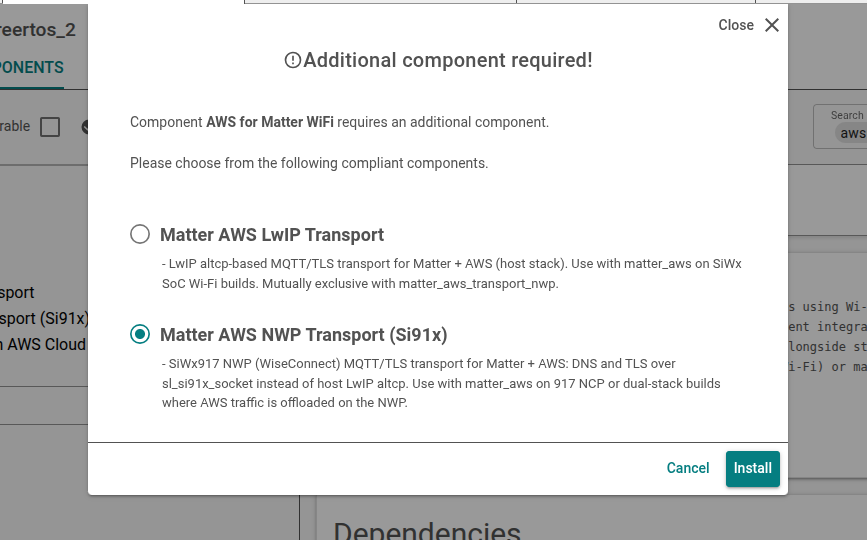
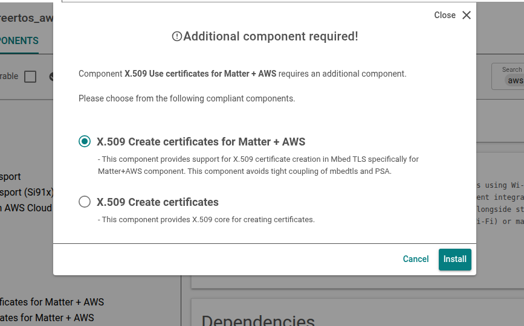
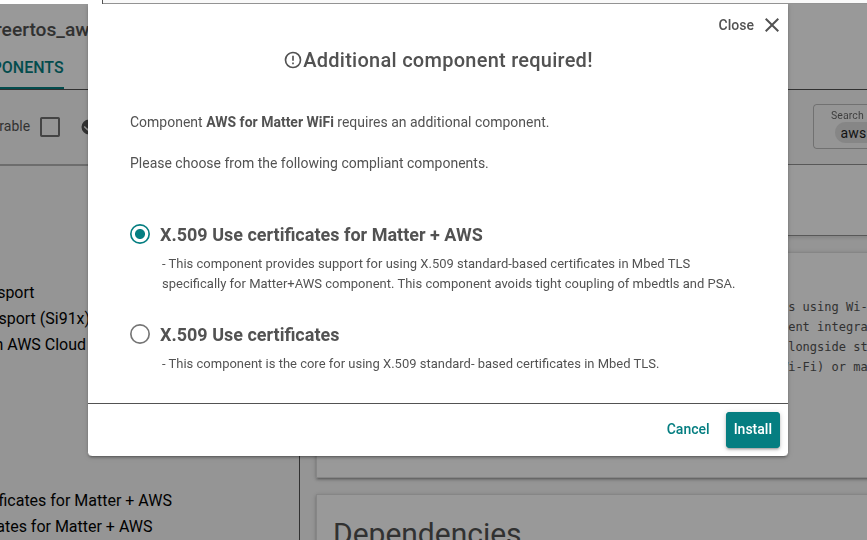

# Build Procedure for Matter + AWS Dual Stack

This procedure details how to enable the dual-stack flavor of Matter + AWS in a 917 NCP project. This configuration uses IPv6 on the EFR32 host for Matter and IPv4 on the SiWx917 NWP for AWS cloud connectivity.

For an architectural overview and flavor comparison, see [Matter + AWS Dual Stack Overview](./matter-aws-dual-stack-overview.md).

For the standard Matter + AWS build (917 SoC or standard 917 NCP with host LwIP transport), see [Build Procedure for Matter + AWS](./build-matter-aws.md).

> **Note:** Dual-stack Matter + AWS is currently supported on 917 NCP boards only (BRD4186C, BRD4187C, BRD4120A).

## Prerequisites

- A **917 NCP** Matter project or the reference example `matter_wifi_917_ncp_lock_app_dual_stack_freertos`.
- Matter Extension **2.9.0** or later, and WiseConnect SDK **4.1.0** or later installed in Simplicity Studio.
- AWS cloud configured according to [AWS installation](./aws-configuration-registration.md).
- Hardware and software requirements are met as described in [Matter + AWS Prerequisites](./index.md#prerequisites).

## Add the AWS Server, Client ID, and Certificate Details

AWS server, client ID, and Certificates are the same as the standard Matter + AWS flavor. Perform the steps in [Adding the AWS Server, Client ID, and Cluster Details](./build-matter-aws.md#adding-the-aws-server-client-id-and-cluster-details) in the standard build guide and refresh the Matter extension in Simplicity Studio.

## Get started

In Simplicity Studio, from the reference example, create a project using `matter_wifi_917_ncp_lock_app_dual_stack_freertos` (917 NCP Lock Dual Stack). 

## Add Dual-Stack Matter + AWS Components

Configure the project using the Simplicity Studio Project Configurator. Following steps specifically describe about dual-stack, which is different from the [standard Matter + AWS build procedure](./build-matter-aws.md#adding-the-matter--aws-component).


### 1. Install Matter AWS with NWP Transport

1. In the **Software Components** section, enter `aws` in the search box, and then click the search icon.
    Search result displays the "AWS for Matter Wi-Fi" component.
2. Select the **AWS for Matter Wi-Fi** component (`matter_aws`) and then click on install.

3. When prompted for the AWS transport dependency, select **Matter AWS NWP Transport (Si91x)** (`matter_aws_transport_nwp`). Do **not** select Matter AWS LwIP Transport.

4. Select the dependencies for the Matter AWS component as shown in the images. The order of the dependencies can vary, in each case select the option with "+ AWS".






### 2. Install TLS 1.2 PRF (917 NCP Requirement)

In **Software Components**, search for `TLS 1.2 PRF` and install the **TLS 1.2 PRF** component (`psa_crypto_tls12_prf`).

This step is required for all 917 NCP Matter + AWS builds, including dual-stack.


## Build and Flash the Application

1. Build the dual-stack Matter + AWS application in Simplicity Studio. 
    For 917 NCP flash and boot procedures, refer to the [917 NCP getting started documentation](/matter/{build-docspace-version}/matter-wifi-getting-started-example/getting-started-siwx917-rcp).
2. Flash the EFR32 host application and the SiWx917 NCP connectivity firmware as required for your board.

## Verify the Build

1. Confirm AWS connectivity from the device logs. 
    The `[MATTER_AWS]` messages displayed after device bootup:
   ```console
      [00:00:23.400][info  ][SVR] [MATTER_AWS] connection callback started
      [00:00:23.690][info  ][SVR] [MATTER_AWS] MQTT connection status: 0
      [00:00:23.995][info  ][SVR] [MATTER_AWS] MQTT sub request callback: 0
   ```

2. After subscribing to a topic in AWS IoT, publish logs appears in the device console and in the AWS IoT console.


3. Commission the device over **EFR32 BLE** and verify Matter control with chip-tool. 
4. For end-to-end Matter and cloud testing steps, refer to [End-to-End Test of Matter + AWS Application](./index.md#end-to-end-test-of-matter--aws-application) and [Running the Matter Demo Over Wi-Fi](/matter/{build-docspace-version}/matter-wifi-run-demo).

## Compile Using New Thing for Different Certificates

Do not use the same client ID for multiple devices. 

To use AWS, update the following information:

1. Add your AWS certificates in the `examples/platform/silabs/matter_aws/matter_aws_interface/include/MatterAwsNvmCert.cpp` file.
   - Provide the AWS Root CA key (https://www.amazontrust.com/repository/AmazonRootCA1.pem).
   - Provide `device_certificate` and `device_key` with your device certificate and device key. For more details, refer to [OpenSSL Device Certificate Creation](./openssl-certificate-creation.md).
  
2. Add your AWS server and client ID information to the `examples/platform/silabs/matter_aws/matter_aws_interface/include/MatterAwsConfig.h` file.

   - Provide `MATTER_AWS_SERVER_HOST` with your AWS Server name.
   - Provide `MATTER_AWS_CLIENT_ID` with your device/thing ID.

> **Note:**
> - The supported certificate type for the 917 NCP matter dual stack is RSA keys.
> - AWS Root CA used for the 917 NCP matter dual stack https://www.amazontrust.com/repository/AmazonRootCA1.pem

## Troubleshooting

- **Matter commissioning or IPv6 connectivity issues**
  Ensure that `SLI_SI91X_ENABLE_IPV6=1` is defined and your network supports IPv6 SLAAC. See the IPv6  troubleshooting section in [Matter Wi-Fi FAQ](/matter/{build-docspace-version}/matter-faq/wifi-faq).

- **AWS MQTT connection failures**
   Ensure that IPv4 is enabled on the Matter Wi-Fi component, and AWS server details and credentials in `MatterAwsConfig.h` and `MatterAwsNvmCert.cpp` are correct.

- **Build errors about conflicting transport**
   Remove `matter_aws_transport_lwip` if exists; only one AWS transport component can be installed.

For architectural context and supported board list, see [Matter + AWS Dual Stack Overview](./matter-aws-dual-stack-overview.md).
