# Build Procedure For Matter + AWS

Below steps are to be followed for setting the AWS configuration in the Matter SDK.

## Adding the AWS Server, Client ID and Cluster Details

1. Open Simplicity Studio. Go to `Settings > SDKs`. Click **Browse to Location** option by right-clicking **Silicon Labs Matter**.
   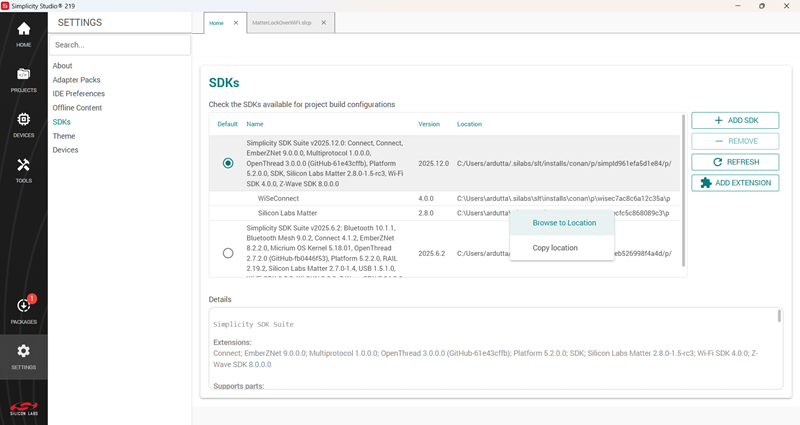

2. Go to the `third_party/matter_sdk/examples/platform/silabs/matter_aws/matter_aws_interface/include/`.   

3. Update the definitions for the server ID, client ID and cluster in `MatterAwsConfig.h`:

   - Update the AWS server name at `#define MATTER_AWS_SERVER_HOST ""`.
   - Update the client ID at `#define MATTER_AWS_CLIENT_ID ""`.
   - Update the cluster server information from the below table, based on your app:
  
   | Application Type | Cluster Definition |
   |------------------|--------------------|
   | Thermostat | `#define ZCL_USING_THERMOSTAT_CLUSTER_SERVER` |
   | Lighting | `#define ZCL_USING_ON_OFF_CLUSTER_SERVER` |
   | Lock | `#define ZCL_USING_DOOR_LOCK_CLUSTER_SERVER` |
   | Window Covering | `#define ZCL_USING_WINDOW_COVERING_CLUSTER_SERVER` |

    **MatterAwsConfig.h File:**

    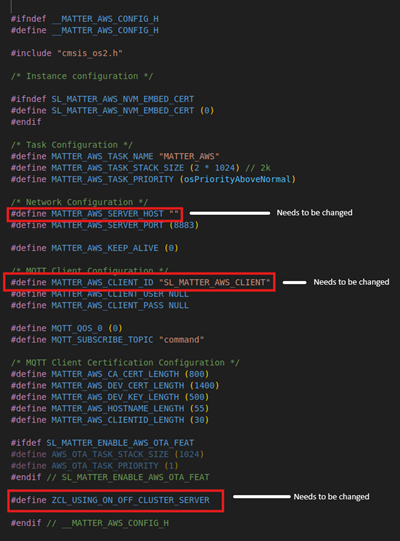

4. After making the above changes, refresh the `matter-extension` in Simplicity Studio.
   - In the **Home** tab, from the left panel, select **Settings**.
   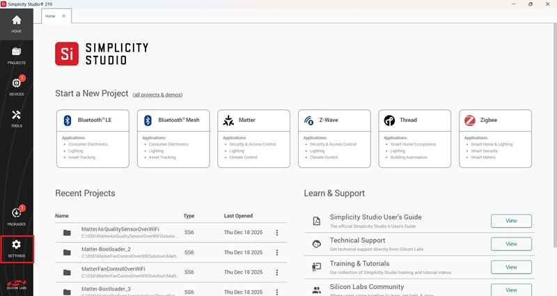
   - Click on **SDKs**, ensure the correct version of the SDK is selected, and then click **Refresh** in the right side menu.
   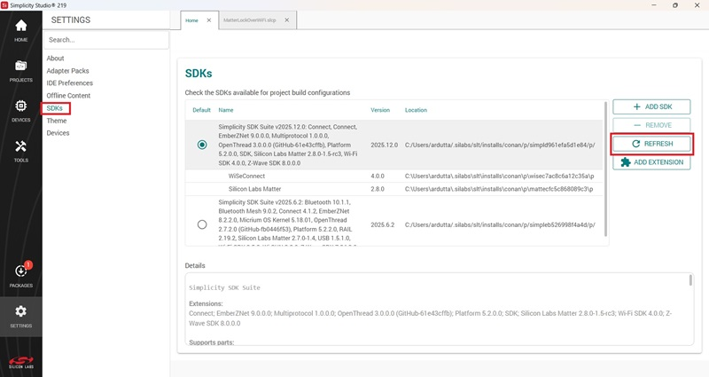

The following steps are common for all apps and should be modified using the Studio Project Configurator tool.

## Adding the Matter + AWS Component

To enable the component in Simplicity Studio, add the following components.

1. Go to **Software** components, search for `Matter_Wifi`. Click the **Settings** symbol beside Matter Wi-fi component in the left panel or the **Configure** option and enable IPV4 configuration.

   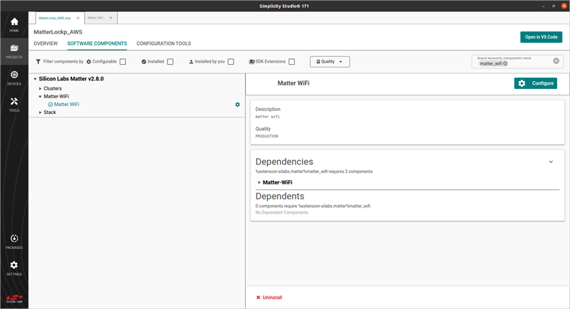

   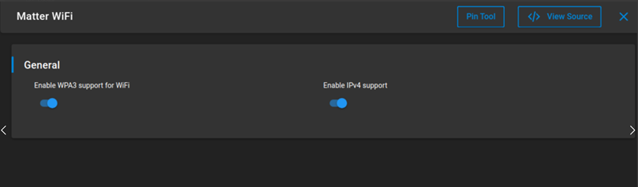

2. In **Software Components**, search for `aws` and install the Matter AWS component.

    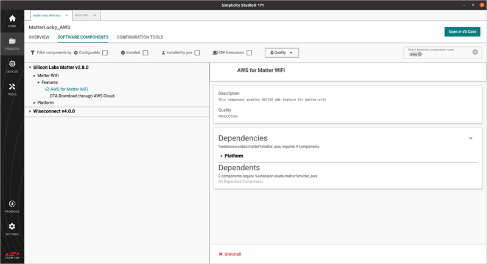

3. Next, select the dependencies for the Matter AWS component.

   > Note: The order can vary, but in every case select the option with "+ AWS".

   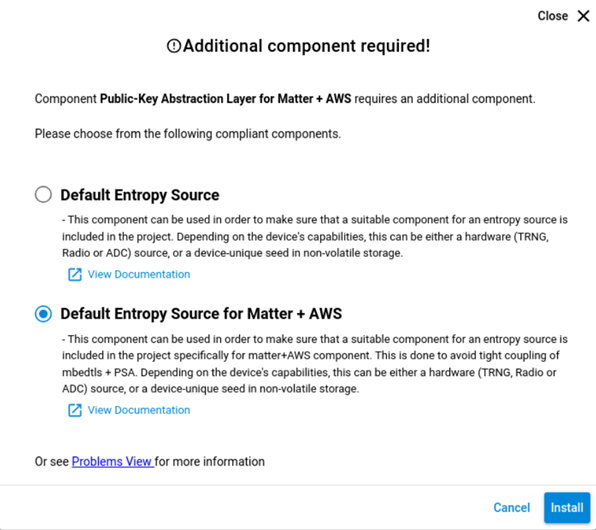

   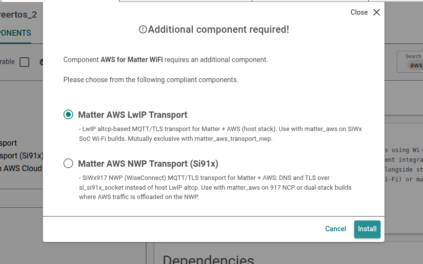

### Additional Step Needed Only For 917 NCP

- In **Software Components**, search for `TLS 1.2 PRF` and install the TLS 1.2 PRF component.

   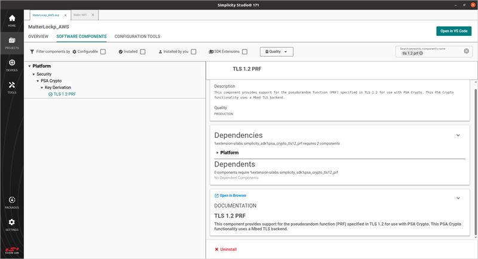

## Building Matter + AWS Application

1. After adding the Matter + AWS component as described above, build the Matter + AWS application using Simplicity Studio as described in [Build SOC Application Using Studio](/matter/{build-docspace-version}/matter-wifi-run-demo/build-soc-application-using-studio).

2. After building and flashing the app, you can see [MATTER_AWS] logs after device bootup.

    ```console
    [00:00:23.400][info  ][SVR] [MATTER_AWS] connection callback started
    [00:00:23.690][info  ][SVR] [MATTER_AWS] MQTT connection status: 0
    [00:00:23.995][info  ][SVR] [MATTER_AWS] MQTT sub request callback: 0
    ```

3. After subscribing to a topic in AWS IoT, you can see the publish logs.

   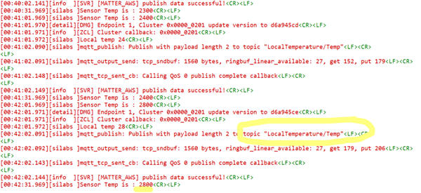

4. You can see the same data in AWS IoT.

   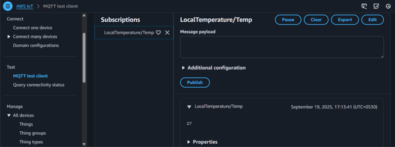

   > **Note:**
   > - The supported certificate type to be used in this PoC is ECDSA.
   > - AWS RootCA used in this PoC is
   > https://www.amazontrust.com/repository/AmazonRootCA3.pem

## Compile Using New/Different Certificates

Two devices should not use the same client ID. Use a different client ID for your second connection. While using AWS, update the following information:

1. Add your AWS certificates in file `examples/platform/silabs/matter_aws/matter_aws_interface/include/MatterAwsNvmCert.cpp`.

   - Provide the AWS Root CA key (https://www.amazontrust.com/repository/AmazonRootCA3.pem).
   - Provide `device_certificate` and `device_key` with your device certificate and device key. For more details, refer to [OpenSSL Device Certificate Creation](./openssl-certificate-creation.md).
  
2. Add your AWS server and client ID information to the `examples/platform/silabs/matter_aws/matter_aws_interface/include/MatterAwsConfig.h` file.

   - Provide `MATTER_AWS_SERVER_HOST` with your AWS Server name.
   - Provide `MATTER_AWS_CLIENT_ID` with your device/thing ID.
   - Update `ZCL_USING_ON_OFF_CLUSTER_SERVER` with the cluster server details based on your app.
