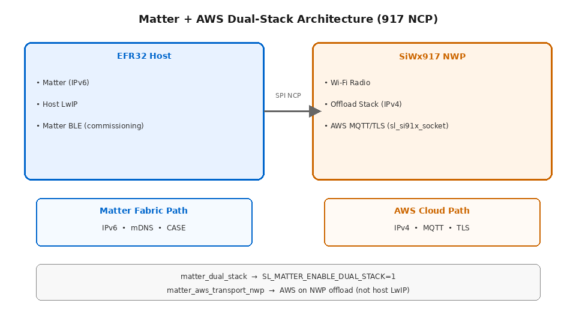

# Matter + AWS Dual Stack Overview

The **dual-stack flavor** of Matter + AWS is a Silicon Labs–specific configuration for **917 NCP** (Network Co-Processor) designs. It enables Matter devices to connect locally on the Matter fabric over **IPv6** on the EFR32 host while connecting to AWS over **IPv4** on the SiWx917 network processor (NWP).

> **Note:** Dual-stack here is **not** classic single-stack IPv4+IPv6 on one TCP/IP stack. It is a **split-stack NCP architecture** with separate network stacks on the host and the NWP.

## When to Use the Dual-Stack Flavor

Use the dual-stack flavor when all of the following apply:

- Your design uses a **917 NCP** board (EFR32 host + SiWx917 co-processor over SPI).
- You need **Matter + AWS** (Direct Internet Connectivity) on that NCP platform.
- Matter traffic must remain on **IPv6** on the EFR32 host LwIP stack.
- AWS MQTT/TLS traffic must run over **IPv4** on the SiWx917 NWP offload stack.

For **917 SoC** or **standard 917 NCP** builds that use a single host LwIP stack for both Matter and AWS, use the [standard Matter + AWS build procedure](./build-matter-aws.md) instead.

## Dual-Stack Architecture

The following diagram shows how traffic is split between the EFR32 host and the SiWx917 NWP.

| Traffic path | Processor | Network stack | Protocol |
|--------------|-----------|---------------|----------|
| Matter fabric, mDNS, CASE | EFR32 host | Host LwIP | IPv6 |
| Wi-Fi radio association | SiWx917 NWP | Offload stack | — |
| AWS MQTT/TLS | SiWx917 NWP | `sl_si91x_socket` (NWP offload) | IPv4 |

The EFR32 host and SiWx917 NWP communicate over the SPI NCP interface. The **Matter Dual Stack** component (`matter_dual_stack`) replaces the standard **Matter LwIP** component (`matter_lwip`) and defines the build macro `SL_MATTER_ENABLE_DUAL_STACK=1`.

## Flavor Comparison

| Setting | 917 SoC Matter + AWS | Standard 917 NCP Matter + AWS | 917 NCP Dual-Stack Matter + AWS |
|---------|----------------------|-------------------------------|----------------------------------|
| Network provider | `matter_lwip` | `matter_lwip` | **`matter_dual_stack`** |
| AWS transport | `matter_aws_transport_lwip` | `matter_aws_transport_lwip` | **`matter_aws_transport_nwp`** |
| MQTT/TLS path | Host LwIP altcp | Host LwIP altcp | NWP `sl_si91x_socket` |
| Matter protocol | IPv6 (host LwIP) | IPv6 (host LwIP) | IPv6 (host LwIP) |
| AWS/cloud protocol | IPv4 (host LwIP) | IPv4 (host LwIP) | IPv4 (NWP offload) |
| BLE for commissioning | SoC BLE | `matter_wifi_ble` (917) | **`matter_ble`** (EFR32 host) |
| IPv6 project define | via `matter_lwip` | via `matter_lwip` | **`SLI_SI91X_ENABLE_IPV6=1`** |
| Dual-stack build macro | — | — | **`SL_MATTER_ENABLE_DUAL_STACK=1`** |

The AWS transport components **`matter_aws_transport_lwip`** and **`matter_aws_transport_nwp`** are mutually exclusive. Install exactly one transport with the **Matter AWS** component.

## Component and Macro Checklist

When building a dual-stack Matter + AWS application, verify the following:

| Item | Dual-stack value |
|------|------------------|
| Network stack provider | `matter_dual_stack` (not `matter_lwip`) |
| AWS transport | `matter_aws_transport_nwp` (not `matter_aws_transport_lwip`) |
| BLE component | `matter_ble` (not `matter_wifi_ble`) |
| Matter Wi-Fi IPv4 setting | Enable `CHIP_DEVICE_CONFIG_ENABLE_IPV4` |
| Project define | `SLI_SI91X_ENABLE_IPV6=1` |
| Build macro (automatic) | `SL_MATTER_ENABLE_DUAL_STACK=1` (set by `matter_dual_stack`) |
| AWS dependencies | `mbedtls_x509_use_aws`, `mbedtls_x509_create_aws`, `mbedtls_entropy_default_aws` |
| 917 NCP TLS | `psa_crypto_tls12_prf` (TLS 1.2 PRF) |

## Supported Hardware and Software

### Hardware

Dual-stack Matter + AWS is supported on **917 NCP Radio boards only(BRD4346A)**:

- BRD4186C
- BRD4187C
- BRD4120A

Standard Matter + AWS on 917 SoC and standard 917 NCP boards is documented separately. See [Prerequisites](./index.md#prerequisites) on the Matter + AWS index page.

### Software

- Matter Extension **2.9.0** or later
- WiseConnect SDK **4.1.0** or later
- Correct SiWx917 NCP connectivity firmware supporting dual network stack mode

## Reference Example

The Matter Extension provides a reference lock application for dual-stack builds:

- **Project:** `matter_wifi_917_ncp_lock_app_dual_stack_freertos`
- **Description:** Matter over Wi-Fi door lock with BLE on the EFR32 host (IPv6 on EFR32, IPv4 on SiWx917)

This is currently the only Matter example project configured for the dual-stack flavor.

## Limitations

- **917 NCP only** — not supported on 917 SoC or standard single-stack 917 NCP AWS builds.
- **Single reference app** — only the lock app example is provided for dual-stack today.
- **Transport exclusivity** — do not install both `matter_aws_transport_lwip` and `matter_aws_transport_nwp` in the same project.

## Next Steps

- [Build Procedure for Matter + AWS Dual Stack](./build-matter-aws-dual-stack.md) — component installation and project configuration
- [Build Procedure for Matter + AWS (standard flavor)](./build-matter-aws.md) — 917 SoC and standard 917 NCP
- [Matter + AWS index](./index.md) — AWS cloud setup, end-to-end testing, and shared configuration
